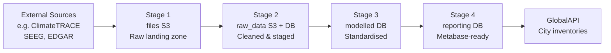

# CityCatalyst Global Data — Architecture

This document describes the data architecture: storage stages, database schema, pipeline orchestration, and naming conventions.

---

## Overview

The system ingests raw emissions and activity data from global and national sources, transforms and models it, and loads it into the GlobalAPI database for use in city-level inventories.



---

## Data Stages

### Stage 1 — `files` (S3)
The raw data landing zone. Source files are stored here exactly as received from the publisher, with no transformation.

- Any original file format (CSV, JSON, XLSX, Parquet, etc.)
- All pipelines read from here as their starting point

### Stage 2 — `raw_data` (S3 + PostgreSQL schema)
Cleaned and structured data, stored as Parquet in S3 and/or as staging tables in the `raw_data` PostgreSQL schema. Data is parsed, typed, and prepared for modelling but not yet mapped to the target schema.

- Staging tables named `raw_data.<source>_<sector>_staging`
- This stage is where most Python transformation logic runs

### Stage 3 — `modelled` (PostgreSQL schema + S3)
Standardised, modelled data. Primary output of the pipeline system and the main input to the GlobalAPI. Data here is aggregated to city level and conforms to the target data model.

- Lives in the `modelled` schema of the `ccglobal` database
- Also mirrored to S3 for datasets not yet loaded to the DB

### Stage 4 — `reporting` (PostgreSQL + S3)
Reporting-optimised tables for Metabase dashboards. Lean and query-performant — not a full copy of modelled data.

---

## Database: `ccglobal`

PostgreSQL database with two schemas: `raw_data` (staging) and `modelled` (final).

> **Canonical schema:** [dbdiagram.io/d/GlobalData-6993ca23bd82f5fce2e31149](https://dbdiagram.io/d/GlobalData-6993ca23bd82f5fce2e31149)

### `modelled` schema — table summary

| Table | Purpose |
|-------|---------|
| `emissions` | Central table — one row per city / reference number / year / gas / datasource |
| `activity_subcategory` | Activity types and units associated with emission records |
| `emissions_factor` | Emission factors linking an activity unit to a GHG quantity |
| `ghgi_methodology` | Methodology reference records, linked to a reporting reference number |
| `publisher_datasource` | Registry of data publishers and their datasets |
| `formula_input` | Input parameters for formula-based calculations |
| `city_polygon` | City boundary geometries; `locode` is the primary city identifier used across tables |
| `global_warming_potential` | GWP reference values per gas and IPCC assessment report |

### `raw_data` schema
Intermediate staging tables created per dataset during ingestion, named:
```
raw_data.<source>_<sector>_staging
```
These exist only to support SQL transformations into `modelled` and are not part of the final data model.

---

## Pipeline Orchestration — Mage.ai

Pipelines run in [Mage.ai](https://www.mage.ai/) (`cc-mage/`), orchestrated locally via Docker on port 6789.

### Standard block flow

```
data_loader (Python)            reads raw file from S3
  └── data_exporter (Python)    writes to raw_data staging table
        └── transformer (SQL)   staging transform + sector mapping
              ├── data_exporter (SQL)  → modelled.ghgi_methodology
              ├── data_exporter (SQL)  → modelled.activity_subcategory
              ├── data_exporter (SQL)  → modelled.emissions_factor
              └── data_exporter (SQL)  → modelled.emissions
```

All SQL blocks use PostgreSQL with `use_raw_sql: true` and `export_write_policy: append`. Dataset-specific parameters (S3 bucket, year, sector) are defined as `variables` in the pipeline's `metadata.yaml`.

---

## Naming Conventions

### Pipeline prefixes

| Prefix | Meaning |
|--------|---------|
| `ghgi_` | Greenhouse Gas Inventory |
| `ccra_` | Climate Risk Assessment |
| `dq_` | Data quality / validation |
| `actions_` | City Action Plan |
| `_v<year>` suffix | Tied to a specific data release version |

### Staging tables
```
raw_data.<source>_<sector>_staging
```
Examples: `raw_data.ct_onroad_v2025_staging`, `raw_data.edgar_emissions_staging`
