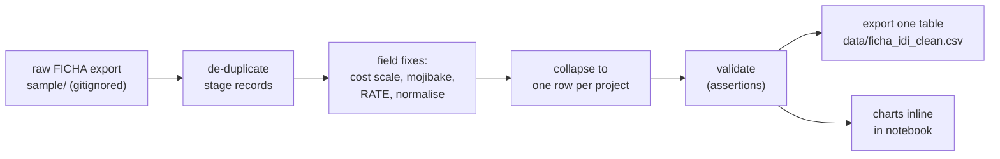

# Review — cl-bip-projects, release v1

## Scope and status

This release captures and cleans the climate-relevant subset of Chile's Banco Integrado de Proyectos (BIP) investment initiatives, the FICHA IDI records administered through the Ministerio de Desarrollo Social y Familia. It is analysed but not yet production-approved. The cleaning runs in one notebook at the release root and exports a single tidy table of 2,576 unique initiatives spanning budget years 2002 to 2027. Dataset-level facts, sources, access and licence sit in the dataset README one level up; this review records what the source supports, the cleaning decisions, the headline findings, and how the entry relates to the legacy cl-ssg-projects review.

One provenance caveat shapes everything below. The captured input still carries the per-project FICHA PDF parser fingerprint (`source_pdf_*` and `parser_version` columns), so it is the PDF-parsed view that cl-ssg-projects produced, not yet the BIDAT bulk open-data download the README targets. The cleaning and analysis are source-agnostic and will run unchanged once the BIDAT cut replaces the parsed input, so swapping the source remains the top open item rather than a blocker on the analysis.

## What this source supports

Chile publishes its full public-investment registry, and each initiative carries the fields needed for climate work. Every record has a sector and subsector, a current stage, a primary financing source, a formulating institution and a cost in pesos, and the climate-relevant transport, water, environment, housing and energy initiatives map onto GPC sectors. That makes the table usable both as a census of climate-relevant public investment and as a library of real, costed precedents for matching to mitigation actions, on the same basis as cl-ssg-projects but from a cleaner tabular load. The dataset is licensed for reuse under CC BY 4.0, with attribution.

## What this source does not support

Three readings would be wrong. The committed table is not yet the BIDAT bulk view: it is the PDF-parsed FICHA cut, and the bulk swap is still open. The dataset is not a pre-filtered climate dataset either; BIP is the full investment universe, and climate relevance is a classification applied downstream rather than a property of the source. Nor are the cost figures audited spend: they are formulation or request values recorded by stage, so the stage and the RATE evaluation result are the approval signal, not evidence of money executed.

## Cleaning

The pipeline reads the raw export from `sample/`, applies one fix per concern, validates against assertions, and exports a single project-level table, with all aggregates rendered as charts inside the notebook rather than written to disk. Each cleaning block in the notebook cites the matching note below.

*Caption: one raw export becomes one committed table plus in-notebook charts; validation gates the export.*

The discrete decisions, each a parsing note the notebook cites:

- **De-duplication.** The raw file is stage-level, one row per project, budget year and stage, so its 7,086 rows represent only 2,576 initiatives; 30 exact project-year-stage rows are redundant and dropped, leaving 7,056 clean stage records.
- **Cost scale.** The `costo_total_M_CLP` column is mislabelled. It holds thousands of pesos, not millions: it equals `costo_total_CLP` divided by 1,000 on every row, so a value of 60,800 is CLP 60.8 million, not 60.8 billion. The clean absolute uses `costo_total_CLP`, and an exact-zero cost is treated as missing rather than a real zero.
- **Mojibake.** About ten names carry double-encoding corruption, repaired with `ftfy`; the five cases that cannot be safely reconstructed are flagged in `name_has_mojibake`.
- **Evaluation.** The `rate_resultado` column is empty in this cut, so the live RATE signal is `resultado_analisis_latest_rate`, mapped to readable labels and an `is_recommended` flag where RS means recomendado.
- **Normalisation.** Text categoricals are trimmed, the primary financing source is taken as the first listed in `fuentes_financiamiento`, and years, costs and beneficiary counts are coerced to numbers.

The export grain is one row per initiative: the latest known state, taken as the highest budget year then the highest stage, with the project's first and last year and its peak cost added.

## Coverage

Coverage bounds every claim that follows. Identity, sector, cost, stage and the lead agency are effectively complete and safe to use directly; geography, the RATE evaluation and the converted USD cost are partial and have to be read as statistics over the populated subset, not over the whole census.

| Field | Project-level coverage |
| --- | --- |
| Cost (CLP) | 100% |
| Formulating institution | 100% |
| Current stage | 99.8% |
| Sector | 99.1% |
| Subsector | 98.8% |
| Beneficiaries | 96.5% |
| Comuna | 58.8% |
| RATE evaluation | 40.5% |
| Region | 33.4% |
| Cost (USD) | 14.7% |

## Headline findings

The cut holds 2,576 climate-relevant initiatives across 2002 to 2027, carrying about 16.7 trillion CLP of committed or requested cost. That total is heavily concentrated: the median initiative is modest at 391 million CLP, the 90th percentile sits near 4.7 billion, the largest single project reaches 3.5 trillion, and the top one percent of projects hold roughly 70 percent of the money. A small number of rail and port mega-projects dominate the portfolio.

Count and money tell different sector stories. Transport leads on both, while Recursos Naturales y Medio Ambiente nearly matches transport on money with far smaller typical projects, and Vivienda y Desarrollo Urbano is high in volume but low in value.

| Sector | Projects | Cost (tn CLP) | Median (M CLP) | Recomendado |
| --- | --- | --- | --- | --- |
| Transporte | 670 | 7.4 | 1,129 | 61.9% |
| Recursos Naturales y Medio Ambiente | 582 | 7.3 | 310 | 11.2% |
| Vivienda y Desarrollo Urbano | 578 | 0.6 | 185 | 30.1% |
| Recursos Hídricos | 429 | 1.2 | 627 | 28.7% |
| Energía | 229 | 0.1 | 124 | 14.8% |

Who funds a project tracks closely with how it is evaluated. The regional development fund (F.N.D.R.) is the most numerous source but most of its records are not yet RATE-evaluated in this cut, which drags its recommendation rate down. State enterprises (the EMPRESA source: rail through EFE, ports, sanitary utilities) are few but concentrate the money and clear the evaluation gate far more often. Across the 40 percent of projects that carry a RATE at all, 78 percent are recomendado.

| Primary financing source | Projects | Cost (tn CLP) | Recomendado |
| --- | --- | --- | --- |
| F.N.D.R. | 1,505 | 8.0 | 17.4% |
| Sectorial | 731 | 2.2 | 37.3% |
| Empresa | 337 | 6.5 | 83.7% |
| Municipal | 3 | 0.0 | 0.0% |

The pipeline has depth over time, with stage-records building through the 2010s, and most initiatives sit at execution or perfil.

A separate companion file travels with the release but is not pooled with the BIP cut. It holds seven World-Bank-financed Chilean projects with model-synthesised narratives on financing structure, lessons and co-benefits. Its provenance and schema differ from the BIP records, so it serves as qualitative precedent rather than as rows to aggregate alongside them.

## Using it downstream

The cleaned table reproduces the SSG-style climate subset from a single tabular load rather than a PDF-scraping pipeline, so the recommended path is to ingest it directly and, when the BIDAT bulk cut is available, swap the input and re-run. Matching to mitigation actions reuses the taxonomy-first approach documented for cl-ssg-projects (sector, then subsector, then semantic similarity) together with the actions library in cl-ssg-legal-signals. Cost benchmarking by sector and subsector, both the typical and the peak project size, gives real precedent for costing a new action. Geography and the RATE rate apply only to their populated subsets, the recommendation rate is a share among evaluated projects and varies sharply by financing source, and a USD figure is better derived from the peso cost at a dated exchange rate than read from the sparse native USD column. Redistribution attributes the source under CC BY 4.0.

## Relationship to cl-ssg-projects

The legacy cl-ssg-projects review derived a climate subset of about 3,144 projects by extracting per-project FICHA PDFs from BIP Consulta and parsing them through a parse, flatten, translate and match pipeline. Its field analysis remains valid for interpreting the records, but the acquisition method is the fragile part, depending on PDF layout stability and a bespoke parser. This entry keeps that field reference and the matching approach while replacing the corpus and parsing steps with a direct table load, and ultimately with the licensed BIDAT bulk download.

## Open items before promotion

Four items stand between this release and promotion, the source swap being the one that matters most.

1. Swap the source to the BIDAT bulk cut, recording its cut date and exact resource URL, and confirm the pipeline runs unchanged on it.
2. Reconcile BIDAT field names and coverage against the FICHA fields cleaned here, and confirm the climate-relevance filter definition.
3. Confirm CC BY 4.0 applies to the specific BIDAT resource downloaded; the historical dataset states it explicitly, but the annual CSV resource needs checking.
4. Reconcile the five residual mojibake names once a cleaner source encoding is available.

## Traceability

Sources were verified on 2026-06-16: the BIDAT historical dataset (CC BY 4.0, RData), the BIDAT annual datasets (CSV, cut 31 March 2026), SNI Datos Abiertos, the BIP Data download portal and the BIP Consulta public tool. The captured input is the PDF-parsed FICHA table from parser version 1.0.2, cleaned and analysed in the release notebook; the BIDAT bulk swap is pending as open item 1. Provenance and licence are verified.

## References

- dataset README, sources and licence → `../../README.md`
- cleaning notebook (load, clean, validate, export, charts) → `extract_clean.ipynb`
- committed clean table, one row per initiative → `data/ficha_idi_clean.csv`
- raw FICHA export and companion file, gitignored → `sample/ficha_idi_table.csv`, `sample/other_projects.csv`
- legacy PDF-derived review and matching method → `../../../cl-ssg/cl-ssg-projects/releases/v1/review.md`
- mitigation actions library → `cl-ssg-legal-signals`
