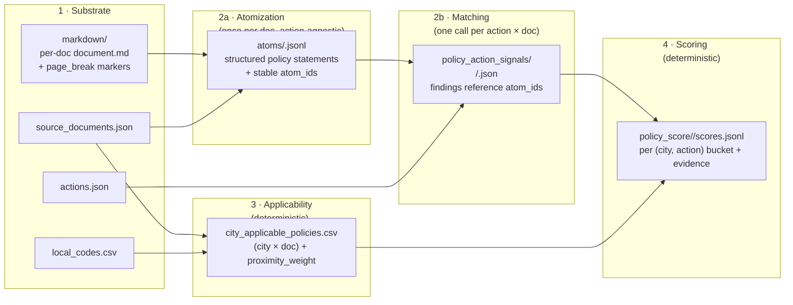

# v1 design

## What this is

A pipeline for the cl-ssg policy-document review that produces a **city × action alignment score** backed by verbatim evidence from applicable Chilean climate-policy documents. The output of the pipeline is, for every Chilean commune × every action in the catalog, a bucketed strength score (`strong / medium / weak / none`) plus the underlying evidence trail.

This is not a generic policy index. Every layer is built specifically toward the city × action scoring use case stated in `review.md`.

## Locked decisions

The following are locked unless eval results force a change:

- **Model**: `gpt-4.1-mini` for both atomization and matching calls. Re-evaluate only if recall on the held-out eval set drops on long docs.
- **Action catalog**: full `releases/v1/data/registry/actions.json` (102 actions, CityCatalyst-sourced).
- **Source corpus**: `releases/v1/data/registry/source_documents.json` with two adjustments:
  - `chl_parcc_araucania` is excluded from the run set (empty markdown file, 35 chars).
  - The four PRAS environmental-program docs (`chl_environmental_program_*`) are demoted to `review_priority = low` and excluded from the default applicability join. They can be re-included by passing `--include-low-priority` to the applicability deriver, but they will not contribute to default city scores.
- **Architecture**: two-stage extraction (atomization once per doc, action-agnostic; then matching one call per (action, doc) pair). Atoms-block-first prompt ordering with the action variable bits last, batch grouped by document so prefix caching stays warm.
- **Concurrency**: `--concurrency 16` default in `v1_batch_match.py`.
- **Scoring**: rubric version `0.2.0` (saturation `K=4.0`, relevance cap by matcher's `best_relevance` grade). See `scoring_rubric.md`.

## Architecture



Phase 1 is given (markdown + registries). Phases 2a and 2b call the LLM. Phases 3 and 4 are deterministic transforms with `rubric_version` stamped on every score row.

## Trade-offs

1. **Catalog-bound**. Adding a new action requires re-running matching for that action across every applicable document. Cost scales as `len(actions) × len(applicable_docs)`. Mitigated by prompt caching (atoms block is constant per doc) and resumable batching (existing output files are skipped on re-run).
2. **Atomization is the recall bottleneck**. Findings can only reference atoms that exist; if the atomization step misses a passage, no amount of downstream matching will recover it. Chunking by section boundaries (default ~50k tokens per chunk) keeps each atomization call inside attention range.
3. **No within-region commune differentiation by default**. Every commune in a region gets the same applicable-doc set (national framework + national sectors + regional PARCC), so all communes in a region produce identical scores unless they have a municipal-level document of their own. This is the current data reality, not a flaw — fixable when more PACCCs land in the registry.

## Pipeline phases

Each phase produces a stable, inspectable artifact. Phases 1, 3, and 4 are deterministic; phases 2a and 2b call the LLM.

### Phase 1: Substrate (given)

- `data/markdown/<doc_id>/document.md` — per-document markdown with `<!-- page_break: N -->` and `## section` markers used to resolve atom locations.
- `data/registry/source_documents.json` — doc metadata (source_level, document_type, region_code, status, etc).
- `data/registry/actions.json` — 102-action catalog with `actionId`, `actionName`, `description`, `intervention_summary`, `outcome_summary`, plus a nested `emissions.gpc_reference_number` from which the pipeline derives the GPC reference.
- `data/registry/local_codes.csv` — Chile commune codes joined to regions.

### Phase 2a: Atomization (`v1_extract_atoms.py`)

For each source document, one LLM pass produces a structured index of every distinct policy statement. The atomization prompt is action-agnostic — the model only has to be a thorough reader, not a matcher.

Output: `data/atoms/<source_document_id>.jsonl`, one atom per line. Each atom carries:

- stable `atom_id` (`<doc_id>_a_NNNN`, numbered by character offset in the doc),
- `primitive_type` from the closed vocabulary (`action`, `target`, `funding`, `monitoring`, `governance`, `sector_priority`, `sector`, `risk`, `context`),
- verbatim `evidence_text` (substring of the markdown, whitespace-normalised tolerant),
- `page` + `section` resolved deterministically from the verbatim offset against `page_break` markers and `## headings`,
- `atom_summary` (short English gist used by the matching stage),
- `sector_tags`, `applicability_scope`, `measure_type`, `explicitness`, `primitive_relation_hint`.

Long documents are split into chunks of ~50k tokens at section boundaries before atomization, and atoms are renumbered in document order after all chunks return. Verbatim substring validation runs before each atom is admitted.

### Phase 2b: Matching (`v1_match_atoms_to_action.py`, batch driver `v1_batch_match.py`)

For each `(action, doc)` pair, one LLM call sees the doc's full atoms list (compact form — atom_id + primitive_type + page + section + summary + first 600 chars of evidence_text) plus the action definition. The model returns:

- a per-document `relevance` grade (`high / medium / low / none`),
- a list of findings, each referencing an `atom_id` and supplying `primitive_relation`, `signal_confidence`, `explicitness`, and a one-line `relevance_note`.

Output: `data/policy_action_signals/<source_document_id>/<action_id>.json`. Findings denormalise `evidence_text`, `page`, and `section` from the referenced atom for downstream convenience, but the canonical reference remains `atom_id`.

### Phase 3: Applicability (`v1_derive_applicability.py`)

Pure transform over `source_documents.json` + `local_codes.csv`. For each `(city, source_document)` pair, decides whether the document applies to the city and sets a `proximity_weight`:

1. National document → applies to every city; `national_framework` / `national_sector` / `national_territorial` by document_type.
2. Regional document → applies to every city whose `region_code` matches the document's; `applicability_type = regional` or `regional_territorial`.
3. Intercommunal document → v0 fallback: every city in the same region as the document; `proximity_weight = 0.85`. Real fix waits on an `intercommunal_comunas` field in the registry.
4. Municipal/communal → only the commune whose code matches the document's `territory_code` segment.
5. Placeholders excluded; low-priority docs (PRAS) excluded unless `--include-low-priority`.
6. Status multiplier: non-`final` docs are multiplied by 0.7 on the proximity weight.

Output: `data/registry/city_applicable_policies.csv` plus a `.derivation.json` run log.

### Phase 4: Scoring (`v1_score_city_actions.py`)

Pure transform over `data/policy_action_signals/` + `data/registry/city_applicable_policies.csv`. For each `(city, action)`:

1. Collect findings from every applicable document.
2. Compute `finding_strength = proximity × confidence × relation × explicitness` per finding.
3. Sum strengths and apply saturation `1 - exp(-sum/K)` with `K = 4.0`.
4. Apply the relevance cap: take the strongest `relevance` grade across applicable docs and cap `score_raw` at `0` (none) / `0.32` (low) / `0.65` (medium) / `1.0` (high).
5. Bucket: `≥ 0.66 strong`, `≥ 0.33 medium`, `> 0 weak`, `0 none`.

Output: `data/policy_score/<run>/scores.jsonl` plus a `summary.json` with per-action bucket distributions.

## Directory layout

```
releases/v1/
  review.yaml, review.md
  design/
    design.md                              # this file
    scoring_rubric.md                      # rubric_version 0.2.0
  prompts/
    atomize_system.md, atomize_user.md.j2  # stage 2a
    match_system.md, match_user.md.j2      # stage 2b
  schemas/
    atoms.schema.json
    action_findings.schema.json            # 2.1.0, atom_id refs
    city_applicable_policies.schema.json
  data/
    markdown/                              # per-doc document.md + page_break markers
    registry/
      source_documents.json
      actions.json                         # 102 actions
      local_codes.csv
      city_applicable_policies.csv         # derived in phase 3
    atoms/
      <source_document_id>.jsonl           # one atom per line
    policy_action_signals/
      <source_document_id>/<action_id>.json
    policy_score/
      <run>/scores.jsonl + summary.json
  scripts/
    v1_common.py                           # Document, render_template, Action, load_*, RunStats
    v1_derive_applicability.py             # phase 3
    v1_extract_atoms.py                    # phase 2a
    v1_match_atoms_to_action.py            # phase 2b (single pair)
    v1_batch_match.py                      # phase 2b (batch driver)
    v1_score_city_actions.py               # phase 4
  tests/
    test_v1_applicability.py
  archive/
    scripts/v1_legacy_atoms_translator.py  # migration tool from earlier atoms format
```

## Registries

### source_documents.json

Required fields per row:

- `source_document_id` (stable id, snake_case)
- `source_name`, `source_url`
- `source_level`: one of `national | regional | intercommunal | communal | municipal`
- `document_type`: one of `framework | sector_plan | parcc | paccc | territorial_plan | environmental_program`
- `document_status`: one of `final | draft | consultation | portal_only | flipbook_only | placeholder`
- `region_code` (2-digit Chile region code, `"00"` for national-scope)
- `territory_code` (`level_region_commune`, e.g. `1_00_00`, `2_06_00`, `3_06_101`)
- `publisher`, `publication_year`, `language`, `access_type`, `review_priority`

### actions.json

Array of 102 action records (camelCase keys). The pipeline's `load_actions()` consumes:

- `actionId`, `actionName`, `description`
- `intervention_summary`, `outcome_summary`
- `gpc_reference` derived from `emissions.gpc_reference_number[0]` when present

Other fields (`coBenefits`, `costInvestmentNeeded`, `*_i18n` translations, etc) are passed through unused at extraction time but available for downstream filtering and reporting.

### city_applicable_policies.csv

Derived in phase 3. One row per `(city, source_document)` where the document applies. See `schemas/city_applicable_policies.schema.json` for the full column contract.

## Schemas

### atoms.schema.json

One atom per line of `data/atoms/<doc_id>.jsonl`. Fields enforced: `schema_version`, `atom_id`, `source_document_id`, `primitive_type`, `evidence_text`, `page`, `atom_summary`. Optional: `evidence_offset`, `page_end`, `section`, `sector_tags`, `applicability_scope`, `measure_type`, `explicitness`, `primitive_relation_hint`, `extraction_metadata`.

### action_findings.schema.json (2.1.0)

Per-pair findings file. Each finding references an `atom_id` and carries `primitive_type`, `primitive_relation`, `signal_confidence`, `explicitness`, `relevance_note`, plus denormalised `evidence_text` + `page` + `section` from the atom. Top-level fields: `schema_version`, `action_id`, `action_name`, `action_gpc_reference`, `source_document_id`, doc metadata, `relevance`, `summary`, `findings`, `absent_primitive_types`, `caveats`, `search_run`.

Closed vocabularies (shared with atoms):

- `primitive_type` ∈ `{action, target, funding, monitoring, governance, sector_priority, sector, risk, context}`
- `primitive_relation` ∈ `{commits, targets, funds, monitors, governs, prioritizes, identifies, contextualizes, restates, references}`
- `signal_confidence` ∈ `{high, medium, low}`
- `relevance` ∈ `{high, medium, low, none}`
- `explicitness` ∈ `{explicit, inferred}`

The scoring rubric is written against these vocabularies — changes here force a `rubric_version` bump.

## Prompt strategy

### Layout for caching

For the matching call, the system prompt is constant. The user prompt is structured so all per-doc content sits before the per-action content:

```
SYSTEM:    matching instructions (constant)
USER:
  SECTION 1: document_metadata          (constant per doc)
  SECTION 2: atoms_block                (constant per doc)
  SECTION 3: action                     (varies per call)
  SECTION 4: task                       (constant)
```

With `gpt-4.1-mini` automatic prefix caching, sections 1-2 hit cache for every action after the first on a given document. The atoms block is ~30-50k tokens for a typical PARCC; caching drops per-call input cost roughly 4× once warm. The batch runner orders pairs by `source_document_id` so prefixes stay warm.

The atomization call (phase 2a) is not optimised for caching — it runs once per doc and each call gets a different chunk.

### Verbatim grounding

Every `evidence_text` in an atom must be an exact (or whitespace-normalised) substring of the source-document markdown. Validation runs after every atomization call and rejects atoms that fail. Findings reference atoms by id and inherit the verbatim guarantee transitively. Bad atoms never reach the matcher and bad findings never reach the scorer.

### Page and section resolution

Pages come from the nearest preceding `<!-- page_break: N -->` marker in the markdown; sections from the nearest preceding `## heading`. Both are resolved deterministically from the verbatim offset, not from the model's claim, so page hallucinations cannot survive into the output.

## Scoring

See `scoring_rubric.md` for the full formula and weight tables. At a glance:

```
finding_strength =
    proximity_weight(source_level, document_type)  # PACCC=1.0, PARCC=0.7, sector=0.5, framework=0.3, ...
  * confidence_weight(signal_confidence)           # high=1.0, medium=0.6, low=0.3
  * relation_weight(primitive_relation)            # commits/targets/funds=1.0, prioritizes=0.7, contextualizes/references=0.4, restates=0.3
  * explicitness_weight(explicitness)              # explicit=1.0, inferred=0.6

sum_strength      = sum(finding_strength) over applicable docs
score_raw_uncapped = 1 - exp(-sum_strength / 4.0)

best_relevance    = max relevance grade across applicable docs that returned findings
score_raw         = min(score_raw_uncapped, RELEVANCE_CAP[best_relevance])
                    # none=0.0, low=0.32, medium=0.65, high=1.0

score_bucket      = {strong: ≥0.66, medium: ≥0.33, weak: >0, none: 0}
```

The saturating sum keeps the 10th piece of evidence from dominating the 1st-5th; the relevance cap keeps accumulated boilerplate from inflating a score past what the matcher itself judged.

## Resumability and failure modes

- **Per-output files**. Both atoms (`<doc>.jsonl`) and findings (`<doc>/<action>.json`) are independent on-disk artifacts. Re-running atomization or matching only does work for missing files. Ctrl-C is safe.
- **Schema validation re-runnable**. Every atoms file is re-validatable with `v1_extract_atoms.py --validate <path>`; every findings file with `v1_match_atoms_to_action.py --validate <path>`. Re-validation does not call the LLM.
- **Repair pass for findings**. `v1_match_atoms_to_action.py --repair-corpus <dir>` walks a directory of finding files and auto-corrects a known model error (`primitive_relation` mislabel) without an LLM call.
- **failed.jsonl**. Pairs that exceed the retry budget are appended here; the runner exits non-zero if `failed.jsonl` has rows.
- **Scoring is idempotent** over the matching outputs + the rubric, with `rubric_version` tagged into every output row. The scorer refuses to merge results across rubric versions.

## Open questions

1. **Intercommunal applicability**: registry doesn't enumerate the comunas covered by each intercommunal document. v0 fallback: every commune in the same region. Real fix is an `intercommunal_comunas` field; one obvious place this would matter is the `Plan Regulador Metropolitano de Concepción`.
2. **PACCC discovery**: PACCCs are sparse in the current manifest. Without municipal-level docs, all communes in a region produce identical scores. Treated as enrichment work, not a v0 blocker.
3. **Score bucket thresholds**: `≥ 0.66 strong, ≥ 0.33 medium, > 0 weak` is the current calibration. Will revisit against a held-out eval set once available.
4. **Within-region differentiation**: see above — currently structural, not algorithmic.
