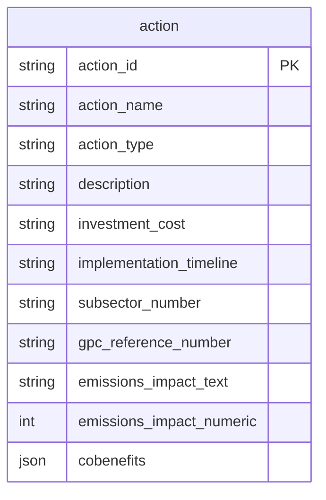
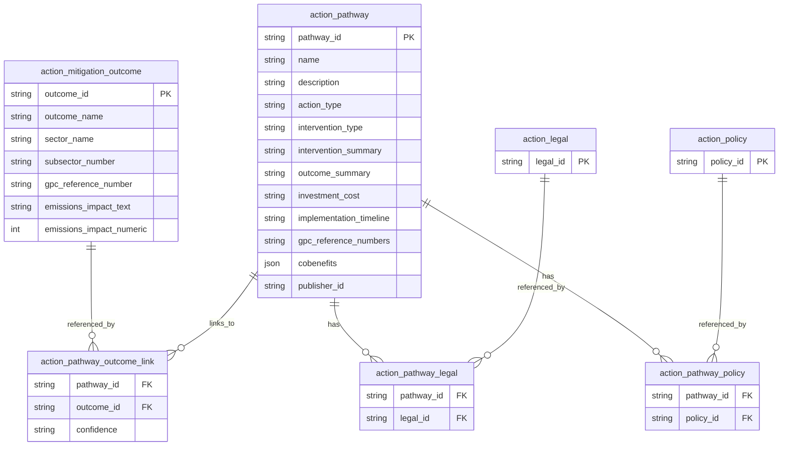
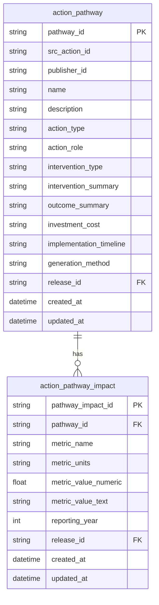

# Actions model — integration review

---

## 1. Purpose and scope

- **Mitigation** is the immediate MEED focus; **adaptation** is required for extensions (e.g., Brazil) and is modeled as interventions linked to hazards, not to transition elements.
- **v1 goal:** evolve from a flat `action` row toward a decomposed model (outcomes / pathways / interventions) without reshaping the entire catalog, map to TEF where defensible, and keep gaps explicit.
- **Out of v1:** action attributes (mediating system conditions) until source-backed or expert-authored catalogs exist.

---

## 2. Working vocabulary

- **Transition element (TE) / outcome:** the system change we want (e.g., electrification, reduced landfill methane, reduced risk to hazard in adaptation context).
- **Intervention:** the mechanism used to enable the change (regulation, financing, planning, program, infrastructure).
- **Action pathway:** a practical combination of intervention + TE/outcome. This is what our current action list aligns most closely with.

---

## 3. Conceptual thinking points

1. **Mechanism vs effect**
   - Intervention answers: *what are we doing to make change happen?*
   - Outcome/TE answers: *what system state changes, and with what effect?*

2. **Where legal and policy evidence belongs**
   - Legal authority, restrictions, thresholds, mandates, and policy commitments are evidence about implementation pathways.
   - These should support intervention claims first, then indirectly support linked outcomes.
   - Example: **"Implement congestion pricing and restrictions on high-polluting vehicles"** is an intervention action. Legal concepts like municipal charging authority, emission-zone bylaws, and exemption thresholds (e.g., emergency/service vehicles) are the primary evidence that the intervention is feasible and enforceable; the outcome (lower private-car use and emissions) is then linked as a downstream effect.

3. **Where mitigation/adaptation effect evidence belongs**
   - Emissions reduction potential, GPC relevance, and hazard effectiveness are effect-side claims.
   - These should be attached to outcome/TE logic, not used to define intervention mechanism.

4. **Pathway framing for current catalog**
   - Many current actions are mixed statements (mechanism + effect in one sentence).
   - Treat these as pathway-like entries for now, but keep explicit role tags so we can separate concerns later.

5. **Adaptation conceptual split**
   - Adaptation actions are typically interventions.
   - Their outcome side is not a TE in the mitigation sense; it is reduced risk/severity for specific hazards.

6. **Minimal attribution rule**
   - If a claim says *what enables implementation*, classify and evidence it on intervention side.
   - If a claim says *what changes in the system or impact*, classify and evidence it on outcome side.

---

## 4. Schema: where we are vs where we’re going

### 4.1 Current state — flat `action` only

The production-oriented sketch today is a single table: one row bundles name, type, description, cost, timeline, GPC hints, impact text/numeric, and co-benefits.

### 4.2 Future state (version 1) — decomposed entities

The target shape separates **mitigation outcomes** (system shifts / TE-aligned) from **pathways** (intervention + linkage), and attaches **legal** and **policy** evidence via junction tables to pathways.

**Naming alignment:** In implementation sketches, `action_mitigation_outcome` corresponds to the **transition element / outcome** concept in definitions; `action_pathway` is the compound “intervention enables outcome” unit surfaced to cities.

**Integration note:** the v1 rule set treats **intrinsic TE properties** (GPC, impact bands, co-benefits class) as living on the outcome/TE side, **mechanism properties** (cost, timeline, intervention type) on the intervention/pathway side, and **combined or confidence-bearing claims** on the pathway or link—as definitions specify.

---

### 4.3 Implemented first step (migration `c9a4e21bd301`)

The first shipped migration intentionally narrows scope to two production tables:

- `modelled.action_pathway`
- `modelled.action_pathway_impact`

This is a deliberate **staging** step before TEF outcome entities and mapping links are enforced in production.

**Why these decisions were made in first implementation:**

1. **Pathway-first matches source truth.**  
   Current expert-reviewed rows are predominantly pathway-like statements (mechanism + intended effect in one record), so persisting pathways first avoids forced decomposition.

2. **Impact kept as a separate fact table (`action_pathway_impact`).**  
   Current metrics are attached to pathway statements; separating impacts from pathway metadata preserves source fidelity and allows multiple metrics per pathway over time.

3. **Outcome/TE tables and pathway→outcome links were deferred.**  
   TEF-aligned outcomes are still being stabilized. Deferring these avoids premature hard constraints that would block ingestion while mappings are incomplete.

4. **Legal/policy link tables were deferred.**  
   They are conceptually valid but not required for the first production slice and would increase complexity before core pathway+impact ingestion is proven.

5. **`review_status` was intentionally omitted from DB shape.**  
   Production DB rows are treated as accepted records at write time; workflow review state is managed outside these tables.

6. **Provenance and audit columns were included from day one.**  
   Both tables include `release_id`, `created_at`, and `updated_at` to align with modelled-schema standards and ensure release-level traceability.

---

## 5. Vocabulary (single glossary)

| Term | Meaning | v1 ranking / surfacing |
|------|---------|-------------------------|
| **Action** | Catalog row with stable ID, source, role, provenance; unit of ingestion and versioning (C40, iCARE, IPCC, TEF). | Depends on role |
| **Transition element (TE) / outcome** | Mitigation: structural system shift (electrify, reduce waste methane, etc.). Carries GPC mapping, emissions logic, co-benefits, sustainability class. | **Ranked in v1 via pathways** |
| **Intervention** | Mechanism the city deploys (subsidy, regulation, program, etc.). Typed: financial, regulatory, planning, program, infrastructure. | **Ranked in v1 via pathways** |
| **Action pathway** | Directed composition: intervention → TE/outcome, with derived/combined properties and link confidence. | **Ranked in v1**  |
| **Mitigation vs adaptation** | `mitigation` or `adaptation`. Adaptation rows are almost always interventions; outcomes are hazard-risk reductions, not TEs. | Adaptation: rank intervention vs hazard effectiveness |
| **Action attribute** | Mediating system conditions between intervention and TE. | **Deferred** |

**Classification rule (roles):** TE if the primary verb is a system shift (shift, reduce, electrify, protect…); intervention if the primary verb is a mechanism (subsidise, mandate, fund…). Ambiguous rows stay unclassified until resolved.

---

## 6. Data sources and provenance

**Generation method (most → least defensible):** `source_declared` → `expert_reviewed` → `literature` → `inferred` → `llm_proposal` (**proposals never land in production**).

**Provider attribution:** distinguish **sourced** (cite catalog), **derived** (documented transform; upstream still cited), **authored** (internal expert review). Partner handovers (e.g., C40 curated lists) use `source` = immediate provider, `generation_method` = `expert_reviewed` for the partner panel, while MEED `review_status` stays `draft` until MEED sign-off.

---

## 7. Rules that drive integration

1. **Every mitigation intervention must link to at least one TE** — otherwise add the TE or exclude from mitigation catalog (post-ingestion DQ check).
2. **Every adaptation intervention must link to at least one hazard** (not a TE).
3. **Intrinsic properties stay with the entity they describe** — TE: GPC, impact, co-benefits; intervention: cost, type, timeline; **pathway link** for combined cost-effectiveness and similar.
4. **Legal and policy signals** support **implementation** — they attach to pathways / interventions first; outcomes are supported indirectly through linkage (see §3, especially point 2).

---

## 8. Cross-document synthesis: decisions, tensions, open items

### 8.1 Aligned decisions

- Keep the **existing action list** while introducing **role** (`outcome`/`intervention` or TE vs intervention) and **intervention_type** where applicable.
- **Map to TEF TEs** where possible; keep **unmapped** rows explicit—gaps are an honest state.
- **Defer attributes** until ClimateView ships them
- **No unsupported claims:** every production claim needs provider, method, and explanation; co-created partner data is acceptable with clear attribution.
- **Intake template** for new actions: required fields, role, intervention type when relevant, provenance, review tags for filtering.

### 8.2 Documented tensions (to resolve over time)

| Topic | Definitions / v1 rules | Thoughts / challenges |
|-------|-------------------------|------------------------|
| **ClimateView alignment** | TEF is canonical for TEs in covered sectors. | Open strategic question: **strict ClimateView alignment** vs **integrated framework** that extends TEF with missing layers—decision deferred. |
| **Identifiers** | (Implied stable IDs.) | `src_ref_0001`-style IDs are painful for ingestion refresh; move toward **canonical IDs from stable attributes** over time. |

### 8.3 Open design questions (not blocking v1 implementation)

- Scope-level disaggregation for emissions/co-benefits/energy metrics vs combined-by-scope presentation.
- Brazil-scale **adaptation**: interventions → hazard-risk outcomes (hypothesis in notes; not urgent for current MEED slice).
- Final **framework strategy** note: ClimateView-aligned vs integrated—draft after further discussion.