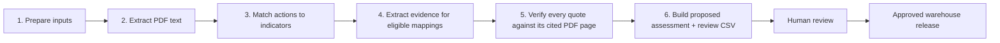

# Sector-action adaptation impact — working methodology

> **Status: all six sectors have complete proposed eligibility, source screening and component assessments. Human review is pending.** V1 remains a research release until the reviewed records are accepted.

## At a glance

| Question | Answer |
| --- | --- |
| What is the purpose? | Map adaptation actions to the vulnerability and exposure components of AdaptaBrasil sectors. |
| What is assessed? | One action × sector × component pair at a time. |
| How is eligibility decided? | By checking the action's primary mechanism against named terminal indicators. |
| How is effectiveness decided? | At component level. Proposed evidence produces a proposed assessment for review; accepted evidence produces the release assessment. |
| What does the method output? | Eligibility plus effectiveness, source sufficiency, implementation horizon and maladaptation categories. |
| What does it not output? | A city score. A later process joins the mapping to municipal AdaptaBrasil values and performs the arithmetic. |
| Where does human judgement enter? | People accept or reject the sources, evidence records and final mappings. |

## Why this method exists

The V1 workbook gets three important things right:

- eligibility refers to named AdaptaBrasil indicators rather than broad themes;
- the link must be part of the action's primary mechanism, not an incidental benefit;
- every positive effectiveness rating has a verbatim quote and page reference; `none_demonstrated` records a completed search that found no positive evidence.

The proposed method keeps those principles while moving the work into validated records. This prevents stale ratings, makes the assessment re-runnable when evidence changes, and makes every mapping traceable from action definition to indicator, evidence and final category.

## How the implementation runs

Document extraction and evidence extraction are different operations. The pipeline first converts every retrieved PDF into reusable page-marked text. It then matches actions to indicators. Only after that does it search retrieved, non-rejected candidate sources for evidence, limited to eligible mappings. Candidate evidence can produce a proposed assessment; only human-accepted sources, screening decisions and evidence can produce a released assessment.

| Stage | What happens | Output or checkpoint |
| --- | --- | --- |
| 1. Prepare inputs | Validate actions, indicators, documents and sector source assignments; maintain one proposal row for every action × sector × component pair. | Stable reference CSVs and the combined matching work queue. |
| 2. Extract documents | Convert each retrieved PDF into text with physical PDF page headings. | Reusable page-marked text. |
| 3. Match actions | An AI or analyst compares action definitions with terminal indicators; the script validates the recorded proposals. | `eligible`, `not_eligible` or `review_required`, plus the indicators establishing eligibility. |
| 4. Extract evidence | An AI or analyst searches retrieved, non-rejected candidate sources for eligible mappings; the script validates each page-located proposal. | Proposed evidence and complete candidate-source screening coverage. |
| 5. Verify grounding | Normalize each quote and its cited extracted PDF page, then compare their ordered words and page-level token coverage. | Exact and strong ordered matches pass; layout-sensitive matches require review; insufficient matches stop the run. |
| 6. Build output | Require a grounding result for every evidence record, apply the ordered rules to the current non-rejected evidence and copy the action time horizon. | A proposed action-to-risk CSV plus a joined assessment-and-evidence review CSV. |

## Core concepts

| Concept | Meaning in this method |
| --- | --- |
| Sector | An AdaptaBrasil risk domain, such as Water Resources or Health. |
| Component | `vulnerability` or `exposure`. Hazard is currently excluded. |
| Indicator-referenced eligibility | An eligible mapping names the terminal indicators that establish the pathway. A terminal indicator is the lowest available node in that sector-component branch; it may be level 4, 5 or 6. |
| Component-level effectiveness | One effectiveness class is derived for the action, sector and component as a whole. Indicators do not receive separate effectiveness classes. |
| Positive evidence | A non-rejected evidence row whose direction is `supports` or `qualifies`. Only accepted rows from accepted sources and screening decisions are used for a released assessment. |
| Complete screening | Every retrieved, non-rejected candidate source in scope for the sector was checked, including sources that produced no quote. Release also requires those sources and screening decisions to be accepted. |
| Source sufficiency | An operational description of the number and tier of supporting sources. It is not scientific confidence. |
| Maladaptation | An adverse or rebound effect described by accepted evidence for the same action, sector and component. |

## Eligibility

The eligibility question is:

> Does the action's primary mechanism have a direct pathway to at least one approved terminal indicator of this component?

The terminal-indicator rule uses the lowest node supplied by the AdaptaBrasil indicator bank rather than assuming every branch has the same depth. In the current workbook, most vulnerability branches end at level 6, Energy Security vulnerability ends at level 5, and Exposure ends at level 4 or 5. The indicator id, not its depth, is the controlled reference.

Eligibility uses the action definition and indicator framework, not the evidence PDFs.

- A narrow example inside a broad action does not make the whole action eligible.
- A secondary benefit of a mechanism aimed elsewhere does not qualify.
- An eligible record names at least one indicator.
- An ineligible record names no indicators and does not proceed to evidence screening.
- An ambiguous pathway is `review_required` and remains `not_assessed` until resolved.

### Current exposure rule

An exposure mapping is eligible only when the action directly changes the terminal exposure quantity used by that sector. For population- or user-based indicators, that means changing the presence, location or number of exposed people or users; planned migration and resettlement therefore qualify. For land- or ecosystem-based indicators, it means directly changing the named coverage or area, such as natural coverage or protected area. Eligibility does not assume that exposure improves: the evidence determines direction and any trade-offs.

## Evidence extraction and review

Each evidence record contains one verbatim quote for one action, sector and component. A claim supported by three sources therefore produces three records rather than three excerpts combined in one spreadsheet cell.

| Annotation | Meaning |
| --- | --- |
| `indicator_ids_addressed` | Indicators the quote speaks to, whether positively or negatively. |
| `direction` | `supports`, `qualifies` or `contradicts` the mechanism. |
| `quantified_value` | Optional outcome figure copied from the quote when useful. It is descriptive and does not affect effectiveness. |
| `support_scope` | Whether the evidence covers the `whole_action` or only a `partial_action`. |
| `maladaptation_signal` | Whether the quote describes an adverse or rebound effect. |

The record also carries the source, physical PDF page, printed page where available, quote language and extraction run. Proposed evidence contributes to the proposed assessment shown to reviewers. It cannot contribute to an approved release until a person accepts it.

### Quote grounding

Every evidence quote is checked against the extracted text for its cited physical PDF page before an assessment is built.

| Grounding result | Rule | Consequence |
| --- | --- | --- |
| `verified_exact` | The normalized quote occurs on the normalized page text. | Pass automatically. |
| `verified_ordered` | At least 95% of quote words match in order on the cited page. | Pass automatically. |
| `layout_match` | Strong page-level token coverage or at least 90% ordered coverage exists, but columns or tables altered extraction order. | The evidence is marked `needs_review` unless a person has already accepted or rejected it. |
| Failure | The quote does not meet any grounding rule. | Stop the pipeline; the evidence cannot reach the assessment output. |

Normalization handles Unicode, punctuation, whitespace and line-break hyphenation. Layout matching also requires a contiguous word anchor, so a collection of common words elsewhere on the page is not enough. Human acceptance is still required for a release and confirms that a `layout_match` is a faithful quote rather than a reordered synthesis.

Proposed screening is complete only when the rows in `releases/v1/data/output/screening.csv` cover the retrieved, non-rejected candidate source set for the sector. This preserves the difference between “nothing supporting was found” and “the sources have not all been read.” A release assessment additionally requires every source and screening record used by the mapping to be accepted.

## Deriving the warehouse fields

The rules are evaluated from top to bottom. The first matching rule wins, so each input state has one deterministic result.

### Effectiveness

| Order | Condition | Result |
| --- | --- | --- |
| 1 | Eligibility is `not_eligible`. | `not_applicable` |
| 2 | Eligibility is `review_required`, or screening is incomplete. | `not_assessed` |
| 3 | Screening is complete and no positive evidence exists. | `none_demonstrated`; review is required if contradicting evidence exists. |
| 4 | Positive evidence exists and a `whole_action` row contradicts the mechanism. | `low`; mapping review is required. |
| 5 | Every positive row qualifies the mechanism, or every positive row covers only part of the action. | `low` |
| 6 | At least two distinct sources support the whole action, with no qualifying or contradicting row. | `high` |
| 7 | Positive evidence exists and no earlier rule matched. | `medium` |

This is an operational preference rule, not a scientific effect-size estimate. A partial-action contradiction prevents `high` and raises the maladaptation flag, but does not by itself cap the whole action at `low`. Any contradiction is shown for human review.

### Source sufficiency

| Order | Condition | Class |
| --- | --- | --- |
| 1 | Eligibility is `not_eligible`. | `not_applicable` |
| 2 | Eligibility is `review_required`, or screening is incomplete. | `not_assessed` |
| 3 | No positive evidence exists. | `none` |
| 4 | Positive evidence comes from at least two distinct sources and at least one is tier A or B. | `broad` |
| 5 | At least one positive row comes from a tier A or B source. | `moderate` |
| 6 | Positive evidence comes only from tier C sources. | `limited` |

The proposal pass uses non-rejected evidence. Once every review decision is resolved, the same rules are rerun using accepted evidence only. The tiers are an operational source hierarchy: tier A covers AdaptaBrasil methodology, IPCC AR6 and Brazilian federal plans; tier B covers multilateral institutions; tier C covers academic, NGO and other sources. They describe the provenance mix used by the index, not scientific certainty or study quality.

### Calculation inputs carried by the mapping

| Field | Source | Downstream preference meaning |
| --- | --- | --- |
| `effectiveness_class` | Ordered effectiveness rules | Higher is preferred, all else equal. |
| `source_sufficiency` | Positive evidence in the current assessment basis | Broader source coverage is preferred, all else equal. |
| `time_horizon` | Authoritative action catalogue | A shorter implementation horizon is preferred. Missing values become `unknown`. |
| `maladaptation_flag` | Evidence in the current assessment basis | A signal lowers preference. |
| `parameters_version` | Versioned parameter file | Results are comparable only within the same version. |

A later process may calculate a component prioritisation index as:

`effectiveness weight × source-sufficiency factor × time-horizon factor × maladaptation factor`

The result is for ordering preferences. It must not be presented as an effect magnitude, probability or measure of scientific certainty. City risk values and any cross-component or cross-sector aggregation belong to the downstream processing contract.

## Human review

The validated CSV records are the system of record. `releases/v1/data/output/assessment_evidence_review.csv` is the generated sharing view: it places each proposed component assessment beside every linked quote. The ICare Excel workbook in `releases/v1/outputs/` is generated from the same records for human review and is not a second calculation source of truth.

| Review table | What the reviewer checks | What acceptance means |
| --- | --- | --- |
| Source review | Title, publisher, URL, stored PDF, hash, page count, tier and access status. | The document may support a released assessment. |
| Evidence review | Grounding result, quote, pages, indicators, direction, action coverage, optional quoted value and maladaptation signal. | The evidence may contribute to the derivation rules. |
| Assessment review | Eligibility, screening coverage, accepted evidence and all derived mapping inputs. | The mapping may enter the accepted V1 output. |

Only four fields may return from any review table: `review_status`, `review_note`, `reviewed_by` and `reviewed_at`. Changes to other fields are reported rather than silently imported; the correction must be made upstream.

- Machines write `proposed` or `needs_review`.
- Only a named person may write `accepted` or `rejected`.
- Rejection, contradiction and requested corrections require a review note.
- Bulk status changes without row-level inspection do not count as review.
- An accepted whole-action contradiction caps a positive effectiveness result at `low`. A partial-action contradiction prevents `high`. With no positive evidence, the result is `none_demonstrated`. All contradictions require mapping review.

When an accepted input changes, the derived assessment is rebuilt and its review status returns to `proposed`. Human acceptance therefore never carries silently across a changed result.

## CSV contracts

| CSV | One record represents |
| --- | --- |
| `releases/v1/data/input/mapping_proposals.csv` | One editable action × sector × component matching decision. Missing combinations are initialized as `review_required`; existing decisions are preserved. |
| `releases/v1/data/input/evidence_proposals.csv` | One editable page-located evidence proposal for an eligible mapping. |
| `releases/v1/data/reference/documents.csv` | One stored PDF and its extraction status. |
| `releases/v1/data/reference/sector_sources.csv` | One document assigned as an evidence source for one sector. |
| `releases/v1/data/output/mappings.csv` | One action-to-sector-component mapping and its categorical calculation inputs. |
| `releases/v1/data/output/mapping_indicators.csv` | One terminal indicator establishing eligibility for a mapping. |
| `releases/v1/data/output/screening.csv` | One source checked for one mapping, including checks that found no quote. |
| `releases/v1/data/output/evidence.csv` | One page-located quote for one mapping, including its deterministic grounding result and note. |
| `releases/v1/data/output/evidence_indicators.csv` | One terminal indicator addressed by one evidence record. |
| `releases/v1/data/output/assessment_evidence_review.csv` | One proposed component assessment joined to one evidence quote for collective human review. |
| `releases/v1/schemas/score_parameters.json` | One version of the downstream preference weights. |

The primary delivery file is `releases/v1/data/output/action_risk_mapping.csv`. The other output CSVs retain the evidence lineage needed to rebuild it. Joins use identifiers rather than names. Pipe-delimited identifiers are allowed only in archived proposal inputs; active relationship files store one identifier per row.

Evidence content is immutable. Its identifier is derived from the assessment pair, source, page, quote and evidence annotations. Corrected evidence becomes a new record and the earlier record is rejected. Human-review metadata may change without changing the quoted evidence.

## Validation and rerunnability

Structural failures stop the run. The minimum checks are:

- every indicator exists and belongs to the stated sector and component;
- every proposed evidence source is retrieved and not rejected; every released source, screening decision and evidence record is accepted;
- every physical page falls within the PDF page count;
- every evidence quote passes exact, ordered or layout-sensitive grounding against its cited extracted PDF page;
- eligibility, screening status, effectiveness and source sufficiency form a valid combination;
- complete screening rows cover the full retrieved, non-rejected candidate source set;
- every category exists in the referenced parameter version;
- accepted and rejected records identify a reviewer and date;
- a known out-of-sector negative control remains ineligible.

Reruns follow three rules:

1. Stage 1 adds missing action × sector × component rows without overwriting recorded proposal decisions; every later script reads explicit CSV inputs or files produced by an earlier stage.
2. Re-ingesting identical evidence for the same mapping is a no-op.
3. Proposed assessments are rebuilt from non-rejected evidence; released assessments are rebuilt from accepted evidence and versioned parameters rather than edited in place.

Evidence and assessment records carry run identifiers. Model, prompt and code provenance for those runs is retained with the release.

## Open decisions

| Question | Current position | Decision still needed |
| --- | --- | --- |
| Exposure | Actions must directly change the sector's terminal exposure quantity: exposed users/population, or named land/ecosystem coverage. | Confirm the sector-specific interpretation during human review; do not broaden it to indirect sensitivity effects. |
| Parameter weights | The weights are author-chosen and uncalibrated. | Inspect the proposed all-sector classifications before selecting or calibrating weights. |
| Hazard | Hazard is excluded because an adaptation action is not assumed to change the climate hazard itself. | Decide how to handle hazard-related terminal indicators that actions can affect. |

## References

- Dataset overview: `README.md`
- V1 implementation: `releases/v1/implementation.md`
- Source-workbook review: `releases/v1/review.md`
- Structural pattern: `reviews/br-federal-government/br-climate-policy-documents`
- Engineering conventions: `knowledge-base/topics/engineering-standards/`
- Notebook structure: the dataset-review skill's `references/notebook-template.md`
- Action catalogues: `reviews/c40/c40-high-impact-actions`, `reviews/ipcc/ipcc-climate-actions`, `reviews/icare/icare-climate-actions`
- Sector and indicator framework: `reviews/br-mcti/br-adaptabrasil`
