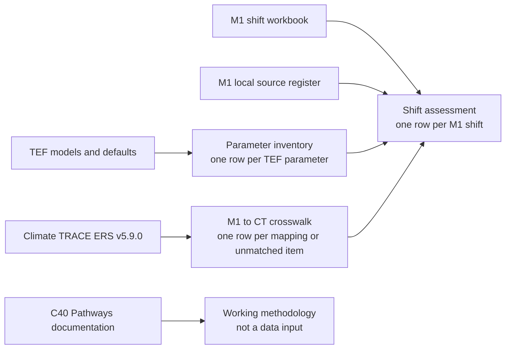

# OEF - Brazil emissions-reduction potential evidence layer

This started review covers the OEF-authored evidence layer for estimating and comparing emissions-reduction potential across the M1 transition elements in Brazil. Step 1 (provenance, access and licence) was completed on 2026-09-01. The current artifacts connect the M1 shift catalogue to ClimateView TEF models and parameters and to Climate TRACE's Brazil emissions-reducing solutions output; they do not yet constitute a production calculation engine or a set of independently reproducible city estimates.

## Review boundary

The review treats the evidence layer as an OEF derived product because no single external dataset supplies its rows. The current product has four data inputs and one methodological reference:

| Component | Role in the current evidence layer | Step 1 finding |
|---|---|---|
| M1 shift catalogue | Defines the 205 in-scope transition rows and their policy-facing granularity | **Verified:** the reviewed Excel snapshot is included in this release. **Unanswered:** it has no formal release identifier or redistribution terms. |
| M1 local data-source register | Lists 85 Brazil parameter or data requirements and up to three candidate sources for each requirement | **Verified:** the original workbook and a normalized CSV are included in this release. Candidate sources have not yet been individually validated for fitness, currency or licence. |
| Climate TRACE ERS plan v5.9.0 | Supplies source-level Brazil solution assignments, reported annual reductions and difficulty scores | **Verified:** the July 2026 global CSV is available from Climate TRACE; the raw 529 MB file is not committed here. The accompanying guide identifies `ers_plan_global.zip` as the canonical download package. |
| ClimateView Transition Element Framework | Supplies model structure, parameter references and default values used in the parameter inventory and worked reconstructions | **Verified:** a named August 2026 working snapshot was reviewed and its parameter evidence is frozen in this release. The reviewed source carried a CC BY-NC-SA 4.0 licence. |
| C40 Pathways / Pathways-AQ | Informs the proposed activity, calibration, default/proxy and baseline-versus-policy architecture | **Verified:** the public technical manual is accessible. **Unanswered:** the underlying Pathways GHG model, parameter database and city input files are not publicly available and are not inputs to the current tables. |

The C40 material therefore remains design evidence at this stage. It must not be described as a source of calculated values in the current OEF product.

## Canonical sources and access

The first OEF research release is dated **2026-08-26**, matching the latest analysis date represented in the tables. It contains the generated evidence CSVs and the two small M1 source workbooks needed to understand them. The large Climate TRACE raw input remains external. This is a captured working release, not a production-approved dataset.

| Source | Version or snapshot | Access result | Retrieval status |
|---|---|---|---|
| Climate TRACE emissions-reducing solutions | Inventory v5.9.0, July 2026 | **Verified:** the review used the global ERS package and filtered it to Brazil. The public [Climate TRACE downloads page](https://climatetrace.org/downloads) is the canonical acquisition route. | Raw input not committed because of its size. A refresh must record the inventory version and access date. |
| Climate TRACE methodology and licensing guidance | ERS framework, November 2025; inventory guide v5.9.0 | **Verified:** Climate TRACE publishes its [methodology repository](https://github.com/climatetracecoalition/methodology-documents) and the [ERS framework PDF](https://github.com/climatetracecoalition/methodology-documents/blob/main/2025/Post%20Processing%20for%20Global%20Emissions%20and%20Metadata%20Completeness/Emissions-Reducing%20Solutions%20Framework%20for%20Climate%20TRACE-112025.pdf). | Public methodology links are used instead of machine-local PDF paths. |
| ClimateView TEF | Working repository snapshot reviewed 2026-08-25 | **Verified:** the reviewed models, parameter files and licence informed the 2,336-row parameter inventory. ClimateView describes TEF on the [official TEF site](https://www.transitionelements.org/) and its [open-source page](https://www.climateview.global/us/opensource). | The release is pinned by its copied parameter inventory and review date, not by an unexplained fork commit. Its relationship to the current upstream code still needs to be recorded before refresh. |
| M1 shift catalogue | Internal working snapshot, 2026-08-14 | **Verified:** [`m1_shift_catalogue.xlsx`](releases/2026-08-26/data/m1_shift_catalogue.xlsx) is included and contains the source sheets used by the review. | **Unanswered:** no formal version identifier, redistribution statement or update process is recorded. |
| M1 local data-source register | Internal working snapshot, 2026-08-17 | **Verified:** the original [`m1_local_data_source_register.xlsx`](releases/2026-08-26/data/m1_local_data_source_register.xlsx) and normalized [`m1_local_data_source_register.csv`](releases/2026-08-26/data/m1_local_data_source_register.csv) are included. | Source candidates require field-level validation; inclusion does not approve their reuse terms. |
| C40 Pathways-AQ technical manual | March 2022 | **Verified:** the manual can be downloaded from the [C40 Knowledge Hub](https://www.c40knowledgehub.org/s/article/Pathways-Air-Quality-Pathways-AQ?language=en_US). | **Verified for the manual; unanswered for the model:** the public page directs cities and consultants to contact C40 for tool access, while the original Pathways GHG model is not publicly downloadable. |

Climate TRACE and TEF are live upstream sources rather than frozen products. A later Climate TRACE inventory or TEF snapshot supersedes them only after a new review release is profiled and compared; it must not silently replace the reviewed inputs.

## Why we use it

The evidence layer supports the open need for emissions-reduction potential per mitigation action by making the limits of each source visible at the M1 shift level.

- It records which M1 shifts have a TEF model and what parameters those models require.
- It records where Climate TRACE provides a semantically equivalent or partial Brazil solution and keeps the published result separate from a transferable calculation coefficient.
- It provides the working basis for assigning reusable calculation families and identifying which parameters need local data, a governed default or an explicit scenario assumption.
- It preserves C40 Pathways as a candidate source of calculation conventions, city data-collection templates and proxy parameters without claiming access to its unpublished GHG model.

## Data structure

The useful material resolves into four tables with distinct grains. Keeping these grains separate prevents a Climate TRACE family total from being mistaken for an M1 shift estimate, a TEF default from being mistaken for local Brazil data, or a candidate source from being mistaken for an approved parameter value.

*The durable product is a shift assessment supported by separate parameter and solution-mapping evidence; C40 belongs in the method, not in the current data lineage.*

| Artifact | Grain and verified shape | Durable value | Carry-forward decision |
|---|---|---|---|
| M1 shift data-source assessment | One row per in-scope M1 shift; 205 rows × 78 columns | Primary assessment table combining calculation family, parameter burden, available sources, Climate TRACE coverage and the next data action | Included as the release's main table, but not yet reproducible because its generation rules are not captured in a notebook or script. |
| Climate TRACE Brazil to M1 crosswalk | Long-form edge list plus explicit unmatched records; 325 rows × 51 columns | Auditable mapping evidence covering all 205 M1 shifts and all 104 normalized Climate TRACE Brazil solution families | Included as mapping evidence. The existing Python builder should become the basis of the release extraction notebook. |
| TEF parameter inventory | One row per unique TEF parameter; 2,336 rows × 38 columns, including 633 parameters used by M1-matched TEF models | Parameter registry with meaning, unit, default, source level and expected data effort | Included as supporting evidence. A reproducible extraction path was not found and must be added before production review. |
| M1 local data-source register | 85 parameter/data requirements × 29 normalized columns; 74 requirements name at least one candidate source and 11 are explicit gaps | Starting register for Brazil baseline activity, stock, mix, factor and projection sourcing; contains 128 dataset or methodology URLs | Included as both the original workbook and a Git-readable CSV. Candidate sources are leads, not validated parameter values. |
| Climate TRACE global ERS CSV | One row per published source-solution result; 2,406,480 rows × 10 columns, including 265,468 Brazil rows | Canonical raw source for the Brazil solution results | Keep outside Git. Record the hash and re-download route; read the Brazil slice in the extraction notebook. |
| M1 shift workbook | Three sheets; the tabular `TEF shifts` sheet contains 282 rows, of which 119 are `Include` and 86 are `Add shift` | Canonical working source for the 205-row M1 scope | Included as a frozen working snapshot. Parse only the named data sheet; confirm redistribution terms before treating the release as public-ready. |

The dated release directory is the review snapshot. Refreshes should create a new release rather than replacing these files in place.

## Profile findings

The tables support the working conclusion that sourcing and governing data is a larger burden than implementing most calculation families. Of the 205 shifts, 197 are assessed as low- or medium-complexity calculations, while 203 have medium or high data-sourcing complexity **verified**. All 205 assessments remain initial desk work: 115 have medium confidence and 90 have low confidence, so the table is suitable for planning the review workload but not yet for publishing shift results.

The main coverage measures reconcile to the source files **verified**:

| Measure | Result |
|---|---:|
| In-scope M1 shifts | 205 |
| Shifts with a TEF model and parameter contract | 115 |
| Shifts with a direct Climate TRACE match | 19 |
| Shifts with a partial Climate TRACE match | 71 |
| Climate TRACE Brazil result rows | 265,468 |
| Normalized Climate TRACE solution families | 104 |
| TEF parameters in the reviewed repository | 2,336 |
| TEF parameters used by M1-matched models | 633 |
| M1 local data requirements | 85 |
| Requirements with at least one proposed source | 74 |
| Explicit source gaps | 11 |
| Dataset and methodology URLs in the source register | 128 |

The four normalized evidence tables contain no empty rows or exact duplicate rows **verified**. The source Climate TRACE file contains two exact duplicate Brazil rows, both very small `Unspecified solution` records. A release calculation must remove or explicitly retain these through a documented rule rather than relying on accidental row multiplicity.

## Licence

The combined product is not cleared for public or commercial redistribution at Step 1. As an OEF derived product it inherits the most restrictive terms of every upstream component and grants no new rights over those inputs.

| Component | Licence finding | Consequence for this review |
|---|---|---|
| Climate TRACE v5.9.0 | **Verified:** the supplied licensing guide states CC BY 4.0 for Climate TRACE data, subject to listed source-specific exceptions, and requires attribution to the inventory version and access date. | Derived tables may use Climate TRACE fields with attribution, but Step 2 must check whether any Brazil ERS rows depend on an exception before a redistributable release is approved. |
| ClimateView TEF repository | **Verified:** the repository `LICENSE` and README apply CC BY-NC-SA 4.0. | Reuse and adaptation are restricted to non-commercial purposes, require attribution and impose share-alike on adaptations. This is currently the most restrictive explicit upstream licence and may be incompatible with the intended product licence. |
| M1 shift catalogue and local data-source register | **Unanswered:** no licence or internal distribution statement accompanies the working workbooks. | The workbooks and derivatives should remain internal until ownership and redistribution terms are recorded; source URLs must also be checked individually before redistribution or automated ingestion. |
| C40 Pathways-AQ manual and model | **Unanswered:** public accessibility of the manual does not establish reuse rights for the manual, model or parameter database. | The manual may be cited as methodological evidence. No C40 formula implementation, parameter table or model output should be redistributed until C40 confirms access and licence terms. |

The licence gate can be resolved either by obtaining permissions compatible with the intended product or by keeping restricted sources as non-redistributed references and independently sourcing or deriving production parameters and equations. That decision is outside Step 1 and requires product/legal ownership.

## Spatial and temporal scope

The current quantitative output is Brazil-specific only where it uses the Climate TRACE ERS rows. The M1 taxonomy and TEF models are global structures, and the TEF default values are not Brazil observations. C40 Pathways-AQ has no Brazilian application in the public six-city material reviewed so far.

The Climate TRACE input is a July 2026 inventory release. The working crosswalk and parameter assessments were produced on 2026-08-25 and 2026-08-26. The target year, baseline year and adoption scenario remain properties of the future calculation layer rather than of this evidence-layer review.

## Interpretation warnings

The current tables describe coverage, evidence and external results; they do not assign a defensible emissions-reduction value to every M1 shift.

- Climate TRACE results remain at Climate TRACE source and solution-family grain. The same family can map to several M1 shifts, so summing the crosswalk repeats published reductions and overstates potential.
- A direct semantic match does not prove that the Climate TRACE result uses the boundary, adoption level or affected activity intended for an M1 scenario. The published output does not expose the input activity and factor values needed to reproduce a result.
- `ct_brazil_unique_sources` is not a reliable entity count. Climate TRACE leaves `source_id` blank on 163,591 Brazil rows, and repeated municipality names can refer to different municipalities. The crosswalk builder falls back to source name and therefore collapses same-named places.
- The TEF inventory records a numeric global default for every parameter, but availability is not fitness. Of the 633 M1-scope parameters, 396 are marked for local/current replacement or an agreed projection, 36 are explicit scenario assumptions, 151 allow a reviewed default only as fallback, and 50 allow a default after review.
- The shift assessment's confidence field applies to the desk assessment, not to a quantified uncertainty interval. It cannot be used as a numerical error bound.
- The M1 workbook includes a separate 50-row `Pathways and Bank actions` sheet. It is not part of the current 205-shift evidence tables and should not be silently joined to them by name.

## Parsing notes

The reviewed files are structurally readable, but several conventions will break a naive import or aggregation.

- Read all identifier and classification columns as strings. Literal `NA` values occur in M1 fields such as TEF code, description and required granularity; default CSV null coercion erases the distinction between a stated `NA` and an empty field.
- Trim `strategy_name` before matching. In the raw Brazil data, 22,731 rows have trailing spaces in the strategy name; normalization reduces 59 raw spellings to 58 strategy names while retaining 104 sector-plus-strategy families.
- Do not derive a Climate TRACE row key from `source_id` alone because 163,591 Brazil rows have no ID. Do not substitute `source_name` as a unique key: 7,760 rows repeat a name-sector combination, primarily because municipalities in different states share names and the ERS file contains no state or geometry field.
- Treat the crosswalk as an edge list. `m1_ct_match`, `m1_unmatched` and `ct_unmatched` are different record types and have intentionally different null patterns; filtering to match rows silently loses the declared coverage denominators.
- Treat semicolon-heavy cells as denormalized text unless a column-specific parser is defined. Several list-like columns use semicolons, while prose fields also contain semicolons, so a global split rule is unsafe.
- The M1 workbook's `Readme` sheet is formatted document content with unnamed columns, empty rows and duplicate layout rows. Only `TEF shifts` is the source table for this review; `m1_source_row` refers to the original worksheet row carried through extraction.
- The local data-source workbook has a grouping row above its actual header. The normalized CSV starts with an explicit 29-column header and preserves 85 requirements. Blank provider cells mean that the register has not proposed a source; they are not proof that no source exists.
- Treat the local data-source register as discovery evidence. Its 128 URLs and provider labels have not yet been checked systematically for current access, geographic fit, temporal coverage, transformation burden or licence.
- One M1 nitrous-oxide label is mojibake in both generated M1 tables (`N‚ÇÇO` rather than `N₂O`), and one Climate TRACE Brazil source name is visibly mis-decoded. Fix these through an explicit text-normalization rule while retaining the original value for audit.
- Numeric Climate TRACE fields parse cleanly in the Brazil slice. `total_emissions_reduced_per_year` is positive throughout and is expressed in annual `co2e_100yr`; difficulty scores range from about 1 to 10. Empty strategy descriptions occur for 5,564 `Enhanced rock weathering` rows and must not be interpreted as missing strategy identity.

## Step 1 gate result

The review is **applicable** because it directly serves the Brazil portion of the action-reduction-potential need and spans all M1 mitigation sectors. It is **profilable now** because the source workbooks and generated evidence tables are included here, while the TEF working snapshot and 529 MB Climate TRACE input were available during the review and have public acquisition routes. A review folder is therefore warranted.

The main Step 1 surprise is that C40 currently contributes a useful modelling pattern but no reviewable GHG dataset. The immediately profilable product is the existing OEF cross-source evidence layer, while access to C40's workbook and parameter database remains a separate provenance and licence question.

## Current review status

No release is production-approved. Research release **2026-08-26** contains the three core evidence CSVs, the M1 shift catalogue and the local data-source register in original and normalized form. The root working methodology consolidates the durable analysis previously spread across four private working notes, so those notes are no longer repository dependencies. The 529 MB Climate TRACE raw file remains external. The remaining release work is a reproducible extraction notebook, fit-for-purpose review, human adjudication of medium/low mappings, and the final release `review.md`.

### References

- [Originating action-reduction-potential need](../../../../dataset-discovery/needs/2026-06-action-reduction-potential/)
- [Working calculation methodology](methodology.md)
- [M1 shift data-source assessment](releases/2026-08-26/data/m1_shift_data_source_assessment.csv)
- [Climate TRACE to M1 crosswalk](releases/2026-08-26/data/climate_trace_brazil_m1_shift_solution_crosswalk.csv)
- [TEF parameter inventory](releases/2026-08-26/data/tef_parameter_inventory.csv)
- [M1 local data-source register, normalized CSV](releases/2026-08-26/data/m1_local_data_source_register.csv)
- [M1 local data-source register, original workbook](releases/2026-08-26/data/m1_local_data_source_register.xlsx)
- [M1 shift catalogue, original workbook](releases/2026-08-26/data/m1_shift_catalogue.xlsx)
- [Climate TRACE data downloads](https://climatetrace.org/downloads)
- [Climate TRACE methodology repository](https://github.com/climatetracecoalition/methodology-documents)
- [Climate TRACE emissions-reducing solutions framework](https://github.com/climatetracecoalition/methodology-documents/blob/main/2025/Post%20Processing%20for%20Global%20Emissions%20and%20Metadata%20Completeness/Emissions-Reducing%20Solutions%20Framework%20for%20Climate%20TRACE-112025.pdf)
- [ClimateView Transition Element Framework](https://www.transitionelements.org/)
- [ClimateView open-source overview](https://www.climateview.global/us/opensource)
- [C40 Pathways-AQ page](https://www.c40knowledgehub.org/s/article/Pathways-Air-Quality-Pathways-AQ?language=en_US)
- [C40 Pathways-AQ technical manual](https://c40.my.salesforce.com/sfc/p/36000001Enhz/a/1Q000000ZeOh/toqQwo6d1UngoNiXDDnmh1nYQ_Wfm8ThHnUEwNxQm6E)
