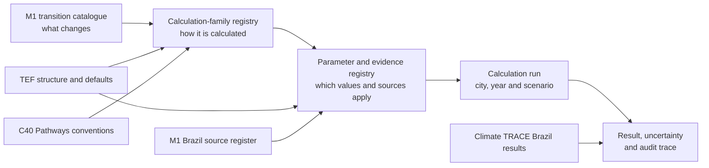

# Brazil emissions-reduction potential - working methodology

Status: **working methodology, not production-approved**. This document consolidates the durable decisions and evidence from the August 2026 OEF/C40 discussion, the TEF parameter review, the Climate TRACE Brazil crosswalk and the three worked calculation comparisons. It defines how the copied evidence tables should be interpreted and the calculation system they are intended to support; it does not claim that all 205 M1 shifts can already be calculated.

The original working notes are not required to use this repository. Their high-value content is carried forward here: product and transparency expectations; TEF model coverage and parameter burden; the Climate TRACE solution crosswalk and result-use limits; the worked same-input calculation comparisons; and the licensing, replication and delivery decisions that follow from them. Public upstream methodology is linked in the references rather than through private filesystem paths.

## Purpose and working decision

The intended product is a city-context-adjusted indication of annual emissions-reduction potential for comparing and prioritising mitigation actions. It is not a project appraisal. A precise point estimate is appropriate only when the activity, eligibility, adoption, intensity, emissions-factor and interaction inputs justify it; otherwise the product should return a numerical range or a magnitude band tied to explicit tCO2e thresholds.

The working decision is to review each M1 transition element individually while implementing a smaller library of reusable calculation families. M1 remains the policy-facing taxonomy, and shared equations do not by themselves justify merging shifts that differ in actors, eligibility, adoption, local data or implementation pathway.

## System structure

The method separates the description of a transition from its equation, evidence and individual calculation runs.



*The calculation engine owns the result. TEF and C40 inform its structure, while Climate TRACE remains an external benchmark unless a source-level estimate passes a specific reuse review.*

| Component | Intended role | Current evidence status |
|---|---|---|
| M1 shift catalogue | User-facing definition of the transition, its scope and required policy granularity | **Verified:** 205 rows are currently in scope. |
| M1 Brazil data-source register | Candidate local/national sources for activity, stock, mix, factor and projection inputs | **Verified:** 85 requirements are catalogued; 74 have at least one proposed source and 11 are explicit gaps. Source fitness and licence are not yet validated. |
| TEF | Starting ontology, activity chains, units, parameter definitions and reviewed fallback candidates | **Verified:** 115 M1 rows have a mapped TEF model; 633 unique TEF parameters occur in those models. Model presence is not calculation approval. |
| Climate TRACE | Brazil source-level solution results, solution descriptions and an external scale benchmark | **Verified:** 19 shifts have a direct semantic match and 71 have a partial match. Published result inputs are not exposed. |
| C40 Pathways / Pathways-AQ | Activity-calculation, calibration, proxy/default and baseline-versus-policy conventions | **Verified for the public manual:** the action logic aligns with the proposed families. **Unanswered:** the underlying GHG workbook and parameter database are not available in the current evidence layer. |
| OEF calculation layer | Canonical equations, parameter precedence, scenario assumptions, interaction rules and result trace | **Working design:** not implemented across the action set. |

## Calculation contract

Most shifts can be expressed as a visible sequence rather than a single opaque coefficient:

```text
eligible activity = baseline activity × eligible share

shifted activity = eligible activity × adoption rate

source intensity = source resource or process intensity × source emissions factor

target intensity = target direct intensity + induced-sector intensity

gross reduction = shifted activity × (source intensity − target intensity)

net reduction = gross reduction − interaction, leakage or rebound adjustments
```

The exact terms vary by family. An efficiency action applies a saving rate to baseline consumption; capture actions apply capture and destruction efficiencies to eligible emissions; land actions use area, practice and time-dependent removal or avoided-emissions factors. The contract is that each input and intermediate remains inspectable and unit-consistent.

Each result must carry:

- shift and calculation-family identifiers;
- geography, baseline year, result year and scenario;
- baseline, eligible and shifted activity;
- adoption and eligibility assumptions;
- source, target and induced intensity components;
- direct, induced and interaction-adjusted emissions;
- gas and GWP basis;
- parameter value, unit, source, geography, year and licence;
- local/default/scenario classification and fallback path;
- uncertainty or scenario range; and
- relevant TEF, Climate TRACE and sector-method benchmarks.

## Calculation-family registry

The copied shift assessment currently groups all 205 M1 rows into nine provisional families. These are planning classifications and require sector review before implementation.

| Calculation family | General form | Example applications |
|---|---|---|
| Technology or fuel substitution | `shifted activity × (source intensity − target intensity)` | Electric vehicles, heat pumps, industrial fuel switching |
| Energy or process efficiency | `affected activity × baseline intensity × saving rate` | Building retrofit, efficient equipment, improved engines |
| Activity or demand reduction | `reduced activity × baseline intensity` | Reduced travel, lower heat demand, waste prevention |
| Mode, material or pathway diversion | `shifted activity × (source pathway intensity − target pathway intensity)` | Modal shift, recycling, composting, material substitution |
| Capture or destruction | `eligible emissions × capture rate × destruction or utilisation efficiency` | Landfill gas, methane flaring, carbon capture |
| Process-emissions change | `production × change in process factor` | Clinker substitution, refrigerants, fertiliser practices |
| Land and sequestration | `eligible area × adoption × annual removal or avoided-emission factor` | Restoration, avoided clearing, soil practices |
| Outcome or enabling action | Aggregation or dependency rule rather than a standalone reduction equation | Targets, planning outcomes, enabling capacity |
| Compound strategy | Sum of non-overlapping components with explicit ordering and residual activity | Waste diversion plus gas capture, industrial intervention packages |

The shift assessment assigns 87 rows to technology or fuel substitution, 57 to efficiency, 34 to diversion, 18 to activity reduction and nine to the remaining families **verified**. This supports code reuse, but it is not evidence that those shifts should be collapsed in the M1 catalogue.

## Parameter model and sourcing order

The main implementation burden is the parameter evidence layer. Of the 205 shifts, 197 have low or medium provisional calculation complexity, while 203 have medium or high data-sourcing complexity **verified**.

Every parameter should be classified into one of four operational roles:

1. **Local or current replacement:** activity, stock, mix, location-sensitive factor or projection that materially determines the city result.
2. **Local preferred with fallback:** a context-sensitive value for which a reviewed national or global default can support minimum-data operation.
3. **Reviewed technical default:** a relatively stable coefficient that can be reused after its source, boundary, unit and year are approved.
4. **Scenario assumption:** adoption, target stretch, implementation rate or other choice that must never be presented as observed local data.

The 633 TEF parameters used by M1-matched models divide into 396 local/current replacements, 151 local-preferred fallbacks, 50 reviewed-default candidates and 36 scenario assumptions **verified**. The first sourcing effort should focus on baseline activity or stock, existing technology and fuel mix, grid and fuel factors, and plausible implementation scale. Stable technical coefficients can follow a governed default hierarchy.

The M1 Brazil data-source register reduces the search space but does not remove the data-review work. It contains 85 parameter or data requirements, 74 with one or more proposed sources, 11 explicit gaps and 128 dataset or methodology URLs **verified**. The register includes Brazilian providers such as IBGE, ANP, ANAC, SNIS and SEEG alongside global or methodological fallbacks including Climate TRACE, C40, IPCC, GHSL and What a Waste. These entries are candidate evidence: each still needs a check for the exact variable, geography, year, unit, boundary, transformation, access conditions and licence required by the calculation contract.

The normalized source-register CSV should be joined through the explicit mapping fields in the shift assessment, not by fuzzy provider or parameter names. A requirement can have several candidate sources, and a named source is not the same as a usable value. The source register therefore supports prioritisation and acquisition; the governed parameter registry remains the place where approved values and transformations are stored.

For each parameter, the registry should record its identifier, meaning, value, unit, geography, year, observed/derived/default/scenario status, source, licence, uncertainty, transformation, applicable shifts and fallback priority.

## Source-specific rules

### TEF

TEF provides substantial structural coverage and a complete numeric global default for every parameter in the reviewed repository **verified**. Defaults are evidence candidates, not automatic production inputs. The M1-matched models cover 56.1% of the 205 shifts, with strong structural coverage in stationary energy and transport and material gaps in AFOLU and waste.

TEF's non-commercial share-alike licence is currently the most restrictive explicit upstream term **verified**. A production implementation must either operate within those terms, obtain permission or independently define the required production equations and parameter sources without redistributing restricted material.

### Climate TRACE

The Climate TRACE ERS file publishes one selected solution result per source row, expressed as annual `co2e_100yr`, plus a difficulty score **verified**. Its methodological form is compatible with affected activity multiplied by the difference between old, new and induced-sector intensities. The supplied result file does not expose the affected activity, old and new factors, conversion factors or marginal emissions rates, so it cannot reproduce its own outputs.

Climate TRACE results may be used directly only when the exact source, geography, inventory sector and intervention are the unit being assessed and the licence exception review passes. Otherwise they are benchmarks. A family result must be counted once: the crosswalk intentionally repeats a Climate TRACE family on every related M1 edge, so summing across M1 rows double counts it.

The source file also has an entity-resolution limitation. `source_id` is blank on 163,591 Brazil rows, and source names are not unique across states **verified**. The current crosswalk's unique-source counts are therefore descriptive approximations, not join-safe identifiers.

### C40 Pathways

The public Pathways-AQ manual confirms a useful operating pattern: preserve strong city data, fill advanced inputs from national, regional or proxy sources, calibrate the base year against the city inventory and change explicit activity, technology, fuel or efficiency parameters in a policy scenario **verified**. Its public equations include transport activity, fuel and energy calculations and the air-pollution form `emissions = activity × emission factor`, followed by baseline minus policy emissions.

The public material does not expose the full Pathways GHG workbook, its sector formulas or the parameter/default database **verified**. C40 can therefore inform the architecture now, but it cannot be represented as a calculated-value source unless those artifacts and their reuse terms are supplied.

## Worked comparisons already completed

Three examples were reconstructed with the same illustrative TEF defaults across the TEF structure, the Climate TRACE equation form and the proposed transparent engine. These are method checks, not Brazil production estimates.

| Example | Illustrative scale | Reconstructed annual reduction | What it demonstrates |
|---|---:|---:|---|
| Petrol cars to battery-electric cars | 1,000 cars; 11,909,000 vehicle-km | 1,509.51 tCO2e | Core substitution arithmetic aligns; the material choices are local fleet activity, efficiency and average versus marginal grid emissions. |
| Gas heating to heat pumps in multi-family buildings | 10,000 m2 | 183.96 tCO2e | Arithmetic is simple, but Climate TRACE's broad retrofit result cannot be allocated to a specific heating technology or building type. |
| Organic waste from landfill to composting | 1,000 tonnes | 91.48 tCO2e | A pure diversion calculation is simple, while Climate TRACE combines diversion with gas capture and site management, requiring component and interaction rules. |

When the same inputs and boundary are imposed, the approaches can return the same core physical result. This does not imply that Climate TRACE used the TEF defaults. It shows that the most consequential differences usually arise from scale, baseline, adoption, factors, boundaries and interactions rather than from arithmetic.

## Transition-element review process

Each M1 shift should pass through the same eight decisions, with the outcome stored as structured fields rather than narrative-only review.

1. Confirm the source state, target state, unit, boundary and whether the record is a standalone shift, component, outcome or compound strategy.
2. Assess available TEF, Climate TRACE, C40 and sector-specific methodology evidence.
3. Assign one calculation family or an explicit composition of components.
4. Define the complete parameter contract and fallback order.
5. Separate baseline activity and existing penetration from eligibility and scenario adoption.
6. Assign interaction, exclusivity, ordering or residual-activity rules.
7. Calculate direct, target and induced emissions as separate intermediates and compare meaningful benchmarks.
8. Decide whether evidence supports a point estimate, range or magnitude band, then assign a data mode and confidence status.

The current shift assessment is the initial triage record for this process. All 205 rows are still marked as an initial desk assessment and require domain or data-owner review **verified**.

## Interactions and non-additivity

Shift-level results cannot be assumed additive. Multiple shifts may act on the same stock or activity, and applying one action changes the residual baseline available to another.

The engine should use explicit rules:

- mutually exclusive technologies compete for the same eligible activity;
- sequential efficiency and fuel-switch actions specify calculation order;
- diversion removes material before landfill-gas capture is calculated on the residual waste;
- mode shift and travel-demand reduction share a transport-activity interaction group;
- compound external estimates are not allocated to individual M1 components without component data; and
- portfolio totals are calculated from a scenario run, not by summing independent maximum potentials.

## Data modes and uncertainty

The method should support three transparent data modes:

| Data mode | Input basis | Appropriate output |
|---|---|---|
| High | Validated local activity, mix, factors and adoption evidence | Point estimate with sensitivity range where material |
| Medium | Local baseline combined with reviewed national or global technical values | Numerical range or calibrated magnitude band |
| Minimum | Documented defaults and explicit scenario assumptions | Broad magnitude band with low confidence and visible fallback use |

Uncertainty should follow the inputs. Adoption and eligible scale normally deserve scenarios or ranges; adjacent results with overlapping uncertainty should be treated as ties. A confidence label must refer to the quality and locality of the calculation inputs, not to the analyst's confidence in a semantic crosswalk.

## Simplification rule

The evidence supports simplifying the calculation architecture more strongly than simplifying the M1 taxonomy. A taxonomy merge should require the same intervention boundary, activity unit, eligibility and adoption logic, policy owner, data requirements and interaction behaviour. If only the equation is shared, retain the distinct shifts and assign them to the same calculation family.

## Delivery sequence

The next method work should proceed from a small number of representative pilots to full shift coverage:

1. Agree the standard output, annualisation, baseline, target year, GWP basis, uncertainty convention and first calculation-family definitions.
2. Implement electric cars, heat pumps, composting/landfill gas, one AFOLU shift and one industrial-process shift in high-, medium- and minimum-data modes.
3. Review all 205 shifts, prioritising Brazil-relevant and high-impact rows, and separate genuine taxonomy decisions from calculation reuse.
4. Build and validate the governed parameter registry, including licence and fallback metadata.
5. Implement interaction rules, calculation traces and comparisons against TEF, Climate TRACE and other authoritative sector methods.

## Open decisions

The following questions remain **unanswered** and block a production methodology:

- Should the first product show a point estimate, numerical range, magnitude band or combination?
- Is the first calculation a current-baseline annual potential or a future-year pathway potential?
- What standard GWP basis and lifecycle/consequential boundary apply?
- How is feasible adoption set when city evidence is absent?
- When are average inventory and marginal consequential factors each required?
- What coverage and confidence threshold permits cross-action comparison?
- Which TEF components can be used under the intended product and distribution model?
- Can C40 provide the Pathways model, parameter database, data-collection sheets and compatible reuse terms?
- Who approves sector methods, parameter defaults and future model changes?

## References

- [M1 shift data-source assessment](releases/2026-08-26/data/m1_shift_data_source_assessment.csv)
- [Climate TRACE to M1 crosswalk](releases/2026-08-26/data/climate_trace_brazil_m1_shift_solution_crosswalk.csv)
- [TEF parameter inventory](releases/2026-08-26/data/tef_parameter_inventory.csv)
- [M1 local data-source register, normalized CSV](releases/2026-08-26/data/m1_local_data_source_register.csv)
- [M1 local data-source register, original workbook](releases/2026-08-26/data/m1_local_data_source_register.xlsx)
- [M1 shift catalogue, original workbook](releases/2026-08-26/data/m1_shift_catalogue.xlsx)
- [Climate TRACE data downloads](https://climatetrace.org/downloads)
- [Climate TRACE methodology repository](https://github.com/climatetracecoalition/methodology-documents)
- [Climate TRACE emissions-reducing solutions framework](https://github.com/climatetracecoalition/methodology-documents/blob/main/2025/Post%20Processing%20for%20Global%20Emissions%20and%20Metadata%20Completeness/Emissions-Reducing%20Solutions%20Framework%20for%20Climate%20TRACE-112025.pdf)
- [ClimateView Transition Element Framework](https://www.transitionelements.org/)
- [ClimateView open-source overview](https://www.climateview.global/us/opensource)
- [C40 Pathways-AQ page](https://www.c40knowledgehub.org/s/article/Pathways-Air-Quality-Pathways-AQ?language=en_US)
- [C40 Pathways-AQ technical manual](https://c40.my.salesforce.com/sfc/p/36000001Enhz/a/1Q000000ZeOh/toqQwo6d1UngoNiXDDnmh1nYQ_Wfm8ThHnUEwNxQm6E)
