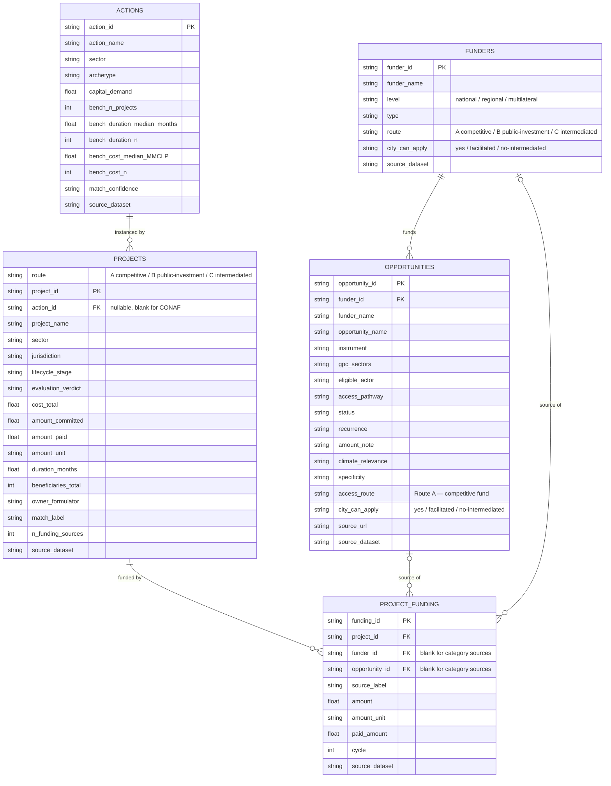

# finance_db: a traceable view of the repo's finance data

A "database" of CSVs covering the conceptual model (`knowledge-base/topics/data-sources/cl-climate-finance.md`), populated from the data currently in the repo so the use cases can be tested and the real scale is visible. There are four concept tables (funder, opportunity, project, action) plus a `project_funding` link that maps a project to the funders and opportunities that paid for it. Award is not a separate table: the money lives as aggregate attributes on the project (cost, committed, paid) and the many-to-many lives in the link. Every row carries a `source_dataset` column naming the dataset-review it came from, and the tables link by id. The design rationale, the data insights, and a worked single-city example (Valdivia) live in `methodology.md` next to this file.

**Refreshed 2026-06-19.** Now unions all ten domestic supply reviews (was six) and adds the **international tier** (GCF Chile projects, plus IDB / World Bank / UNDP-SGP as funders). Two fields make the access **route** explicit so the "a city cannot apply directly" signal is never lost: every funder and opportunity carries `route` / `access_route` (Route A competitive fund · Route B public investment · Route C intermediated multilateral) and `city_can_apply` (yes / facilitated / no-intermediated), and every project carries a `route`. International funders are recorded with `city_can_apply = no` (reached only via a National Designated Authority / accredited entity). Award precedent is now **multi-sector** (FPA, CONAF and GCF crosswalks populate `project.action_id`), not afolu-only.

*Four concept tables plus the `project_funding` link. The project carries the aggregate money (`cost_total`, `amount_committed`, `amount_paid`); the link carries one row per funding source on a project, mapping it to a funder and (where it is a named fund) an opportunity. CONAF appears as one project with one funding line; a BIP project appears with one line per source (FNDR, Sectorial, …), which is the many-to-many. `funder_id` and `opportunity_id` are blank on the link when the source is a category (Sectorial, Empresa, Municipal) rather than a named fund. Every table carries `source_dataset`.*

## The tables

| File | Concept | Rows | Source dataset(s) | Linking ids |
|---|---|---|---|---|
| `funders.csv` | Funder | 18 | `oef/cl-finance-inventory` (10 domestic) + CONAF + **4 multilateral** (GCF, IDB, World Bank, UNDP-SGP) | `funder_id` |
| `opportunities.csv` | Funding opportunity | 100 | the ten `cl-*/cl-*-fondos` via `oef/cl-finance-inventory` (incl. INDAP, MOP) + CONAF + MTT + the FPA fund | `opportunity_id`, `funder_id` |
| `projects.csv` | Project | 11,310 | `cl-ssg/cl-ssg-projects` (787 BIP, Route B) + `cl-conaf/cl-conaf-bn-awards` (9,860) + `cl-mma/cl-mma-fpa-awards` (655 FPA) + `gcf/gcf-projects` (8 Chile, Route C) | `project_id`, `action_id` |
| `project_funding.csv` | Funding link | 11,322 | BIP sources + CONAF + FPA + **GCF (intermediated, no opportunity)** | `funding_id`, `project_id`, `funder_id`, `opportunity_id` |
| `actions.csv` | Action | 102 | `cl-ssg/cl-ssg-projects` catalog; benchmark from BIP projects | `action_id` |

## Scale and coverage (what we are working with)

The fixture makes the shape of the data plain. The two things that stand out are that the money detail is dominated by one fund, and that BIP projects carry their own sector taxonomy rather than GPC.

| Concept | Rows | Coverage to know |
|---|---|---|
| Funders | 18 | 14 domestic (all ten supply institutions + CONAF) + 4 multilateral (GCF, IDB, World Bank, UNDP-SGP) |
| Opportunities | 100 | the ten-institution inventory + transport (MTT) + the FPA fund; `city_can_apply` = yes for 72, facilitated 4, no/intermediated 15 |
| Projects | 11,310 | 787 BIP (Route B) + 9,860 CONAF + 655 FPA + 8 GCF Chile (Route C, intermediated) |
| Funding links | 11,322 | CONAF bonificación 9,860 · FPA grant 655 · F.N.D.R. 566 · Sectorial 133 · Empresa 94 · Municipal 6 · GCF (via accredited entity) 8 |
| Actions | 102 | **21 have a "strong" matched benchmark**, 41 have any benchmark; the rest are `compatible_context`/`none` and should not be quoted (see `match_confidence`) |

The award side is now three sources and the precedent is genuinely multi-sector. CONAF still dominates by volume (afolu), FPA adds 655 comuna-level awards across five sectors, and the GCF Chile slice adds the international, intermediated layer. With the FPA, CONAF and GCF crosswalks now populating `project.action_id`, **award precedent reaches 11 distinct actions across afolu, energy/buildings, waste/water and transport** — not the afolu-only picture the older fixture showed.

The three routes are now explicit, which is the point of the refresh. A project's `route` says how the money reached it: **Route A** competitive fund (the CONAF and FPA awards — a landowner or community org applies, the city facilitates), **Route B** public investment (the 787 BIP projects — the city formulates and draws FNDR / Sectorial / Municipal), and **Route C** intermediated multilateral (the 8 GCF projects — the city cannot apply directly, access runs through the National Designated Authority and an accredited entity). The international funders are loaded so the universe is complete, but each carries `city_can_apply = no` with the reason, so adding them never implies a city can reach them directly. Transport supply exists (three MTT funds) but is operator-facing and intermediated, so the city-access problem remains there too.

**The action-to-project match now carries a quality label, and the fixture trusts only the good ones.** The rerun matching (`cl-ssg-projects` channel experiment) grades every match — `strong`, `goal_aligned`, `compatible_context`, `wrong_scope`, `unrelated` — and the fixture keeps only `strong`/`goal_aligned` projects, dropping the BIP layer from ~1,115 to 787 cleaner rows. Each action carries a `match_confidence` (its dominant label): **21 actions are `strong`** with sensible benchmarks (active mobility → cycleways, solar lighting → PV street lights, landfills → sanitary-landfill works), 29 are `compatible_context` (related but not a true match — e.g. "Establish eco-parks" still pulls waste-management projects, so it is flagged and should not be quoted), and 51 have no match. Quote a benchmark only where `match_confidence = strong`. Funds are still matched to actions by GPC sector (reliable); the supply signal for transportation now has the MTT funds but they are operator-facing, so a municipality still has no direct route there.

## What the data shows (insights from the fixture)

These come straight from the refreshed CSVs, not from prior assumptions.

**One instrument dominates the whole picture.** Of 11,310 projects, **9,860 (87%) are CONAF afolu bonificación** — a single forestry payment. One action (`ipcc_0054`, native-forest management) alone holds 9,463 of them. So the database is large but lopsided: counts, money detail and "precedent" are concentrated in one sector, and any landscape-level average is really an average of CONAF. Read the other layers on their own terms, not against this volume.

**Direct-apply supply is broad; realised precedent is thin and indirect.** On the supply side a city *can* apply directly to **72 of 100 opportunities** — the access problem is smaller than expected. But on the project side, the money that actually flowed came overwhelmingly through routes where the city is a **facilitator** (Route A: CONAF + FPA, 10,515 projects) or **excluded** (Route C: GCF, 8 projects). Only the **787 Route B / BIP** projects are ones a city formulated itself. The supply and the evidence point at different doors.

**Most actions still have no precedent.** Only **44 of 102 actions** have any project mapped to them; **58 have none**. And the cross-sector reach is almost entirely public investment, not grants: **Route B (BIP) reaches 41 actions**, while the entire competitive + intermediated award side (Routes A + C) reaches just **11**. The award datasets add depth in a few sectors (waste, community solar, solar-thermal, wetlands, green space), but BIP is what gives the action list its breadth.

**Benchmarks are trustworthy for only a fifth of actions.** Of 102 actions, **21 carry a `strong` match**, 29 are `compatible_context` (kept but not quotable), and 51 have no match. A timeline or cost figure should be surfaced only for the 21 — the headline "44 actions have projects" overstates how many are safe to quote.

**The international tier is real but small and unreachable directly.** All **8 GCF Chile projects** arrive via an accredited entity (CAF, FAO, IDB, IUCN, IFC, Pegasus) and reach just 3 actions; every multilateral funder carries `city_can_apply = no`. It is in the database so the universe is complete and visible — not because it is a route a municipality can walk through.

## How it tests the use cases

- **Benchmark an action on timeline (and cost).** `actions.csv` carries `bench_duration_median_months`, `bench_cost_median_MCLP`, and the sample size behind each (`bench_duration_n`, `bench_cost_n`), rolled up from the matched projects. This is the "derive benchmarks from example projects" idea made concrete: the action does not store a hand-typed timeline, it stores the median of its projects.
- **Trace an action to what got built and how it was paid for.** Join `projects.action_id` to an action for the work (`lifecycle_stage`, `evaluation_verdict`, `cost_total`, `amount_committed`, `amount_paid`, `duration_months`), then join `project_funding` on `project_id` for the sources that paid for it.
- **See the supply side for a sector.** Filter `opportunities.csv` by `gpc_sectors` and `eligible_actor` to list the funds a city could pursue, with their `access_pathway` and `instrument`.
- **Read funding by source.** Group `project_funding.csv` by `source_label` (or `funder_id`) to see how projects are financed — which projects FNDR funded, the CONAF bonificación cycles, and where the money came from.

## Things to know (so the data is read honestly)

- It is the repo's data, scoped to the concepts: every inventory fund, all BIP projects that matched an action (one row per project, its best-matching action), the full CONAF history, and all 102 actions. It is not every public-investment project in BIP, only the climate-relevant matched subset.
- A project's money has two layers. The aggregate is on the project (`cost_total`, `amount_committed`, `amount_paid`); the per-source breakdown is in `project_funding`, one row per funding source. CONAF is one project with one funding line (1:1); a BIP project has one line per source it lists (FNDR, Sectorial, …), which is the co-finance many-to-many.
- The per-source amount is usually unknown for BIP: it records the project totals and the list of sources, not the split. So BIP funding links carry the source and (where named) the opportunity, but a blank `amount`. CONAF lines carry the amount in UTM.
- `funder_id` and `opportunity_id` on a funding link are blank when the source is a category, not a named fund. F.N.D.R. maps to the FNDR opportunity and the regional-government funder; Sectorial, Empresa and Municipal stay as a `source_label` only. Municipal is the city's own budget (self-financing), kept as a line for completeness rather than an external grant.
- `project.sector` mixes taxonomies: CONAF projects use the GPC value `afolu`, while BIP projects keep their own source sector names (`TRANSPORTE`, `ENERGIA`, `RECURSOS NATURALES Y MEDIO AMBIENTE`, and so on). Mapping BIP's taxonomy to GPC is a known next step.
- `evaluation_verdict` and `duration_months` are populated only where BIP recorded them, so many project rows are blank there; this is real source sparsity, not an error.
- Amounts are in mixed units by source named in `amount_unit`: BIP projects and their links in CLP millions, CONAF in UTM. (BIP's source field is `costo_total_M_CLP`, where `M` means *miles*/thousands, so the build divides by 1000 to get millions — a unit trap worth remembering.)
- The action-to-project match now comes from the rerun (channel-experiment) matcher with a quality `label`, and the fixture keeps only `strong`/`goal_aligned` matches. Each action's `match_confidence` says whether its benchmark is trustworthy: quote only `strong` (21 actions). `compatible_context` actions (e.g. eco-parks) still draw the wrong project type and are kept only so the limitation is visible, not to be quoted.

## Running the use cases

`queries.ipynb` (in this folder) runs the four use cases against the fixture and renders each result inline: the timeline-and-cost benchmark, the action-to-projects trace, the supply view for a sector, and funding by source from the link table.

`fundability_walkthrough.ipynb` shows how these tables feed the fundability methodology (`../../methodology.md`): the ACTION demands from `actions`, the FINANCE supply and access-fit from `opportunities`, and the PROJECTS precedent and benchmark from `projects` + `project_funding` — combined into a route bucket, a `financial_feasibility` score, and the reason annotation. The CITY layer (autonomy and capacity) is external to finance_db and is supplied as illustrative comuna profiles, with a note that it comes from the SINIM review in production.

## Rebuild

`build_finance_db.py` (one level up) reads the source reviews and regenerates all the CSVs deterministically.
