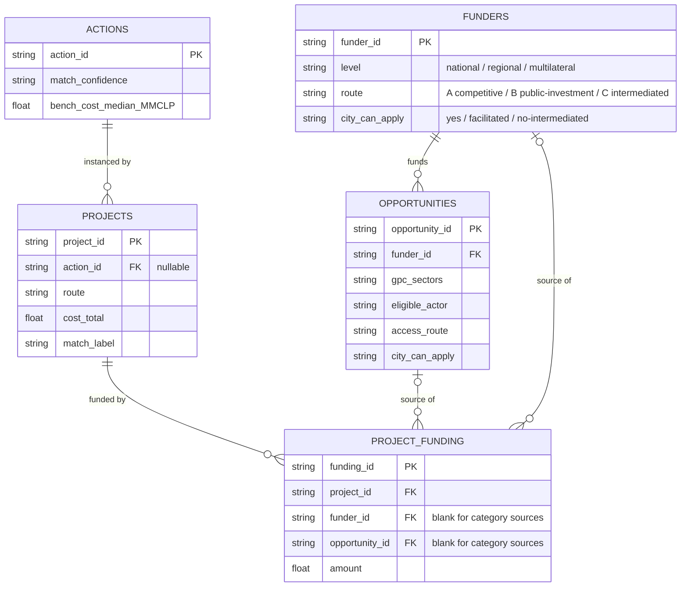

# finance_db — design, insights, and a worked example (Valdivia)

This is the design and reasoning doc for the `finance_db` fixture. The `README.md` next to it is the at-a-glance orientation (tables, ERD, scale); this file explains **why the schema is shaped this way**, **what the data actually says**, and **what one city looks like** through it. It complements the model methodology in `../../methodology.md` (Part B is the model; this is the data layer the model reads).

---

## 1. Database design

### 1.1 The model: four concepts + one link

The finance space is captured with **four concept tables** and **one link table** — deliberately not one row per "award".

- **Funder** — who has money (a ministry, a regional government, a multilateral). `funder_id`, `level`, and the access fields `route` / `city_can_apply`.
- **Funding opportunity** — a named, applyable channel (a *concurso*, a credit line, a statutory transfer). `opportunity_id`, `funder_id`, `gpc_sectors`, `eligible_actor`, `access_route`, `city_can_apply`.
- **Project** — a thing that got built or funded (a BIP investment, a CONAF bonificación, an FPA grant, a GCF programme). `project_id`, `action_id`, the aggregate money (`cost_total`, `amount_committed`, `amount_paid`), and a `route`.
- **Action** — the city climate action being financed (the 102-item catalog), with its benchmark roll-ups and a `match_confidence`.
- **`project_funding` (the link)** — one row per funding source on a project, joining a project to a funder and (where it is a named fund) an opportunity.

**Why "award" is not a table.** An award is an *event* that connects money to a project — exactly what a link row is. Modelling it as the `project_funding` link (rather than a fifth table) means a project that drew three sources (FNDR + Sectorial + Municipal) is three link rows, and a CONAF bonificación is one — the same shape handles 1:1 and many-to-many without a special case. The money that is *known in aggregate* lives on the project; the *per-source split* lives on the link (often blank for BIP, which records totals not splits).

### 1.2 The schema (ERD)

### 1.3 The three routes (the design's main job)

Every funder, opportunity and project carries an explicit **route**, so the "a city cannot apply directly" signal is never lost:

- **Route A — competitive fund (concurso).** A landowner, community org or the city applies to a named fund. CONAF bonificación and FPA grants are here; the city often *facilitates* applicants rather than being the grantee.
- **Route B — public investment (SNI/BIP).** The city formulates an *iniciativa*, passes the SNI gate (RATE → RS), and draws FNDR / Sectorial / Municipal money. This is the route a municipality "owns".
- **Route C — intermediated multilateral.** GCF / IDB / World Bank money reaches a city only via a National Designated Authority and an accredited entity — the city cannot apply directly. These funders carry `city_can_apply = no` with the reason recorded, so they are *visible but not overstated*.

`city_can_apply` on opportunities (yes / facilitated / no-intermediated / unknown) is the companion flag at the channel grain.

### 1.4 Provenance and build

The fixture is **regenerated deterministically** by `../build_finance_db.py` from the source reviews — no hand-typed rows. Every table carries a `source_dataset` column naming its origin (`cl-ssg/cl-ssg-projects` for BIP, `cl-conaf/cl-conaf-bn-awards`, `cl-mma/cl-mma-fpa-awards`, `gcf/gcf-projects`, the inventory for opportunities). Action mappings for the award sets come from the FPA / CONAF / GCF crosswalks. Re-run the script to rebuild; the per-source reviews remain authoritative for licence and caveats.

**Unit traps to remember:** BIP money is in **CLP millions** (`MMCLP`); the source field `costo_total_M_CLP` uses `M` = *miles* (thousands), so the build divides by 1,000. CONAF amounts are in **UTM**. GCF programme totals are often **multi-country USD**, not a Chile figure. Mixed units are named per row in `amount_unit` — never sum across them.

---

## 2. What the data says (insights)

Computed from the current fixture (18 funders · 100 opportunities · 11,310 projects · 11,322 funding links).

1. **One instrument dominates.** 9,860 of 11,310 projects (**87%**) are CONAF afolu bonificación; a single action (native-forest management) holds 9,463. The database is large but lopsided — any landscape average is really a CONAF average. Read the other layers on their own terms.
2. **Direct-apply supply is broad; realised precedent is indirect.** A city can apply directly to **72 of 100 opportunities**, yet the money that actually flowed came through routes where the city *facilitates* (Route A, 10,515 projects) or is *excluded* (Route C, 8). Only the **787 Route B / BIP** projects are city-formulated. Supply and evidence point at different doors.
3. **Most actions have no precedent.** Only **44 of 102 actions** have any project; **58 have none**. Cross-sector reach is almost all public investment: **Route B reaches 41 actions**, the whole competitive + intermediated award side (A + C) just **11**.
4. **Benchmarks are trustworthy for a fifth.** **21 of 102 actions** carry a `strong` match; quote a cost/timeline benchmark only for those (29 are `compatible_context`, kept but not quotable; 51 unmatched).
5. **International tier is real but small and unreachable directly.** All **8 GCF Chile projects** arrive via an accredited entity (CAF, FAO, IDB, IUCN, IFC, Pegasus) and reach 3 actions; every multilateral funder is `city_can_apply = no`. In the database for completeness, not because a municipality can walk that route.

---

## 3. A worked example — Valdivia (comuna 14101)

What the model + fixture look like for one real comuna, the capital of Los Ríos. (Figures from `../data/fundability_scored.csv` and the fixture.)

### 3.1 City profile

| | Value | Reading |
|---|---|---|
| Financial autonomy | **0.44** | mid-low — leans on FCM transfers, not own revenue |
| Delivery capacity | **0.84** | high — strong professional staff, formulates its own projects |
| City archetype | **capable-but-cash-tight** | it can *deliver*; money, not capability, is the constraint |

This pairing is the whole story: a city that can build but has to find the money.

### 3.2 Route mix across the 102 actions

| Route bucket | Actions | |
|---|---|---|
| self-deliverable | **25** | regulatory / low-cost actions it can just do |
| needs external co-finance | **59** | can deliver, needs the money — its dominant bucket |
| needs external finance + TA / pooling | **18** | the heaviest infrastructure (regional energy hubs, CCS) |

Mean `financial_feasibility` **0.597** — above the national median (0.51). **25 actions are doable unaided.** Notably almost nothing lands in *needs technical assistance*: with capacity 0.84, the gap is money, not know-how — so demanding actions route to **co-finance**, not TA. A low-capacity city with the same autonomy would show the opposite tilt.

### 3.3 Concrete actions

**Self-deliverable (feasibility 1.0)** — e.g. *energy-efficiency standards for new residential buildings* (5 local projects on record), *phase out fossil-fuel cooking in favour of efficient electric cookstoves* (14), *agroecological certification participation*. Regulatory / low-capital: Valdivia's capacity carries them.

**Hardest (feasibility 0.30, needs external finance + TA / pooling)** — *regional renewable-energy hubs*, *carbon capture & storage*, *mini/micro-hydro & biomass*, *hybrid solar-wind*. High capital + heavy formulation; beyond a single comuna's balance sheet.

### 3.4 Where the money would come from

| Sector | City-applicable funds (Route A) | Example named channels |
|---|---|---|
| stationary energy | **8** | FPA 2026 lines, Comuna Energética |
| waste | **14** | FPA, FPR (Fondo para el Reciclaje) |
| afolu | **21** | FPA citizen / education / Indigenous lines |
| transportation | **0** | — no city-applicable competitive fund |

The transport zero is the structural gap made concrete: Valdivia clearly *does* transport work — the fixture holds **18 Valdivia projects**, led by cycleways (*Construcción Red de Ciclovías*, ~72–865 MM CLP, action `ipcc_0105`), green-area and accessible-sidewalk works (`c40_0042`, ~46–62 MM CLP), and a regional sanitary landfill (`c40_0036`, ~14,492 MM CLP). But every one of those ran through **Route B (SNI/BIP — FNDR/Sectorial)**, not a competitive transport fund, because none is open to a municipality. For transport, Valdivia's route is formulate-and-pass-the-SNI-gate, not apply-to-a-fund.

Around the comuna, the **Los Ríos region** carries **1,466 projects**, almost all CONAF afolu (native-forest bonificación) — the Route A / landowner-facilitates layer at work in a forested region, which a municipality enables rather than owns.

### 3.5 The one-paragraph read

Valdivia is a *capable-but-cash-tight* city: it self-delivers a quarter of the catalog and can execute the rest, but 59 actions need external co-finance and 18 need finance plus pooling. For energy, waste and AFOLU it has named funds it can actually apply to (FPA, FPR, Comuna Energética); for transport — where it has the most built precedent — it has **no** city-applicable fund and must go the public-investment route. The model turns "rank 3" into "rank 3, here's the route, the funds, and the precedent" — which is the point.
