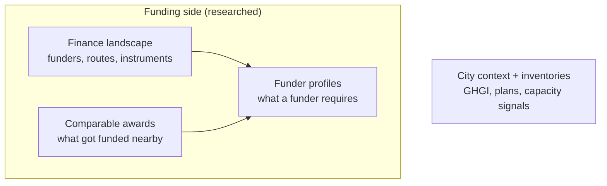

# Concept Note Builder — data research knowledge base

A single entry point to the data inputs found so far for the **Concept Note Builder (CNB)**: the OpenEarth Foundation (OEF) × National League of Cities (NLC) "smart grant consultant" inside CityCatalyst (OEF's city climate platform) that helps a Minnesota city move a project it already has to funder-ready and hands back a concept note. This is a research-phase page: it catalogues what has been discovered and points to the detail. Where each input eventually lands (CityCatalyst city context, the greenhouse-gas-inventory (GHGI) pipeline that loads CityCatalyst's production database GlobalAPI, or a reusable `get_projects()` service) is a later decision, not fixed here.

The inputs are grouped by where the context comes from rather than by the delivery structure in the PRD (the product requirements document). The authoritative statement of scope and open questions is that draft PRD; this page grounds it in data.

## What it is

In one line, the CNB is a smart grant consultant: a city brings a project it already has, and the Builder uses everything known about the city plus everything learnable about a target funder to move it toward funder-ready.

- **The goal:** push a project from roughly 70/100 to roughly 100/100 against one specific grant, and export a funder-ready concept note (Word).
- **First instance is narrow:** one Minnesota funder, one instrument, Word output — but the capability is meant to reuse across funders and regions.
- **Shape is a guided interview, not a wizard:** the first cities are high-capacity and already have a Climate Action Plan and a project, so the flow must use what they have rather than re-ask it.

### References
- For full scope, the guided-interview design, and the open questions: Concept Note Builder — Draft PRD → https://app.notion.com/p/38eeb557728b816f8c06f8f6469f9b6c
- For the agent and skill architecture this sits on: Agentic CityCatalyst — Cornerstone → https://app.notion.com/p/35deb557728b8141b16efbb3960a9251

## The inputs found so far

Four kinds of input have been researched: three describe the funding side, and one is what CityCatalyst can already say about a city.

*Caption: the landscape map navigates the award compilation, awards feed the revealed half of a funder profile, and the city-side inventories seed a candidate city. Arrows are "informs", not data joins.*

| Input | What it is | Maturity | Home |
|---|---|---|---|
| Finance landscape | Map of funders, six routes, instruments (MN, plus CL and BR siblings) | Landed MN, CL; BR drafted | `knowledge-base/topics/climate-finance/` |
| Funder profiles | Per-funder gates: eligibility, rubric, template | One prototype (BWSR CWF) | `dataset-compile/mn-funder-profiles/` |
| Comparable awards | Awarded projects by funder, category, region, instrument | Staging; MN 498, BR 496 rows | `dataset-compile/mn-climate-awards/`, `dataset-compile/br-climate-awards/` |
| City context / GHGI | City-scale emissions, plan directories, capacity signals | Three sources reviewed, none promotion-ready | `dataset-review/reviews/mn-rii/`, `.../mn-mpca-greenstep/` |

## The data model everything rests on

The finance inputs use a country-agnostic model so Minnesota is the first set of values, not a special case. One funding system produces data at three separate moments, and mixing them causes most confusion:

- **Supply:** what funding exists, one row per program — the basis of a funder profile.
- **Awards:** what got funded, one row per award — the basis of "show comparable projects."
- **Pipeline:** the ranked queue that sets funding order; in Minnesota explicit and load-bearing, via the Project Priority List and the annual Intended Use Plan.

The whole landscape reduces to four stored concepts (funder, funding opportunity, project, action) plus a funding link from a project to what paid for it. A new funder or country adds values, not tables.

### References
- To understand the country-agnostic model in full (funder levels, the funding lifecycle, the four stored concepts): `knowledge-base/topics/climate-finance/overview.md`
- For any term or acronym used on this page: `knowledge-base/topics/glossary.md`

## The Minnesota finance landscape (the map)

A landscape reference fixes the vocabulary, names the funders and instruments, and maps the six routes a Minnesota city reaches climate money by. It is the map that navigates the compilation, not data itself. Two facts drive everything downstream:

- **The route determines the document:** a FEMA grant needs a benefit-cost analysis, a State Revolving Fund (SRF) project a priority-list ranking, a green-bank loan a cashflow.
- **The US federal tier is in active disruption (mid-2026):** programs cancelled, rescinded, frozen, in litigation — so any federal funder needs a live status flag, and Minnesota's stable state channels are the safer spine.

The six routes, since the route sets the document a concept note has to be:

- **Route A — competitive discretionary grant**, won by applying to a dated funding call (a NOFO, Notice of Funding Opportunity): FEMA BRIC/HMGP, DNR (Department of Natural Resources) Flood Hazard Mitigation, BWSR (Board of Water and Soil Resources) Clean Water Fund, Met Council Livable Communities.
- **Route B — subsidised loan on a priority-list pipeline**: Clean Water and Drinking Water State Revolving Funds, Point Source Implementation Grant.
- **Route C — formula / block grant** passed through by eligibility rule, not competition: CDBG (Community Development Block Grant), USDA Rural Development, state formula programs.
- **Route D — green bank / revolving finance**, a loan to repay and recycle: MnCIFA.
- **Route E — state capital investment**, a bonding request to the legislature: general-obligation capital grants.
- **Route F — the city financing itself**: municipal or green bonds, tax-increment financing, local levies.

For a city-climate-resilience pilot the map narrows the likely funders to the water and stormwater channels: the SRFs plus Point Source Implementation Grant (Route B), the BWSR Clean Water Fund and Met Council Livable Communities (Route A grants), and DNR Flood Hazard Mitigation (Route A). Chile and Brazil siblings follow the same section order.

### References
- The next stop if a water or stormwater funder is in scope — full route detail, funder tables, award-size ranges, and the 2026 federal-disruption picture: `knowledge-base/topics/climate-finance/us-mn-climate-finance.md`
- To see how the same structure fills in for another region: Chile → `knowledge-base/topics/climate-finance/cl-climate-finance.md` · Brazil → `knowledge-base/topics/climate-finance/br-climate-finance.md`

## Funder profiles (what a funder requires)

One nested document per funder holds the funder's gates and is the target a concept note is written toward.

- **Two halves:** a *stated* half read from the funder's RFP (request for proposals, the NOFO in grant programs) and a *derived* half computed from the awards data.
- **Prototype built:** the BWSR Clean Water Fund Projects & Practices profile — 100-point rubric transcribed from the FY27 RFP (verified to sum to 100), revealed half from the 18 FY27 award rows (median grant $289,500; winners mostly watershed districts and soil-and-water conservation districts, cities a minority).
- **Binding caveat:** NLC must co-calibrate the matching emphasis and thresholds before the CNB scores against the rubric — not yet done.
- **Next:** the schema is meant to generalise to the SRF, Met Council, and DNR funders.

### References
- For the two-halves method (stated vs derived), verification, and known gaps: `dataset-compile/mn-funder-profiles/collection.md`
- The worked prototype to copy when building a second funder profile: `dataset-compile/mn-funder-profiles/profiles/bwsr-clean-water-fund.yaml` · the object shape it follows: `dataset-compile/mn-funder-profiles/schema.json`

## Comparable awards (what got funded)

Real awarded projects, indexed by route and the four comparison axes (funder, category, region, instrument — the award-indexing axes, distinct from the data model's four stored concepts above), give evidence for which path a city should pursue and material for "show examples". Existing OEF project data skews Latin America, so US/Minnesota coverage was built from scratch. The Minnesota dataset holds 498 rows across the two water-heavy routes, one recent cycle each (the revolving-fund list labelled state fiscal year 2026, the BWSR grant round FY27).

| Measure | Route A (competitive grant) | Route B (SRF loan) |
|---|---|---|
| Median award | $299K | $4.73M |
| Whole-sample total | about $10M | $1.2B fundable in one year |
| Document the note is | competitive narrative + BCA | priority ranking + facility plan |

Main readings from the data:

- **A resilience note is a Route A object in a Route B-dominated landscape:** of the $4.0B requested on the priority list (only about $1.2B fundable this cycle), 97% is wastewater renewal; stormwater and green infrastructure, where a resilience note sits, is 2.7%, best funded through Route A grants.
- **Energy and buildings is a different shape:** program-heavy and award-thin, so "fundable" means assembling a stack (green-bank loan plus rebates plus elective pay plus PACE), not winning one grant.
- **Coverage:** deep and verified for water and stormwater, partial for flood, thin for energy and heat.
- **Brazil sibling:** 496 reconciled rows (Fundo Amazônia, Novo PAC, COFIEX), same design and different values, proving it travels.
- **Status:** both are staging compilations from public award announcements, not yet vetted, with route and category still assigned by judgment.

### References
- For what the Minnesota dataset contains, how each figure was verified, and what is still assigned by judgment: `dataset-compile/mn-climate-awards/collection.md` · the rows themselves: `dataset-compile/mn-climate-awards/data.csv`
- The Brazil sibling, same design and different values, if coverage beyond Minnesota is relevant: `dataset-compile/br-climate-awards/collection.md`

## City context and inventories

The CNB seeds a candidate city from what CityCatalyst already knows (profile, GHGI, climate risk, prioritised actions). The live thread is finding city-level GHG inventories for Minnesota cities, both to seed context and to help pick the three cohort cities. Three sources are reviewed; none is promotion-ready.

| Source | What it gives | Coverage | Blocker |
|---|---|---|---|
| Regional Indicators Initiative (RII) | City GHG values in tonnes CO₂-equivalent (tCO₂e): energy, transport, waste | 117 transport, 70 waste, 28 energy | LHB redistribution license; non-GPC waste method |
| MN Sustainability Index (GreenStep) | Directory of who has a CAP, inventory, vulnerability assessment, with links | 73–119 per theme | License unconfirmed; lags newest plans |
| GreenStep completed actions | What each community has done; program step 1–5 | 156 communities | License unconfirmed; per-action detail not extracted |
| MnGeo CTU (city / township / unorganized-territory) boundaries | City polygons plus a stable GNIS id, county, and population — the geometry and join spine | 856 cities statewide | License unspecified (not stated); GNIS→`locode` crosswalk not yet filled |

How the four fit together:

- **Division of labour:** the Index says who has an inventory, RII holds the numbers, GreenStep actions reads capacity, and the MnGeo boundary layer (every Minnesota city, township, and unorganized territory as a polygon) is the authority the other three join to.
- **RII is the one emissions source, but caveated:** it is the only single source with city-scale emissions for many Minnesota cities at once, but coverage is per-indicator (a full energy-plus-transport-plus-waste picture exists for only about 28 cities), and its values follow ICLEI's US Community Protocol, so waste is not a drop-in for GPC (the Global Protocol for Community-Scale GHG Inventories, CityCatalyst's framework).
- **MnGeo imposes one discipline:** join on the GNIS id (the stable national Geographic Names Information System code) rather than name, dissolve the 48 multi-county cities first, and use it as the home for the eventual GNIS→`locode` crosswalk (the repo's canonical UN/LOCODE city key) that ties Minnesota city data into the modelled schema. A name match lands every RII city and all but three GreenStep communities, and those three are spelling errors in GreenStep, not gaps.
- **City-provided docs come via the interview:** project details and the Climate Action Plan are ingestion, not sourcing; the open question is how to turn a large plan into something an agent uses well.
- **One deferred decision:** whether RII feeds only the CNB as read-only context or also the GlobalAPI pipeline as a re-served source — the second use is what makes redistribution permission from LHB (the firm that compiles RII) binding.

### References
- Why the GHGI source is still open, and how it feeds cohort selection — the live thread, and the best place to pick up work: `dataset-discovery/needs/2026-07-mn-city-ghgi/need.md`
- Per-source detail (coverage, license terms, the GPC caveats) — read the review for whichever source becomes relevant: RII → `dataset-review/reviews/mn-rii/rii-city-indicators/README.md` · Sustainability Index → `dataset-review/reviews/mn-mpca-greenstep/mn-greenstep-sustainability-index/README.md` · GreenStep actions → `dataset-review/reviews/mn-mpca-greenstep/mn-greenstep-actions/README.md`
- For the boundary/join spine, the GNIS-vs-name join rules, and the crosswalk seed: `dataset-review/reviews/mn-mngeo/mn-ctu-boundaries/README.md`

## Generalisation, and open questions

Funder and climate-action documents are heavily regional, so building only the Minnesota slice risks working on what is available instead of what is wanted. The research answers this structurally, and a few decisions still gate it:

- **Built to generalise:** the four-axis model, the six-route framing, and the two-instance awards design (Minnesota and Brazil on one schema) keep funder logic, template, region, and language in config and data, so a second funder or region is a new record, not a rebuild.
- **Blocked on NLC, the funder:** the single target funder and instrument are unconfirmed, which blocks locking a funder profile.
- **Blocked on the cohort:** the three cities are unconfirmed, which changes both the funder set (Met Council is Twin-Cities-only; USDA Rural favours small cities) and which RII coverage applies.
- **Source-level blockers:** the RII redistribution license, the GreenStep license confirmation, the RII-to-GPC mapping cost, and the NLC rubric co-calibration.

### References
- For the full open-questions table with owners: PRD §8 → https://app.notion.com/p/38eeb557728b816f8c06f8f6469f9b6c
- Before editing this page or any sibling review: `knowledge-base/topics/writing-style.md`
