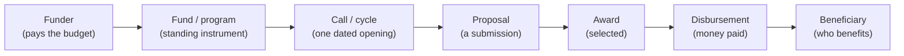
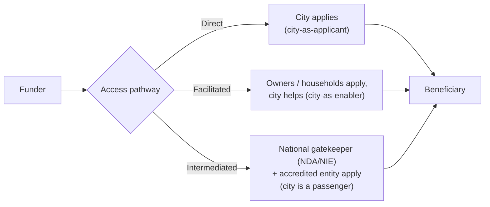

# Chile climate finance: concepts, actors, and data layers

Reference for the Chile climate-finance work. It fixes a shared vocabulary, names the main actors, and says which dataset answers which question, so the terms "funder", "fund", "call", "proposal", "award", and "project" stop blurring together. This is landed reference; the working methodology, such as the fundability score, lives with the finance-inventory review, not here.

## The mental model: three data layers

One funding system produces data at three different moments. Most confusion comes from mixing them. Keep them separate.

1. **Supply:** what funding *exists*. The catalogue of programs/funds a city could pursue or facilitate, one row per program. Answers "what's available, for whom, when?"
2. **Awards (revealed fundability):** what actually *got funded*. The list of selected proposals for a given call, one row per awarded project, the first layer of its kind in this repo. Answers "what gets funded, where, how often, at what size?"
3. **Public-investment pipeline:** the parallel system for *public* investment projects (municipal/GORE/sectoral), evaluated and tracked end-to-end, one row per initiative. Answers "what public projects are formulated, recommended (RATE), and financed?"

Supply and awards relate *by program*, not by a shared key. Awards (layer 2) and the public-investment pipeline (layer 3) are **different actor universes** (private applicants vs public bodies) and do **not** share records; relate them only at the (region/comuna, sector) aggregate level.

### References

- supply datasets → `cl-mma-fondos`, `cl-minenergia-fondos`, `cl-corfo-finance`, `cl-subdere-fondos`, `cl-minvu-fondos`, `cl-gore-fndr`, `cl-mtt-fondos`, `cl-conaf-fondos`, unioned in `oef/cl-city-action-fundability`
- awards datasets → `cl-conaf-bn-awards`
- public-investment pipeline datasets → `cl-mdsfam/cl-bip-projects`, `cl-ssg/cl-ssg-projects`

## The whole map: every dataset, where it sits, and the city's role

If only one section is read, read this one. Two pictures, then a table of every dataset.

**How a city actually gets money — two routes.** Almost everything in this repo describes one of these two paths. The big source of confusion is mixing them.

```mermaid
flowchart TB
    subgraph RA["Route A — Competitive Funds (Concursos)<br/>National, regional, local funders: MMA, MinEnergía, CORFO, SUBDERE, MINVU, GORE, CONAF"]
      direction LR
      A1["1. Apply<br/>submit proposal"] --> A2["2. Award<br/>selected"] --> A3["3. Disbursement<br/>money paid"]
    end
    
    subgraph RB["Route B — Public Investment (SNI/BIP)<br/>City acts directly; MDSF evaluates; money from FNDR, Sectorial, Municipal"]
      direction LR
      B1["1. Formulate<br/>city writes iniciativa"] --> B2{"2. BIP Gate<br/>RATE verdict<br/>(evaluation, NOT money)"} --> B3["3. Finance<br/>draw FNDR / Sectorial /<br/>Municipal source"] --> B4["4. Execute<br/>implement project"]
    end
    
    subgraph MB["Route B+ — Multilateral/Bilateral<br/>GCF, GEF, IDB, CAF: city CANNOT apply directly — two intermediaries stand in between"]
      direction LR
      M0["City<br/>(cannot apply<br/>directly)"] -.->|via| M1["Gatekeeper 1:<br/>National Authority<br/>NDA / NIE<br/>(no-objection)"] --> M2["Gatekeeper 2:<br/>Accredited Entity<br/>IDB, CAF, FAO, FYNSA<br/>(submits + delivers)"] --> M3["Board decision<br/>→ Awards/Projects only<br/>(what got funded)"]
    end
```

*Route A: someone applies to a fund and may win a grant. Route B: the city formulates a project itself, passes the SNI/BIP evaluation **gate** (a recommendation, not money — shown as a diamond), then draws financing from a separate source. **BIP is a gate, not a fund and not an intermediary**: the city is the direct actor, and a recommended project still needs an FNDR / Sectorial / Municipal source to be paid for. Route B+ is genuinely **intermediated**: the city cannot apply directly and must pass through two gatekeepers — a national authority (NDA/NIE) that gives a no-objection, then an Accredited Entity that actually submits and delivers — so all that remains as data is the funded portfolio. Route A is where the city is often an enabler; Route B is where the city is the driver; Route B+ is where the city is a passenger.*

**Every dataset at a glance.** Layer (supply / awards / pipeline) is *what moment* the data captures; level is *who sits above the money*; the role is *how a city touches it*.

| Dataset | Layer | Level | Funder / owner | GPC sectors | City's role | What it tells you |
|---|---|---|---|---|---|---|
| `oef/cl-city-action-fundability` | Supply (union) | all | all CL public funders | cross-sector | Mixed (tagged per row) | **Start here:** one catalogue of what funding exists |
| `cl-mma-fondos` | Supply | National | MMA | waste, afolu, cross | Applicant + Enabler | Environment grants (FPA, FPR, heater swap) |
| `cl-minenergia-fondos` | Supply | National | Min. Energía / AgenciaSE | stationary_energy | Applicant + Enabler | Energy efficiency & small renewables |
| `cl-corfo-finance` | Supply | National | CORFO | energy, industry | Enabler (firms) | Loans/guarantees a city can refer local firms to |
| `cl-subdere-fondos` | Supply | National | SUBDERE | cross, water/waste | Applicant | Municipal infrastructure (PMU, PMB) |
| `cl-minvu-fondos` | Supply | National | MINVU | afolu (urban green), buildings | Applicant + Enabler | Public space, parks, housing thermal |
| `cl-gore-fndr` | Supply | Regional | GORE | cross | Applicant | Regional funds (FNDR, FRIL, 8%) — feeds Route B |
| `cl-mtt-fondos` | Supply | National (per-region) | MTT / DTPR | transportation | Enabler / Intermediated | Transport renewal & electrification (operators apply) |
| `cl-conaf-fondos` | Supply | National | CONAF | afolu | Enabler | Native-forest grants (owners apply; city facilitates) |
| `cl-conaf-bn-awards` | **Awards** | National → region | CONAF | afolu | Enabler | Who actually won Bosque Nativo, 2016–2025 (revealed fundability) |
| `cl-mdsfam/cl-bip-projects` | **Pipeline** | National / Regional / Municipal | MDSF (gate); money = FNDR / Sectorial / Municipal | transport, water, environment, housing, energy | **Applicant** (city formulates) | Public projects formulated → recommended (RATE) → financed |
| `cl-ssg/cl-ssg-projects` | Pipeline (legacy) | same as BIP | same | same | Applicant | Older PDF-derived view of BIP; superseded by `cl-bip-projects` |
| `cl-ssg/cl-ssg-finance` | Supply (legacy) | National | mixed | cross | Context | 2023 consultancy snapshot; stale, superseded by the live `cl-*-fondos` + `oef` inventory |

Role legend: **Applicant** = the city applies for itself · **Enabler** = the city helps others (owners, households, firms) apply · **Intermediated** = access runs through a bank or operator · **Context** = background, the city does not transact.

**How they relate.** The supply datasets list the *opportunity*; the awards and pipeline datasets show what *happened* to opportunities. Supply ↔ awards join by program (e.g. `cl-conaf-fondos` ↔ `cl-conaf-bn-awards`). Awards ↔ pipeline never share rows (private vs public applicants) — relate them only at the (comuna/region, sector) level. Sector is the common thread that lets any two of them be read side by side.

## Funder levels, and why the level decides which layer exists

The level is who sits above the money, and it is not merely a label: it decides which of the three data layers a funder actually produces, and so whether the opportunity (what a city applies to) and the projects (what got funded) are two separate things or one. National, regional and local public funders run competitive funds, so they produce all three layers and a city applies to them directly (Route A). Multilateral, bilateral and private funders are reached only through an intermediary (Route B), so for a city they produce a single layer: the awards/projects record of what was funded. A funder being higher up the list does not mean more money is reachable; it means the access runs through a gatekeeper and the visible data shrinks to the portfolio.

| Level | Example funders | Supply (planned) | Awards / Projects (committed) | Pipeline (public investment) | City access |
|---|---|---|---|---|---|
| National | MMA, CORFO, INDAP, MOP, CONAF | yes | yes | yes | direct (Route A) |
| Regional | GORE / FNDR | yes | yes | yes | direct (Route A) |
| Local | municipal budgets, local funds | yes | yes | yes | direct (Route A) |
| Multilateral | GCF, GEF, IDB, CAF, World Bank | no | yes | no | intermediated (Route B) |
| Bilateral | KfW/IKI, AFD, JICA, EU/EUROCLIMA | no | yes | no | intermediated (Route B) |
| Private / philanthropic | foundations, impact investors (Bezos, ClimateWorks) | no | yes | no | intermediated (Route B) |

*The level sets the access route. Route A funders yield a Supply catalogue, an Awards record and a Pipeline; Route B funders collapse to Awards/Projects only, because there is no open call a city applies to.*

Why the collapse happens is worth stating plainly. A city cannot apply to GCF, GEF, the IDB or the Adaptation Fund directly. Access runs through a national gatekeeper and an accredited delivery body. For GCF the gatekeeper is the National Designated Authority, which in Chile is the Ministerio de Hacienda, and delivery is by an Accredited Entity such as the IDB, CAF, FAO, or the Chilean direct-access entity FYNSA; for the Adaptation Fund the gatekeeper is the National Implementing Entity, AGCID. The opportunity at this level is therefore an accreditation relationship and a continuous, rolling project cycle (a concept note, then a no-objection from the gatekeeper, then submission by the entity, then a Board decision), not a dated concurso. The only thing that exists as an enumerable dataset is the project portfolio: what got funded.

So international climate finance sits in the awards/projects layer, at the multilateral or bilateral level, accessed intermediated. The consequence for a row is concrete: mark its access pathway as intermediated, carry the gatekeeper and the accredited entity, and do not expect or invent an open-call supply catalogue for these funders. The GCF datasets follow this directly. There is one GCF review, the global project portfolio from the GCF Projects API, with Chile held as a filter inside it rather than a separate dataset, and that review also carries the Chilean access structure and the project-to-action crosswalk.

The action work covers mitigation only, so adaptation-specific funders such as the Adaptation Fund, and adaptation items inside an otherwise-relevant portfolio such as GCF's resilient-water facility, are flagged out of scope rather than counted as taxonomy gaps. The mitigation international tier is tracked in the international-finance discovery need.

*Route A reaches all three data layers by direct application; Route B reaches only the awards/projects layer, through a national gatekeeper and an accredited entity. There is no open call a city applies to at Route B.*

### References

- GCF projects review → `dataset-review/reviews/gcf/gcf-projects/` (source: GCF Projects API, `http://api.gcfund.org/v1/projects`)
- international finance discovery → `dataset-discovery/needs/2026-06-cl-international-climate-finance/`

## Core vocabulary

Most of these terms name points on a single funding lifecycle, from the body that pays to the person who benefits. Seeing them in order is what stops them blurring together.

*One opportunity at seven moments. "Awarded" is not "paid", and the applicant is not always the beneficiary.*

Each entry below gives the standard term (use these) and its database field in backticks, then the Spanish equivalent in italics, then the plain meaning.

- **funder / funding institution** (`funder_institution`), *institución / organismo*: the body whose budget pays, such as MMA, CONAF, or MTT. Not always the website operator (see *provider*).
- **provider / implementer** (`provider`), *ejecutor / implementador*: who runs delivery and the site, sometimes a separate body (AgenciaSE delivers for Min. Energía). Matters for citation and licence.
- **fund / program** (`program`, `program_family`), *fondo / programa*: the standing instrument, such as the Fondo de Protección Ambiental. Recurs across years.
- **call / cycle** (`cycle_observed`, `recurrence`, `status`), *concurso / convocatoria / llamado*: one dated opening of a fund, such as "Primer Concurso 2025". A fund has many calls; a call has open/close dates and a status.
- **instrument** (`instrument_type`), *instrumento*: the financing form, one of grant (*subsidio/aporte*), loan (*crédito*), guarantee (*garantía*), blended (*mixto*), technical_assistance (*asistencia técnica*), or equity. CONAF's grant is a *bonificación*, a reimbursement-style subsidy.
- **applicant / eligible actor** (`eligible_actor`), *postulante / beneficiario elegible*: who may apply, such as a municipality, community or citizen org, household, private firm, NGO, indigenous community, or accredited entity. Distinct from who benefits and from who submits.
- **proposal / application**, *postulación / proyecto postulado*: a single submission to a call, not yet funded.
- **presenter** (`presenter_type`), *quien presenta*: who actually files the proposal, often a technical intermediary (extensionista, consultor) rather than the beneficiary. A delivery-channel signal, not the beneficiary identity.
- **award / adjudication**, *adjudicación / proyecto adjudicado*: a proposal selected for funding. Awarded is not the same as disbursed.
- **disbursement / bono**, *pago / bono*: money actually paid, usually after the project executes (the CONAF SAFF bono, for example). Often a later, separate record.
- **beneficiary** (`beneficiarios_total`), *beneficiario*: who ultimately benefits, which may differ from the applicant (households benefit while the comuna facilitates).
- **project / initiative** (`codigo_bip`, `nombre`), *proyecto / iniciativa de inversión*: a concrete funded or proposed piece of work. In the public system, a BIP-coded initiative with a stage and a RATE.
- **RATE**, *Resultado del Análisis Técnico-Económico*: the SNI's recommendation verdict on a public-investment project (RS = recomendado). Layer-3 only.
- **access pathway** (`access_pathway`), *vía de acceso*: direct application, facilitated-by-city, or intermediated via a bank or accredited entity.
- **specificity** (`specificity`): sector-specific vs broad/cross-sector, flagging general-purpose funds so scoring can down-weight them.
- **climate relevance** (`climate_relevance`): explicit, climate-adjacent, or indirect.

How a city relates to a fund depends on the access pathway, and that distinction drives prioritisation. Under **city-as-applicant** the municipality applies for itself (FPR, BIP projects). Under **city-as-enabler** the city facilitates others who apply, such as CONAF private owners or Casa Solar households. A third route is **intermediated**, where access runs through a bank or accredited entity. All are in scope, so tag the role rather than excluding it.

*Where the city sits depends on the pathway: applying for itself (direct), enabling others who apply (facilitated), or — for multilateral/bilateral money — passing through a national gatekeeper and an accredited entity (intermediated), where the city cannot transact on its own. Note this is distinct from the SNI/BIP gate: BIP is an evaluation checkpoint the city passes through itself, not an intermediary acting on its behalf.*

## Conceptual model: the things worth storing

The landscape reduces to four concepts worth storing, plus one link, and one principle keeps them portable: the structure is universal, while region-specific labels (FNDR, concurso, comuna, RATE, UTM) are *values* inside these fields, not new tables. Adding another country adds values, not structure. Geography is deliberately not one of the concepts here; a jurisdiction is a field on the records and is handled in the database, not part of the conceptual picture.

### The four concepts and their key data points

| Concept | What it is | Key data points |
|---|---|---|
| **Funder** | the body whose budget pays | name; level (national / regional / local / multilateral / private); type |
| **Funding opportunity** | a fund or program a city could pursue or facilitate, with its calls | instrument; sector; eligible actor; access route; status and timing (open/close, recurrence); amount (often missing); climate relevance and specificity; source link |
| **Project** | a concrete instance of work, with its money | id and name; the action it instances; sector; jurisdiction; lifecycle stage; evaluation verdict; cost, committed and paid amounts; scale; timeline; owner or formulator |
| **Action** | the climate intervention type, the spine everything hangs on | id; name; sector; archetype; capital intensity; plus a derived benchmark profile (below) |

The fifth element is lighter: a **funding link** that maps a project to the funders and opportunities that paid for it, one row per source, carrying the amount and paid figure where the source provides them. This is where "award" lives. It is not a concept of its own but the *relationship* between a project and an opportunity.

### Action, project, and the money: where "award" went

The distinction that matters is the type-versus-instance one. An action is the timeless template, such as "install rooftop solar"; a project is one real instance of it in a place. A funded thing is always a project; the money is detail on it.

"Award" is real but it is a relationship, not a peer concept, so it is modelled as the funding link rather than its own table. The reason is the data: sources are project-grain, not award-grain. The CONAF file carries one forestry project and its single bonificación on the same row (one project, one funding line). BIP is project-centric: a project with a stage and a verdict, and a *list* of funding sources with no per-source split. Neither gives independent award records with their own amounts, so a separate Award table would model a granularity the data does not fill. A project can have zero funding links (formulated and awaiting finance) or several (co-finance), which is exactly what the link expresses.

### Benchmarks are derived from projects, not entered

Benchmark figures for an action are not typed in; they are rolled up from the example projects that instance it. Each project carries its own raw facts (cost, scale, timeline, and later its realised co-benefits), and the action gets a derived benchmark profile: a median and a range for each, with a sample size so the reliability is visible. Timeline is the worked example, where the typical duration across a given action's projects, with its `n`, is the benchmark. The richer attributes raised so far, such as implementation steps and expected or realised co-benefits, are extended columns to add later; once projects record co-benefits, those become a benchmark too.

### Two lifecycles

Two lifecycles run through these concepts. The first is the funding lifecycle drawn under Core vocabulary, where an opportunity moves from funder to fund to call to proposal to award to disbursement to beneficiary. The second belongs to a project, and it is what the public-investment data tracks:

*A project's life. Chile's values slot in: formulation (perfil / prefactibilidad / diseño), the RATE verdict, financing from a source, then ejecución. A project can stall at any stage, and it is only "financed" once a funding link attaches.*

## Main actors (funders/administrators)

| id | institution | role for cities | example funds | review |
|----|-------------|-----------------|---------------|--------|
| cl-mma | Ministerio del Medio Ambiente | environment grants; municipality & community applicants | FPA, FPR (recycling), Recambio Calefactores | `cl-mma/cl-mma-fondos` |
| cl-minenergia | Min. Energía / AgenciaSE | energy efficiency & renewables; municipal + facilitated | Comuna Energética, FAE, Casa Solar | `cl-minenergia/cl-minenergia-fondos` |
| cl-corfo | CORFO | firm-facing debt/blended; city points local business | Crédito Verde, H2V, FOGAIN | `cl-corfo/cl-corfo-finance` |
| cl-subdere | SUBDERE | municipal infrastructure (broad) | PMU, PMB, PMR, FRC | `cl-subdere/cl-subdere-fondos` |
| cl-minvu | MINVU | urban / green space / housing | Espacios Públicos, Parques Urbanos, DS 27 thermal | `cl-minvu/cl-minvu-fondos` |
| cl-gore | Gobiernos Regionales | regional investment & activity grants | FNDR, FRIL, FNDR 8% | `cl-gore/cl-gore-fndr` |
| cl-mtt | Min. Transportes / DTPR | transport renewal & electrification; operator-facing, GORE-administered | Subsidio Nacional al Transporte, Renueva tu Micro/Colectivo | `cl-mtt/cl-mtt-fondos` |
| cl-conaf | CONAF | native-forest grants; private-owner (city facilitates) | Fondo Bosque Nativo (Ley 20.283) | `cl-conaf/cl-conaf-fondos` (+ awards: `cl-conaf-bn-awards`) |
| cl-mdsfam | Min. Desarrollo Social y Familia | runs the public-investment system (SNI/BIP) that evaluates municipal/GORE projects | (system, not a fund) | `cl-mdsfam/cl-bip-projects` |
| multilateral/bilateral | GCF, GEF/UNDP, IDB, CAF | intermediated; community or national entities | GEF Small Grants, Fondo Chile, GCF FP189 | (not yet reviewed, a gap) |

Cross-cutting backbone: **fondos.gob.cl** (SEGEGOB) is the national noticeboard listing live calls. It is a *human discovery index only*, not a data source (restrictive terms; rejected for ingestion). Always source each opportunity from its administering institution's own page.

## Which dataset answers which question

- "What funding could this city pursue/facilitate?" → supply inventory (`oef/cl-city-action-fundability`).
- "Does this kind of project actually get funded, where, at what size?" → awards (`cl-conaf-bn-awards`; more to come).
- "How does a city get *its own* project financed?" → Route B in the map: formulate an iniciativa, pass the SNI/BIP gate (RATE → RS), then draw FNDR / Sectorial / Municipal money. The feeder funds (FNDR, FRIL, PMU, PMB) live in the supply reviews `cl-gore-fndr` and `cl-subdere-fondos`.
- "What public investment projects has this comuna formulated / had recommended / financed?" → `cl-mdsfam/cl-bip-projects`.
- "How fundable is this action?" → the score in `oef/.../methodology.md`, which combines supply (is a channel available) with awards (does it actually get funded); see that file for the live design.

## See also

- `dataset-discovery/needs/2026-06-cl-finance-opportunities/`: the originating need, gaps, and candidates.
- `dataset-review/reviews/oef/cl-city-action-fundability/methodology.md`: fundability/coverage methodology (working).
- `knowledge-base/topics/glossary.md`: repo-wide glossary (core finance terms cross-listed there).
