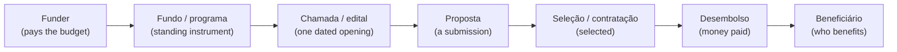

# Brazil climate finance: concepts, actors, and data layers

Landed reference for the Brazil climate-finance work (City Climate Compass, Phase 3). It fixes a shared vocabulary, names the main actors, and says which layer of data answers which question — so the terms *funder*, *fundo*, *edital*, *proposta*, *seleção*, and *projeto* stop blurring together. It is the Brazil country page of the climate-finance topic — see `overview.md` for the country-agnostic model it instantiates. This page says what finance *means* and who the actors *are*; the working method that turns it into a fundability score is kept with the Brazil Phase 3 project (`brazil-phase-3/4-feasibility/financial-feasibility.md`).

Because Phase 3 is adaptation-first, this reference foregrounds where the adaptation reality bends the general picture — chiefly the **financing inversion** (vulnerability-targeted money can favour the weakest cities) and the **centrality of BNDES** (one national bank sits at the centre of both federal and international climate money). Those two facts most shape how climate finance works in Brazil.

One scoping warning up front: **most of the money that actually funds urban adaptation is not labelled "climate."** Drainage, water security and flood-risk works are financed through the *sanitation* system (FGTS/CAIXA), and post-disaster and prevention money flows through *civil defence*. A view built only from climate-badged funds (Fundo Clima, Fundo Amazônia) would miss the larger flows. This reference therefore maps the whole plumbing a city touches, climate-labelled or not.

## The mental model: three data layers

One funding system produces data at three different moments. Most confusion comes from mixing them. Keep them separate.

1. **Supply:** what funding *exists*. The catalogue of funds/programmes a município could pursue or facilitate, one row per programme. Answers "what's available, for whom, when?"
2. **Awards (revealed fundability):** what actually *got funded*. Selected proposals / disbursements for a given call, one row per awarded project. Answers "what gets funded, where, how often, at what size?"
3. **Public-investment pipeline:** the parallel system for *public* investment — cities formulate projects and submit them for federal co-financing (convênios / Transferegov, Novo PAC), evaluated and tracked. Answers "what public projects does this município formulate, get approved, and get financed?"

Supply and awards relate *by programme*, not by a shared key. Awards (layer 2) and the public-investment pipeline (layer 3) are **different actor universes** (private/community applicants vs public bodies) and do **not** share records; relate them only at the (state/município, sector) aggregate level.

A structural point worth stating up front: Brazil has **no single national investment gate** that evaluates a public project and returns a recommendation. Public-investment money reaches cities through *voluntary transfers* (convênios via Transferegov), *earmarked federal programmes* (Novo PAC), and *politically-allocated channels* (emendas parlamentares) — several of which have no clean "apply → appraise → recommend" semantics. Approval is programme-by-programme, and this is drawn out under "Routes" below.

## The whole map: every route, and the city's role

If only one section is read, read this one. Almost every instrument a city touches sits on one of **six routes**. The big source of confusion is mixing them.

*Route A: apply to a fund or credit line and may win a grant (não-reembolsável) or a loan (reembolsável) — and note this includes the **FGTS/CAIXA sanitation and drainage lines**, which are the largest single pool of urban-adaptation-relevant money. Route B: the city formulates a project itself and secures a **voluntary transfer** or an earmarked programme slot — the city is the driver, but there is **no single national appraisal gate**; approval is programme-by-programme. Route C: larger, creditworthy cities and states **borrow directly** from development banks through **COFIEX** with a Union guarantee — a direct route, but hard-gated by CAPAG A/B. Route D is the genuinely **intermediated** tier — for the GCF/GEF/Adaptation Fund grant facilities a city cannot apply directly and passes through a national gatekeeper (NDA) and an Accredited Entity; in Brazil that entity is often **BNDES itself**, so the "passenger" framing is weaker than elsewhere. Route E: **disaster money** moves on its own civil-defence track, triggered by a declared emergency, not by a fund application. Route F is real, large money with **no "apply" mechanism** — it behaves like a windfall and fits the supply catalogue poorly.*

**The distinction that matters most (Routes C vs D):** international finance is *not* one thing. Development-bank **loans** (World Bank, IDB, CAF) are reached **directly** by capable cities via COFIEX + Union guarantee — gated by CAPAG, not by an intermediary. Only the **grant facilities** (GCF, GEF, Adaptation Fund) are truly intermediated through the NDA and an accredited entity. Collapsing the two is the most common mistake.

**Role legend.** **Applicant** = the município applies/borrows for itself · **Enabler** = the city facilitates households/firms/civil-society orgs who apply (much of Fundo Clima's non-reembolsável adaptation line runs through civil-society organisations) · **Intermediated** = access runs through a national gatekeeper + accredited entity · **Windfall** = allocated politically, not transacted for.

## Funder levels, and why the level decides which layer exists

The level is who sits above the money, and it shapes which data layers a funder produces and how a city reaches it. National, regional, state and local public funders run programmes and transfers, so they produce all layers and a city reaches them directly (Routes A/B/E). Multilateral money splits: development-bank **loans** are reached directly by creditworthy cities (Route C), while the **grant facilities** are reached only through an intermediary (Route D). Bilateral and private funders are intermediated. A funder being higher up the list does not mean more money is reachable; it often means access is gated (by CAPAG, or by a national gatekeeper) and the visible data shrinks to the portfolio.

| Level | Example funders | City access |
|---|---|---|
| National | Fundo Clima (BNDES+MMA), FNMA, Fundo Amazônia, FGTS/CAIXA, Novo PAC, MIDR/Sedec (disaster) | direct (Routes A/B/E) |
| Regional | FCO / FNE / FNO via Banco do Brasil / BNB / BASA | direct (Route A) |
| State | state environment/climate funds, state development banks (BDMG, BRDE, Desenvolve SP, BADESUL), Fecam-type funds | direct (Route A/B) |
| Local | municipal budgets, consórcios públicos (pooling vehicle) | direct |
| Multilateral — **loans** | World Bank, IDB (BID), CAF, AIIB, FONPLATA | **direct via COFIEX + Union guarantee, CAPAG-gated (Route C)** |
| Multilateral — **grant facilities** | GCF, GEF, Adaptation Fund | intermediated (Route D) |
| Bilateral | KfW/IKI, AFD, JICA, EU/EUROCLIMA, Norway/Germany (Fundo Amazônia donors) | intermediated |
| Private / philanthropic | foundations, impact investors, green-bond markets | intermediated / market |

*Two things this table corrects. First, **development-bank loans are a direct route**: a state or a larger município proposes a project, it clears **COFIEX** (the federal external-financing commission), and — with a **Union guarantee that requires CAPAG A/B** — it borrows straight from the World Bank, IDB, CAF, AIIB or FONPLATA. COFIEX approved on the order of US$3.5bn per meeting in 2025, mostly subnational. Second, only the **grant facilities** (GCF, GEF, Adaptation Fund) are truly intermediated: access runs through the **National Designated Authority** — Brazil's is the **Secretaria de Assuntos Internacionais (SAIN) of the Ministério da Fazenda** — plus an **Accredited Entity** (**BNDES**, 2019; **FUNBIO**, 2018; **CAIXA**). There the opportunity is an accreditation relationship and a rolling project cycle, not a dated edital, and the only enumerable dataset is the funded portfolio.*

**The Brazil twist — BNDES centrality.** Because BNDES is simultaneously (a) the operator of the reimbursable arm of the domestic Fundo Clima, (b) the manager of Fundo Amazônia, and (c) a GCF/international **direct-access accredited entity**, the neat "domestic = direct, international = intermediated" split partly collapses. One national development bank sits at the centre of federal *and* international climate money. For a city this means the intermediated route is less of a black box than in a country with no national AE — but it also means much of the money is **credit** (reimbursable), which is gated by the city's borrowing capacity (see CAPAG).

## Core vocabulary

Most of these terms name points on a single funding lifecycle, from the body that pays to the person who benefits. Seeing them in order is what stops them blurring together.

*One opportunity at seven moments. "Selected" is not "paid", and the applicant is not always the beneficiary.*

Standard term (use these), then the Brazilian equivalent in italics, then the plain meaning.

- **funder / funding institution** *(instituição financiadora)*: the body whose budget pays — MMA, BNDES, a regional bank. Not always the operator (Fundo Clima is *funded* via the FNMC but *operated* by BNDES for credit and MMA for grants).
- **operator / implementer** *(operador / agente financeiro)*: who runs delivery — BNDES, Banco do Nordeste, CAIXA. Matters for how a city actually applies.
- **fund / programme** *(fundo / programa)*: the standing instrument — Fundo Nacional sobre Mudança do Clima (FNMC / "Fundo Clima"), Fundo Nacional do Meio Ambiente (FNMA). Recurs across years.
- **call / cycle** *(chamada / edital / seleção pública)*: one dated opening of a fund. A fund has many calls; a call has open/close dates and a status. Note that credit lines often use rolling *enquadramento* (fit-to-criteria) rather than a dated edital.
- **instrument** *(instrumento)*: the financing form — grant (*não-reembolsável / subvenção*), loan (*reembolsável / crédito / financiamento*), guarantee (*garantia*), blended (*misto*), or technical assistance (*assistência técnica / cooperação técnica*). Fundo Clima has **both** a reimbursable arm (BNDES credit) and a non-reimbursable arm (MMA grant) — the same fund spans instruments.
- **eligible actor** *(beneficiário elegível / tomador)*: who may apply — a município, state, consórcio público, private firm, NGO/OSC, or accredited entity. Distinct from who benefits and from who submits.
- **proposal** *(proposta / projeto)*: a single submission, not yet funded.
- **award / selection** *(seleção / contratação)*: a proposal selected for funding. Selected is not the same as disbursed.
- **disbursement** *(desembolso)*: money actually paid, often in tranches after milestones.
- **beneficiary** *(beneficiário)*: who ultimately benefits, which may differ from the applicant (households benefit while the município or an OSC facilitates).
- **voluntary transfer** *(transferência voluntária / convênio)*: federal money passed to a city for a formulated project, arranged and tracked through **Transferegov** — the closest Brazilian analogue to a "formulate-and-apply" pipeline (Route B).
- **FGTS** *(Fundo de Garantia do Tempo de Serviço)*: the workers' severance fund, and — via **CAIXA** as operating agent under the Ministério das Cidades — the **largest pool of urban-infrastructure lending** (housing, sanitation, drainage). Lines like *Saneamento para Todos* and *Drenagem Urbana Sustentável* are the main channel for flood/drainage adaptation. Not climate-labelled, but decisive for adaptation. See below.
- **COFIEX** *(Comissão de Financiamentos Externos)*: the federal commission that authorises external borrowing by states and municípios from development banks, with a Union guarantee. The gateway for **Route C** direct MDB loans — first stop before a World Bank/IDB loan.
- **disaster transfer** *(transferência de defesa civil)*: federal money for response, reconstruction and prevention, moved by the **MIDR/Sedec** via the **Cartão de Pagamento de Defesa Civil (CPDC)** (response) or an **S2ID**-registered account (reconstruction/prevention), triggered by a declared emergency (PNPDEC, Lei 12.608/2012) — not a fund application (Route E).
- **consórcio público** *(public consortium)*: a legal vehicle letting municípios pool capacity and jointly access finance — a common workaround for small-city capacity limits.
- **parliamentary amendment** *(emenda parlamentar)*: budget money allocated by an individual legislator or bench. Large, but **politically allocated with no open call** — Route F, a windfall not a reachable fund.
- **CAPAG** *(Capacidade de Pagamento)*: the National Treasury's A/B/C/D fiscal-solvency rating of a município. **A hard, formal gate**, not a soft score — only A or B unlocks Union-guaranteed credit (which is what Route C borrowing requires). See below.
- **access pathway** *(via de acesso)*: direct application/borrowing, facilitated-by-city (enabler), intermediated (via a national gatekeeper + accredited entity), disaster-triggered, or windfall (politically allocated).
- **climate relevance / adaptation eligibility**: whether a fund is explicitly climate, climate-adjacent, and specifically whether it funds *adaptation* (many Brazilian funds are mitigation- or forest-weighted; adaptation eligibility must be tagged, not assumed).

How a city relates to a fund depends on the access pathway, and that distinction drives prioritisation. Under **city-as-applicant** the município applies for itself (a convênio, a Fundo Clima credit line). Under **city-as-enabler** the city facilitates others who apply (Fundo Clima's non-reembolsável adaptation line channels through civil-society organisations serving urban peripheries). A third route is **intermediated**, where access runs through the NDA and an accredited entity. All are in scope — tag the role rather than excluding it.

## CAPAG: the formal credit gate

CAPAG deserves its own note because it changes the method's logic, not just its data. It is the Tesouro Nacional's assessment of a município's **capacity to pay**, built from three indicators — indebtedness (*endividamento*), current savings (*poupança corrente*), and liquidity (*índice de liquidez*) — and expressed as a letter grade **A / B / C / D** (with A+/B+ for entities that also achieve the Aicf accounting-quality flag). Its methodology is set and periodically revised by the Ministério da Fazenda / STN, and it now covers all municípios.

The consequence is decisive: **only a município rated A or B can receive Union guarantees on new credit.** So any financing route that runs through *credit* — including the reimbursable arm of Fundo Clima — is sharply gated. A CAPAG C or D city effectively cannot take guaranteed loans and is pushed toward grants and transfers. This is why CAPAG is modelled as a **discrete gate** rather than a smooth autonomy axis. Roughly half of municípios sit at C/D (about 49% A/B vs 51% C/D on recent Treasury data), so the gate bites for a large share of the country. CAPAG is also the *cleanest* fiscal signal for the feasibility score because, unlike a vulnerability index, it is **not** inside the AdaptaBrasil risk model — so using it does not double-count the Impact pillar.

## The adaptation inversion

For mitigation, the intuitive rule holds: more fiscal capacity → better access to capital. **For adaptation it can run backwards.** A large share of adaptation money — Fundo Clima's adaptation line for urban peripheries, Fundo Amazônia, and international adaptation windows (GCF, the Adaptation Fund) — deliberately **targets the most vulnerable, lowest-capacity municípios**. So low fiscal capacity can *raise* grant eligibility even as it *lowers* credit access.

The method's response is to model financing as **two channels that partly cancel**: an **own-resource / credit channel** (CAPAG × cost band — higher capacity is better) and a **grant-eligibility channel** (funder criteria that favour vulnerability — lower capacity can be better). Crucially, grant eligibility is read from **funder criteria**, not by re-reading the AdaptaBrasil vulnerability index — otherwise vulnerability would be smuggled back into Feasibility and double-count the Impact pillar. This two-channel design is the load-bearing adaptation-specific idea in the whole finance model.

This sits inside a live national frame: the **Plano Clima Adaptação** (approved end-2025, under the umbrella Plano Clima to 2035) sets out a National Adaptation Strategy plus 16 sectoral/thematic plans — including one for **cities** — and targets *all states and at least 35% of municípios having their own adaptation plans by 2035*. A city's own adaptation plan is increasingly a precondition for reaching this money, which makes planning capacity part of financing feasibility.

## Sanitation & drainage: where urban-adaptation money actually is

For the flood, drainage and water-security actions that dominate an urban-adaptation library, the largest reachable money is **not** a climate fund — it is the **sanitation system, financed by FGTS and operated by CAIXA** under the Ministério das Cidades. FGTS is programmed to invest on the order of **R$160bn in 2026** across housing, sanitation and urban infrastructure, with dedicated lines — *Saneamento para Todos*, *Drenagem Urbana Sustentável* — that fund exactly the works (stormwater detention, flood-flow control) an adaptation plan calls for. A **BNDES–CAIXA partnership** channels a further ~R$12bn of FGTS into sanitation and mobility. All of this sits under the **Novo Marco Legal do Saneamento (Lei 14.026/2020)**, which restructured the sector and brought in heavy private/concession participation — so for many cities the "funder" of a drainage project is a *regulated concession*, not a public grant.

The practical consequence for this work: a fundability view that reads only climate-badged funds will **understate** what a city can actually finance for adaptation, sometimes by an order of magnitude. Sanitation/drainage must be a first-class part of the supply inventory, tagged for its adaptation relevance even though its label is "saneamento."

## Disaster & civil-defence finance (Route E)

Adaptation and disaster response are the same problem viewed before and after the event, and for many vulnerable municípios the **only** climate-relevant federal money they ever touch is disaster money. It runs on its own track, managed by the **Ministério da Integração e do Desenvolvimento Regional (MIDR)** through its civil-defence secretariat (**Sedec**), and it is triggered by a **declared emergency or state of calamity**, not by a fund call:

- **Response** (relief, humanitarian aid, restoration of essential services) → the **Cartão de Pagamento de Defesa Civil (CPDC)**, a fast-disbursing federal card.
- **Reconstruction and prevention** → transfers into a dedicated account, registered and tracked in the **S2ID** (Sistema Integrado de Informações sobre Desastres).

This is governed by the **PNPDEC (Política Nacional de Proteção e Defesa Civil, Lei 12.608/2012)**, the same instrument that anchors the *legal* feasibility of risk-area actions. Because it is emergency-triggered and largely reactive, it fits the supply catalogue awkwardly — but ignoring it would miss the dominant adaptation flow to the most exposed places. It should be carried as its own access route (reactive, non-competitive, emergency-gated), distinct from the programmatic funds.

## The state layer and consórcios

Brazil is a three-tier federation and the **state** is a major intermediary that a purely federal view drops. States run their own **environment and climate funds** (Fecam-type funds), and several operate **state development banks** — BDMG (Minas Gerais), BRDE (the three southern states), Desenvolve SP, BADESUL — that on-lend federal and international resources to municipal projects. For a small município, the realistic path to a large project often runs *through* its state government or a state bank, not directly to Brasília. **Consórcios públicos** (public consortia) are the other workaround: neighbouring municípios pool technical capacity and jointly borrow or contract, which is often the only way a small city clears the capacity bar that Routes B and C demand.

## City size stratifies the reachable space

The single most important qualifier on everything above: **the reachable finance space is not the same for every city.** The instruments differ sharply by size and CAPAG:

- A large, creditworthy capital (São Paulo, Rio, Fortaleza, Salvador) can **borrow directly from the World Bank or IDB** via COFIEX, tap BNDES credit, issue debt, and formulate complex convênios — most routes are open.
- A mid-sized city can reach FGTS/CAIXA sanitation lines, Fundo Clima, state banks and Transferegov, but is often CAPAG-gated out of guaranteed credit.
- A small, FPM-dependent município (the large majority of Brazil's 5,570) realistically sees only **FPM, small convênios, emendas, state transfers, disaster money, and grants channelled through OSCs or consórcios** — Routes C and much of A are effectively closed to it.

So "does a fund exist?" is the wrong question on its own; the right one is "does a fund exist *that this size of city can actually reach*?" This stratification is why delivery capacity and CAPAG, not just fund supply, drive the feasibility score.

## Market instruments (context, mostly out of city reach)

Brazil is building a market-finance ecosystem that sits *around* rather than *inside* the city-access picture, but is worth naming so it is not mistaken for a gap: the **Taxonomia Sustentável Brasileira (TSB)** (a Ministério da Fazenda classification guiding what counts as sustainable investment), **Eco Invest Brasil** (a Treasury/MMA programme to mobilise and FX-hedge foreign private capital — it mobilised on the order of R$75bn in 2025), sovereign sustainable bonds, and **green/infrastructure debêntures**. These mostly reach *firms, concessionaires and projects*, not municipal governments directly — so for this tool they are **context** (they shape what private co-financiers can bring to a concession), not a route a city applies to.

## Conceptual model: the things worth storing

The landscape reduces to four concepts worth storing, plus one link. The structure is stable while the instruments change: Brazil-specific labels (FPM, CAPAG, convênio, emenda, FNMC) are *values* inside these fields, not new tables — a new fund adds values, not structure.

| Concept | What it is | Key data points |
|---|---|---|
| **Funder** | the body whose budget pays | name; level (national / regional / local / multilateral / bilateral / private); type |
| **Funding opportunity** | a fund or programme a city could pursue or facilitate, with its calls | instrument (grant/credit); sector; eligible actor; access route; status and timing; amount (often missing); climate relevance and **adaptation eligibility**; source link |
| **Project** | a concrete instance of work, with its money | id and name; the action it instances; sector; jurisdiction; lifecycle stage; cost, committed and paid amounts; scale; timeline; formulator |
| **Action** | the climate intervention type, the spine everything hangs on | id; name; sector; archetype; cost band; plus a derived benchmark profile |

The fifth element is lighter: a **funding link** mapping a project to the funders and opportunities that paid for it, one row per source, carrying the amount and paid figure where the source provides them. This is where "award" lives — a *relationship*, not a peer concept. The principle to hold onto: Brazil-specific labels (FPM, CAPAG, convênio, emenda, FNMC) are *values* inside these fields, not new tables — so the model stays stable as instruments come and go.

## Main actors (funders / administrators)

| id | institution | role for cities | example instruments | layer |
|----|-------------|-----------------|---------------------|-------|
| br-fundoclima | Fundo Nacional sobre Mudança do Clima (FNMC / "Fundo Clima") — BNDES (credit) + MMA (grant) | flagship climate fund; credit to cities/firms + grants via OSCs | reembolsável windows (desenvolvimento urbano resiliente, recursos hídricos, florestas nativas, mobilidade verde, indústria verde, transição energética); não-reembolsável adaptation line | Supply (A/B), Awards |
| br-fnma | Fundo Nacional do Meio Ambiente (MMA) | environmental grants; municipal & community applicants | editais FNMA | Supply (A) |
| br-fundoamazonia | Fundo Amazônia (BNDES, donor-funded) | major grants for Legal Amazon municípios; conditioned on deforestation reduction | "União com os Municípios" programme; R$2bn+ approved in 2025, 75%+ of Legal Amazon municípios | Supply (A/B), Awards |
| br-fco-fne-fno | Regional constitutional funds — FCO (Banco do Brasil), FNE (BNB), FNO (BASA) | subsidised regional credit incl. environmental/adaptation lines (Centre-West / Northeast / North) | Lei 7.827/1989; 3% of IPI+IR; env-recovery & adaptation eligible | Supply (A) |
| br-transferegov | Transferegov (federal) — voluntary transfers / convênios | city formulates and submits a project for federal co-finance | convênios, contratos de repasse | Pipeline (B) |
| br-pac | Novo PAC (federal investment programme) | large earmarked infrastructure; part open selection, part discretionary | Novo PAC seleções | Pipeline (B) / windfall (D) |
| br-emendas | Emendas parlamentares | politically-allocated budget money; no open call | emendas individuais / de bancada | Windfall (D) |
| br-caixa | CAIXA — FGTS operating agent (Min. Cidades) | **largest urban-infrastructure lender**: sanitation, drainage, housing; also GCF accredited entity | *Saneamento para Todos*, *Drenagem Urbana Sustentável*; FGTS ~R$160bn/yr; Novo Marco Legal (Lei 14.026/2020) | Supply (A), Awards |
| br-midr | MIDR / Sedec (civil defence) | disaster response, reconstruction & prevention transfers; emergency-triggered | CPDC (response), S2ID account (reconstruction/prevention); PNPDEC Lei 12.608/2012 | Route E, Awards |
| br-cofiex | COFIEX (Min. Planejamento) | authorises **direct external borrowing** by cities/states + Union guarantee (needs CAPAG A/B) | gateway to World Bank / IDB / CAF / AIIB / FONPLATA loans | Route C |
| br-states | State funds & development banks; consórcios públicos | state env/climate funds, on-lending banks (BDMG, BRDE, Desenvolve SP, BADESUL); consortia pool capacity | Fecam-type funds; state credit lines | Supply (A/B) |
| br-bndes | BNDES | development bank at the centre of it all: Fundo Clima credit, Fundo Amazônia, **GCF/international accredited entity**, BNDES–CAIXA FGTS partnership | own green credit lines + fund operator | all |
| intl-loans | World Bank, IDB (BID), CAF, AIIB, FONPLATA | **direct** MDB loans via COFIEX + Union guarantee (Route C) | sub-sovereign project loans | Route C, Awards |
| intl-grants | GCF, GEF, Adaptation Fund | intermediated; reached via NDA (Min. Fazenda/SAIN) + AE (BNDES/FUNBIO/CAIXA) | GCF/GEF/AF projects | Route D, Awards only |
| br-market | TSB, Eco Invest Brasil, sovereign green bonds, debêntures | context — reach firms/concessionaires, not municipal governments directly | Taxonomia Sustentável; Eco Invest (~R$75bn mobilised 2025) | Context |

**Cross-cutting fiscal & capacity data** (city-side inputs, not funders): **CAPAG** (Tesouro — borrowing gate), **SICONFI / FINBRA** (Tesouro — own-revenue vs **FPM** transfer dependence, the fiscal-autonomy axis), **IBGE MUNIC** (Pesquisa de Informações Básicas Municipais — the **financing-access capacity** proxy: does the city have an environment or planning body, a fund, a council, staff, a Plano Diretor — i.e. can it formulate and shepherd a project to finance). This is the financing-relevant half of "delivery capacity"; the *implementation* half (build/operate once funded) is deferred to Phase B. Sourced from MUNIC institutional-presence fields, it stays distinct from the AdaptaBrasil vulnerability owned by Impact — so it is not a double-count. See the Brazil Phase 3 working method (`brazil-phase-3/4-feasibility/financial-feasibility.md`).

## Which layer answers which question

- "What funding could this município pursue or facilitate?" → **supply** inventory (Fundo Clima, FNMA, Fundo Amazônia, FCO/FNE/FNO, **FGTS/CAIXA sanitation & drainage**, state funds, Transferegov windows, multilateral).
- "Where's the real money for flood/drainage/water actions?" → **FGTS/CAIXA sanitation lines** (Route A), not primarily the climate funds — the largest urban-adaptation pool, just labelled "saneamento."
- "Does this kind of project actually get funded, where, at what size?" → **awards / revealed fundability** (BNDES & CAIXA disbursements, Fundo Amazônia contracts, Transferegov execution, COFIEX portfolio, Portal da Transparência).
- "How does a city get *its own* project financed?" → **Route B**: formulate a projeto/plano, secure a voluntary transfer (Transferegov) or an earmarked PAC slot — programme-by-programme, no single national appraisal gate.
- "Can this city *borrow* — domestically or from the World Bank/IDB?" → **CAPAG**: only A/B unlock Union-guaranteed credit, which gates both BNDES credit and Route C external loans (via COFIEX).
- "What can the *smallest* cities actually reach?" → FPM, small convênios, emendas, state transfers, **disaster money (Route E)**, and grants via OSCs/consórcios — Routes C and much of A are closed to them.
- "Which funds does *low capacity* actually help a city reach?" → the **grant-eligibility channel** (vulnerability-targeted: Fundo Clima adaptation line, Fundo Amazônia, international adaptation windows) — the inversion.
- "How feasible is financing this action for this city?" → the two-channel score in the Brazil Phase 3 working method (`brazil-phase-3/4-feasibility/financial-feasibility.md`).

## The things that most shape Brazilian climate finance

If a reader takes only a handful of facts from this reference, take these:

1. **The real urban-adaptation money is "saneamento," not "clima."** Flood/drainage/water actions are financed mostly through **FGTS/CAIXA sanitation lines** (~R$160bn/yr), which dwarf the climate funds. A climate-badged-only view badly understates what a city can finance.
2. **International finance is two different routes.** Development-bank **loans** (World Bank, IDB, CAF) are reached **directly** via COFIEX + Union guarantee (Route C, CAPAG-gated); only the **grant facilities** (GCF, GEF, Adaptation Fund) are intermediated (Route D). Don't collapse them.
3. **CAPAG is a hard credit gate.** Only municípios rated A or B can take Union-guaranteed credit (domestic *or* MDB); roughly half sit at C/D and are pushed toward grants, transfers and disaster money.
4. **Disaster money is its own track.** MIDR/Sedec transfers (CPDC, S2ID) are emergency-triggered, not fund applications — and for the most exposed small cities they are the dominant climate-relevant flow.
5. **City size stratifies everything.** A capital borrows from the World Bank; a small FPM-dependent município sees only FPM, emendas, small convênios, state transfers and OSC/consórcio grants. "Does a fund exist?" matters less than "can *this* city reach it?"
6. **BNDES is central**, and **adaptation money can invert the logic** — vulnerability-targeted funds favour the lowest-capacity cities, so low fiscal capacity can *raise* grant eligibility even as it lowers credit access.
7. **Large channels are unreachable by application.** Emendas parlamentares and discretionary PAC selections are big money with no open call — windfalls, not reachable funds.

## See also

- `overview.md`: the country-agnostic climate-finance model this page instantiates (sibling pages: `cl-climate-finance.md`, `mn-climate-finance.md`).
- Originating investigation: `dataset-discovery/needs/2026-06-br-city-finance-fiscal/` — candidate sources, gaps, and open questions.
- Dataset deep-dives (e.g. CAPAG) currently live in the Brazil Phase 3 project repo (`brazil-phase-3/4-feasibility/datasets/`); promote to `dataset-review/reviews/` when landed.
- Working method (Brazil Phase 3 project repo): `brazil-phase-3/4-feasibility/financial-feasibility.md` (the two-channel scoring method + Brazil sourcing) and `feasibility-overview.md`; C40-facing framing in `brazil-phase-3/external-shared-docs/A1 — Adaptation Feasibility Methodology (C40 Pre-Read).md`.

## Sources (verified 2025–2026)

- Fundo Clima — [BNDES product page](https://www.bndes.gov.br/wps/portal/site/home/financiamento/produto/fundo-clima) · [R$25bn carteira 2024/25 — MMA](https://www.gov.br/mma/pt-br/noticias/fundo-clima-alcanca-carteira-de-r-25-bi-no-bienio-2024-2025) · [R$11.2bn aprovados 2025 — MMA](https://www.gov.br/mma/pt-br/noticias/fundo-clima-aprova-r-11-2-bilhoes-em-investimentos-para-2025) · [COP30 captação R$8.84bn — MMA](https://www.gov.br/mma/pt-br/noticias/na-cop30-mma-e-bndes-anunciam-captacao-de-r-8-84-bilhoes-para-o-fundo-clima)
- CAPAG — [Tesouro Transparente](https://www.tesourotransparente.gov.br/temas/estados-e-municipios/capacidade-de-pagamento-capag) · [dataset municípios](https://www.tesourotransparente.gov.br/ckan/dataset/capag-municipios) · [metodologia revista — Min. Fazenda](https://www.gov.br/tesouronacional/pt-br/noticias/ministerio-da-fazenda-altera-metodologia-para-calculo-da-analise-da-capacidade-de-pagamento-capag)
- International access — [Brazil | Green Climate Fund](https://www.greenclimate.fund/countries/brazil) · [FUNBIO AE](https://www.greenclimate.fund/partners/accredited-entities/funbio) · [BNDES accreditation](https://greenfinancelac.org/resources/news/the-green-climate-fund-approved-the-accreditation-application-of-banco-nacional-de-desenvolvimento-economico-e-social-bndes-based-in-brazil/) · [Brazil GCF Country Programme 2025](https://www.gov.br/fazenda/pt-br/assuntos/fundos-internacionais-de-desenvolvimento/fundo-verde-do-clima/publicacoes/programa_pais_and_2025_eng.pdf)
- Regional constitutional funds — [FNO/FNE/FCO — Min. Desenvolvimento Regional](https://www.gov.br/mdr/pt-br/assuntos/fundos-regionais-e-incentivos-fiscais/fundos-constitucionais-de-financiamento-fno-fne-e-fco) · [MMA financiamento climático](https://www.gov.br/mma/pt-br/assuntos/mudanca-do-clima/financiamento)
- Fundo Amazônia — [R$2bn+ aprovados 2025 — BNDES](https://agenciadenoticias.bndes.gov.br/socioambiental/Fundo-Amazonia-aprova-mais-de-R$-2-bilhoes-em-2025-e-amplia-escala-de-atuacao/) · [Fundo Amazônia portal](https://www.fundoamazonia.gov.br/)
- Plano Clima Adaptação — [aprovado até 2035 — Agência Brasil](https://agenciabrasil.ebc.com.br/meio-ambiente/noticia/2025-12/plano-clima-e-aprovado-para-orientar-politicas-no-pais-ate-2035) · [Plano Clima Adaptação — MMA](https://www.gov.br/mma/pt-br/composicao/smc/plano-clima/plano-clima-adaptacao)
- FGTS / CAIXA sanitation & drainage — [FGTS R$160.5bn 2026](https://gcmais.com.br/noticias/2025/12/31/investimentos-em-habitacao-saneamento-e-infraestrutura-terao-r-1605-bilhoes-do-fgts-em-2026/) · [BNDES–CAIXA R$12bn FGTS](https://agenciadenoticias.bndes.gov.br/cultura/BNDES-firma-parceria-com-a-Caixa-para-financiar-projetos-de-saneamento-e-mobilidade-com-R$-12-bilhoes-do-FGTS/) · [CAIXA Drenagem Urbana Sustentável](https://www.caixa.gov.br/poder-publico/infraestrutura-saneamento-mobilidade/meio-ambiente-saneamento/drenagem-urbana-sustentavel/sistema-drenagem-urbana-sustentavel/Paginas/default.aspx)
- COFIEX / direct external borrowing — [COFIEX aprova US$3.5bn subnacional 2025 — MPO](https://www.gov.br/planejamento/pt-br/assuntos/noticias/2025/marco/a-comissao-de-financiamentos-externos-cofiex-realizou-nesta-quinta-feira-27-03-sua-primeira-reuniao-do-ano-de-2025) · [Painel COFIEX](https://painel-cofiex.planejamento.gov.br/)
- Disaster / civil-defence finance — [Cartão de Pagamento de Defesa Civil — MIDR](https://www.gov.br/mdr/pt-br/noticias/cartao-de-pagamento-da-defesa-civil-garante-mais-agilidade-e-controle-em-situacoes-de-emergencia) · [Guia de acesso a recursos de proteção e defesa civil](https://www.gov.br/cgu/pt-br/acoes-da-cgu-em-apoio-ao-rio-grande-do-sul/arquivos/guia-para-acesso-a-recursos-de-protecao-e-defesa-civil-federal.pdf)
- Market instruments — [Eco Invest Brasil R$75bn mobilised 2025 — Agência Brasil](https://agenciabrasil.ebc.com.br/meio-ambiente/noticia/2025-12/programa-eco-invest-brasil-encerra-2025-com-r-14-bi-em-financiamentos) · [Eco Invest — Min. Fazenda](https://www.gov.br/fazenda/pt-br/acesso-a-informacao/acoes-e-programas/transformacao-ecologica/programas-em-destaque/eco-invest-brasil)
