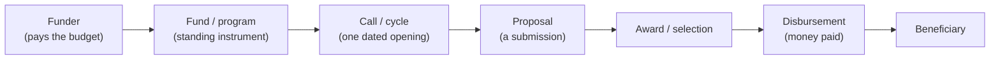

# Climate finance: the general model

This is the country-agnostic backbone for the climate-finance topic. It fixes the concepts, layers, funder levels, and vocabulary that every country page in this folder instantiates, so the country pages can be read side by side and a tool built on one can generalise to another. The governing principle throughout: **the structure is universal; the country-specific labels are *values* inside these fields, not new structure.** Moving to another country adds values (a fund name, a rating, a transfer mechanism), not new concepts.

Read this page for the shared model; read a country page for how that country fills it in.

## Country pages in this folder

- `cl-climate-finance.md` — Chile (the first fully landed country map; mitigation-weighted).
- `br-climate-finance.md` — Brazil (adaptation-first; drafted in the `brazil-phase-3` project repo, promote here when stable).
- `us-mn-climate-finance.md` — Minnesota / US (for the Concept Note Builder; all climate finance).

Each page follows the same section order so the same question can be found in the same place across countries.

## The three data layers

One funding system produces data at three different moments. Most confusion comes from mixing them; keep them separate.

1. **Supply** — what funding *exists*: the catalogue of programs a city could pursue or facilitate, one row per program. Answers "what's available, for whom, when?" This is the layer a **funder profile** is built from.
2. **Awards (revealed fundability)** — what actually *got funded*: awarded projects, one row per award. Answers "what gets funded, where, how often, at what size?" This is the layer that powers "show me comparable funded projects."
3. **Pipeline** — the parallel system for *public* investment: projects a city formulates and moves toward finance, tracked through whatever gate or queue the country uses. Answers "what has this city formulated, had approved, and financed?"

Supply and awards relate *by program*, not a shared key. Awards and pipeline are usually **different actor universes** (private/community applicants vs public bodies) and don't share records — relate them only at the (jurisdiction, sector) aggregate level. How explicit the pipeline is varies by country (a single national appraisal gate in some, program-by-program transfers in others) — that variation is a country value, not a change to the model.

## Funder levels, and why the level shapes access

The **level** is who sits above the money, and it shapes both which data layers a funder produces and how a city reaches it. Domestic public funders (national, regional, state, local) run programs and transfers, so they produce all three layers and a city reaches them directly. Money from above the sovereign — multilateral, bilateral, private — is often reached only through an intermediary, so for a city it can collapse to a single layer: the awards/projects record of what was funded. A funder being higher up the list does not mean more money is reachable; it usually means access is gated (by a rating, a guarantee, or a national gatekeeper) and the visible data shrinks to the portfolio.

| Level | Typical role | Layers a city sees | Access |
|---|---|---|---|
| National | flagship funds, formula/block grants, national programs | all three | direct |
| Regional / State | regional funds, state agencies, dedicated revenue | all three | direct |
| Local | municipal budgets, own borrowing, consortia | all three | direct |
| Multilateral | development banks, climate funds | awards (loans can be direct; grant facilities intermediated) | mixed |
| Bilateral | donor programs | awards only | intermediated |
| Private / philanthropic | foundations, impact investors, capital markets | awards / market | intermediated / market |

The one recurring subtlety, worth stating at the model level: **multilateral money is not one thing.** Development-bank *loans* are often reached directly by creditworthy cities (gated by a fiscal rating and a sovereign guarantee), while *grant facilities* are reached only through a national gatekeeper plus an accredited entity. Collapsing the two is the most common mistake; each country page draws its own version of this line.

## The funding lifecycle and core vocabulary

Most finance terms name points on a single lifecycle, from the body that pays to the party that benefits. Seeing them in order stops them blurring together.

*One opportunity at seven moments. "Awarded" is not "paid," and the applicant is not always the beneficiary.* The country pages give the local word for each moment (edital, concurso, NOFO, convênio, IUP…) as a value in these fields.

Generic terms every country page uses:

- **funder** vs **operator** — who pays vs who runs delivery (they can differ).
- **fund / program** vs **call / cycle** — the standing instrument vs one dated opening of it.
- **instrument** — grant, loan (subsidised/revolving), guarantee, blended, technical assistance, rebate, bond.
- **eligible actor** vs **beneficiary** vs **presenter** — who may apply, who benefits, who actually files (often a technical intermediary).
- **access pathway** — direct application, facilitated/enabler (the city helps others who apply), intermediated (via a gatekeeper + accredited entity), self-financing (own capital markets), or windfall (politically allocated, no open call).
- **fiscal / credit gate** — a formal rating or rule that decides whether a city can borrow (a country value: CAPAG, CAPAG-equivalents, creditworthiness/bond ratings).
- **climate relevance / adaptation eligibility** — whether a program is explicitly climate, and specifically whether it funds *adaptation*; must be tagged per program, not assumed.

## The four concepts (plus one link)

The whole landscape reduces to four things worth storing, plus one relationship. This is the portable data model behind every country page.

| Concept | What it is | Key fields |
|---|---|---|
| **Funder** | the body whose budget pays | name; level; type |
| **Funding opportunity** | a fund/program a city could pursue or facilitate, with its calls | instrument; sector; eligible actor; access route; status/timing; amount; climate & adaptation relevance; source |
| **Project** | a concrete instance of work, with its money | id; the action it instances; sector; jurisdiction; lifecycle stage; cost/committed/paid; scale; timeline; formulator |
| **Action** | the intervention type — the spine everything hangs on | id; name; sector; archetype; cost band; derived benchmark profile |

The fifth element is a **funding link** mapping a project to the funders and opportunities that paid for it — one row per source, carrying amount and paid figure. This is where "award" lives: a *relationship*, not a peer concept. Country-specific labels (a fund acronym, a rating, a transfer mechanism) are values in these fields; a new country adds values, not tables.

## What "fundable" means (the generic gates)

Whatever the country, moving a project toward a given funder means clearing that funder's specific gates. The recurring families:

- **Eligibility** — is the applicant type and activity allowed?
- **Priority / queue status** — where a country funds off a ranked list, is the project on it?
- **Match / co-finance** — is the required non-funder share secured?
- **Appraisal artifact** — the analysis a funder demands (a benefit-cost ratio, a technical-economic verdict, a cashflow for a loan).
- **Category / hazard fit** — does the project map to a named funder focus?
- **Targeting** — vulnerability/disadvantaged-community weighting, where it applies.
- **Readiness** — design stage, permits, site control.
- **Format fidelity** — following the funder's required template/section structure exactly.

These gates change *value* by funder and country, not *structure* — which is what lets scoring and concept-note tooling generalise across regions.

## Why this generalises

Because the model is fixed and only the values move, a product built on one country re-points to another by swapping data, not code: a fundability score, a coverage map, or a concept-note builder keeps its funder / template / region / instrument logic in config and data. That portability is the reason for keeping this general page separate from the country pages — it is the contract the country pages agree to, and the seam any cross-country tool builds against.

## See also

- Country pages: `cl-climate-finance.md`, `br-climate-finance.md`, `mn-climate-finance.md` (this folder).
- Originating investigations: `dataset-discovery/needs/` (e.g. `2026-06-br-city-finance-fiscal`, `2026-06-cl-finance-opportunities`, `2026-06-cl-international-climate-finance`).
- Repo-wide finance terms are cross-listed in `../glossary.md`; house prose conventions in `../writing-style.md`.
