# Minnesota climate finance: concepts, actors, and the funder map

Landscape reference for the **Concept Note Builder (CNB)** — the OEF × National League of Cities (NLC) "smart grant consultant" for Minnesota cities. It fixes a shared vocabulary, names the funders and instruments, and says how a city actually reaches climate money, so the CNB's funder-profile and matching logic rest on a real map rather than assumptions. It is oriented to the CNB's job: help a city move a project it already has to funder-ready, for one funder's region and format.

Scope is **all climate finance** (mitigation, resilience/adaptation, energy, water, buildings, transport), with water and stormwater foregrounded because that is where Minnesota money concentrates. It organises around the four axes the CNB's Project KB needs — **funder · category · region · instrument** — so a funder profile or a comparable-project query drops straight onto this structure.

**Time-sensitivity warning (read first).** The US federal climate-finance tier is in active disruption as of mid-2026 — programs cancelled, rescinded, frozen, and in litigation (see "The 2026 federal disruption"). Any concept note or funder profile built on federal money must be checked against current status, not the 2021–2024 IIJA/IRA picture. Minnesota's **state** channels are far more stable and are the safer spine for a first build.

## The mental model: layers, and three data moments

Two orthogonal axes organise the whole space. **Who sits above the money** (the level) and **what moment of data you're looking at** (the layer).

**Levels** — federal → state → regional → local → private. US climate money is overwhelmingly **intergovernmental grants and subsidised loans**: federal dollars flow to state agencies, which re-grant or on-lend to cities, often through a ranked project pipeline. The city is usually a **direct applicant**, not a passenger — and, unusually by global standards, a US city can also **finance itself** through a deep, mature municipal-bond market (Route F), an option many countries' cities do not have.

**Three data layers:**

1. **Supply** — what funding *exists*: the catalogue of programs a city could apply to, one row per program. Answers "what's available, for whom, when?" This is what a **funder profile** is built from.
2. **Awards (revealed fundability)** — what actually *got funded*: awarded projects by funder, category, region, instrument. This is exactly the CNB's **Project KB** — the "show examples" layer — and for the US it has to be built (existing OEF project data skews Latin America).
3. **Pipeline / priority lists** — the ranked queues that decide *order of funding*. In Minnesota this layer is unusually explicit and load-bearing: the water programs fund strictly off a **Project Priority List (PPL)** and an annual **Intended Use Plan (IUP)**, so "being on the list" is a real, datable status a concept note must target.

## How a Minnesota city actually reaches money — the routes

Almost every instrument sits on one of six routes. The CNB's matching logic should know which route a target funder is, because the route dictates what a concept note must contain.

```mermaid
flowchart TB
    subgraph RA["Route A — Competitive discretionary grant (apply to a NOFO)<br/>FEMA BRIC/HMGP, DNR Flood Hazard Mitigation, BWSR Clean Water Fund, Met Council Livable Communities, EPA/DOT discretionary"]
      direction LR
      A1["Read NOFO<br/>+ template"] --> A2["Apply<br/>(match + BCA)"] --> A3["Award<br/>competitive"]
    end

    subgraph RB["Route B — Subsidised loan via priority-list pipeline<br/>Clean Water SRF, Drinking Water SRF, Point Source Implementation Grant (PFA/MPCA)"]
      direction LR
      B1["Get on MPCA<br/>Project Priority List"] --> B2["Land on annual<br/>Intended Use Plan"] --> B3["Below-market loan<br/>(+ PSIG grant)"]
    end

    subgraph RC["Route C — Formula / block grant (pass-through)<br/>CDBG (HUD), USDA Rural Development, state formula programs"]
      direction LR
      C1["Eligible activity<br/>+ national objective"] --> C2["Local/state<br/>allocation"] --> C3["Sub-grant to city"]
    end

    subgraph RD["Route D — Green-bank / revolving finance (borrow)<br/>MnCIFA (state green bank), revolving loan funds"]
      direction LR
      D1["Project pitch<br/>+ savings/cashflow"] --> D2["Loan / credit<br/>enhancement"] --> D3["Repay + recycle"]
    end

    subgraph RE["Route E — State capital investment (bonding request)<br/>GO-bond capital grants, Rural Finance Authority"]
      direction LR
      E1["Local request<br/>to legislature"] --> E2["Bonding bill<br/>(political)"] --> E3["Capital grant"]
    end

    subgraph RF["Route F — City's own capital markets<br/>Municipal / green bonds, TIF, local levies"]
      direction LR
      F1["City issues<br/>debt / levy"] --> F2["Investors /<br/>taxpayers"] --> F3["Project funded"]
    end
```

*Route A is the classic competitive grant a concept note is written for — and the CNB's core case. Route B is the Minnesota water workhorse: money is not won in an open competition but by climbing a **priority list**, so the "concept note" is really a project on the PPL/IUP. Route C is formula money that passes through with eligibility rules rather than a beauty contest. Route D is the state **green bank** (loans, not grants — the concept note must show repayment). Route E is politically-allocated capital via the **bonding bill** (closer to a windfall than a reachable fund). Route F is the city financing itself. The single most important matching fact: **the route determines the document** — a FEMA grant needs a benefit-cost analysis, an SRF project needs a PPL ranking, a green-bank loan needs a cashflow.*

## The 2026 federal disruption (the load-bearing weirdness)

The thing that makes the US map unusual right now is that **the federal climate tier is partly dismantled and in litigation**. A concept-note builder that points a city at a cancelled program does real harm, so this must be encoded in the funder profiles, not left to the user to discover.

State of play as of mid-2026 (verify per funder before use):

- **FEMA BRIC** (Building Resilient Infrastructure and Communities — the flagship pre-disaster mitigation grant) was **cancelled in April 2025**, then a federal court ruled the termination unlawful and issued a **permanent injunction in December 2025** ordering FEMA to restart it (FY2024 NOFO, with FY2025/26 cycles to follow). It is legally restored but **operationally in flux** — treat as "uncertain, re-check," not "reliably open."
- **FEMA Flood Mitigation Assistance (FMA)** funding was removed for 2025. **FEMA HMGP** (post-disaster mitigation, tied to a disaster declaration) and **Public Assistance** continue — these are the durable FEMA channels.
- **Greenhouse Gas Reduction Fund (GGRF)** — the $27bn federal "green bank" program (incl. National Clean Investment Fund and **Solar for All**) was **repealed by the One Big Beautiful Bill Act (OBBBA), signed July 4 2025**, unobligated funds rescinded, awards frozen; still in litigation (oral argument Feb 2026). This directly hits Minnesota because **MnCIFA** (the state green bank) had built its scale-up on leveraging this money.
- **Climate Pollution Reduction Grants (CPRG)** and several DOT low-carbon transportation grants — **unobligated funds rescinded**. The obligated-vs-unobligated line matters: money already **obligated** to a specific award generally proceeds. Minnesota's **$200M CPRG award** (the MPCA-led climate-smart food-systems initiative, running through 2029) was obligated and is continuing — so a program can be "rescinded" nationally while a specific MN award is still live. Always check the *award*, not just the *program*.
- **IRA clean-energy tax credits via elective ("direct") pay** — cities can still claim, but the window is **narrowing fast** under the OBBBA: the clean-vehicle credit (45W) ended Sept 2025, EV-charging (30C) ends June 2026, and projects starting construction after **4 July 2026** face domestic-content rules and a placed-in-service-by-2027 deadline. Still real money (600+ local governments have filed), but timing-critical — see the energy stack below.
- **What survived and is dependable:** the **State Revolving Funds** (Clean Water SRF, Drinking Water SRF — IIJA-capitalised, state-administered), **CDBG** (HUD block grants), **USDA Rural Development** water/wastewater, and FEMA's disaster-triggered channels. These established, formula-based programs are the safe federal ground.

**Implication for the CNB:** default to Minnesota state channels and the surviving federal formula programs; carry a live "program status" flag on every federal funder profile; and never let the interview assume an IRA/IIJA discretionary program is open without a current check.

## Minnesota state channels — the stable spine

Minnesota is a national leader in state-level climate policy and funding, which is fortunate given the federal turbulence. The **2026 Climate Action Framework** (an update of the 2022 original) sets the frame: seven goal areas, 400+ actions, building on the **40+ climate laws and >$1bn of state climate funding the Legislature passed in 2023**, and a 100%-carbon-free-electricity-by-2040 target. A city's fit to these state priorities is itself a matching signal.

The distinctively Minnesotan feature is a **constitutionally dedicated funding stream**: the **Clean Water, Land and Legacy Amendment** (2008) adds a 3/8-cent sales tax through 2034, one-third of which feeds the **Clean Water Fund** — hundreds of millions a year that can only go to water-quality protection and restoration. This is why water/stormwater money in Minnesota is unusually deep and stable, and it flows through several agencies below.

Minnesota has a **second dedicated pot**: the **Environment and Natural Resources Trust Fund (ENRTF)**, funded by state lottery proceeds and allocated by the **LCCMR** (Legislative-Citizen Commission on Minnesota Resources). It has put ~$1.1bn into 1,700+ environment/natural-resource projects since 1991 (~$100M/yr recently), and a **new ENRTF Community Grant Program** (created 2023, DNR-administered, first cycle 2026) makes it more directly reachable by local governments and community organizations. Where a project is environment/natural-resources-flavored (habitat, water, land, some climate) rather than pure infrastructure, ENRTF/LCCMR is a serious channel — but note it runs on a **long annual legislative cycle** (proposal in year *n*, appropriation the following session), so it is a plan-ahead source, not a fast one.

Below the state, **watershed districts** and **watershed management organizations (WMOs)** are special-purpose local governments (Minn. Stat. ch. 103D) with **ad valorem levy authority** — they tax, and many run **cost-share programs** that fund stormwater and water-quality projects directly, especially in the Twin Cities metro. For a stormwater or green-infrastructure project, the relevant watershed district is both a potential funder and a required partner. And the **GreenStep Cities & Tribal Nations** program (MPCA-led, voluntary, 29 best practices) is not money but a **readiness/recognition framework** — a city's GreenStep status is a useful signal of the sustainability posture funders reward.

## Energy & buildings: the ratepayer + tax-credit stack

Mitigation and buildings/energy projects run on a **different funding logic** from the water/flood grants above — less "win a competitive grant," more "stack ratepayer programs, utility rebates, tax credits, and low-cost financing." A city electrifying a fleet, retrofitting buildings, or adding solar assembles money from several of these at once:

- **Utility conservation programs (CIP → ECO).** Minnesota's **Energy Conservation and Optimization (ECO) Act** (the successor to the decades-old Conservation Improvement Program) requires investor-owned utilities like **Xcel Energy** to run efficiency, efficient-fuel-switching, and load-management programs funded by ratepayers. Cities tap these as **rebates and technical assistance** (e.g. Xcel's business rebate and *Partners in Energy* planning support). This is the workhorse for building/energy efficiency and needs no competitive application — it is program participation, not a NOFO.
- **IRA elective / direct pay.** Local governments (tax-exempt) can receive a **cash payment** in lieu of a dozen clean-energy tax credits (solar, storage, EVs, charging, geothermal) — often 30–50% of project cost. It is claimed on a federal return, not "applied for," but it is **time-critical** in 2025–26 (see the disruption section: several credits are sunsetting and domestic-content rules bite after mid-2026). For a clean-energy capital project this is frequently the single largest funding layer.
- **EECBG (Energy Efficiency and Conservation Block Grant).** An IIJA-funded **formula** block grant ($431M nationally) to states, local governments and tribes for efficiency/energy projects — durable, non-competitive for entitlement recipients, small-to-mid-sized.
- **MnCIFA** (the state green bank) — low-cost **loans and credit enhancement** for the capital stack (repayment required).
- **C-PACE (MinnPACE).** **Property Assessed Clean Energy**: energy-efficiency and renewable upgrades on commercial/larger buildings repaid through a **special property-tax assessment** over up to 30 years. Administered statewide by the **Saint Paul Port Authority** (statute 216C.435–436; ~$291M/100+ projects). A financing *mechanism* the city enables more than money the city receives.
- **CERTs (Clean Energy Resource Teams)** — small **seed grants** (labor, not equipment; ~$1.3M to 393+ projects since 2006) plus technical assistance for community clean-energy projects. Good for pilots and getting a project moving.
- **Dept of Commerce rebates** (*Save Energy Minnesota*: HEAR/HOMES + state heat-pump/panel rebates) — mostly residential, and awaiting DOE launch as of mid-2026.

The CNB takeaway: for energy/buildings projects, "fundable" means **assembling a stack** (rebate + elective pay + a green-bank or PACE loan + maybe EECBG), and the binding constraint is often *timing* (tax-credit sunsets) rather than a competition.

## Beyond government: philanthropy, tribal nations, and voluntary programs

- **Philanthropy.** The **McKnight Foundation** runs a major **Midwest Climate & Energy** program (Minnesota, Wisconsin, Iowa) funding energy-system, transportation, and buildings decarbonization, and helped seed the **Minneapolis Climate Action and Racial Equity Fund** (place-based, community-driven). Foundation money is flexible and often funds the *planning, staffing, and community-engagement* that unlocks the bigger public grants — a real complement to a concept note, not a footnote.
- **Tribal nations.** Minnesota's **11 federally recognized tribal nations** (Ojibwe and Dakota) are **sovereign governments** with their own **direct federal access** (EPA, BIA, tribal set-asides, direct CPRG/IIJA awards) distinct from cities. They are a separate actor universe: a city project touching tribal land or shared watersheds involves government-to-government coordination, not a city-to-tribe grant. Worth flagging in a funder profile when relevant, not folded into "local government."

## Typical award sizes (rough, for matching)

The PRD asks for a sense of scale; approximate current magnitudes to calibrate expectations: **PFA/SRF** — the largest, ~$236M/yr across many loans, individual water projects often multi-million; **ENRTF/LCCMR** — ~$100M/yr statewide, individual grants typically hundreds of thousands to low millions; **BWSR Clean Water Fund** — $6–12M rounds, grants tens to hundreds of thousands; **MnCIFA** — 2026 call up to $50M, project loans mid-six to seven figures; **DNR flood** — up to 50% cost-share, project-scaled; **Met Council Livable Communities** — grants typically hundreds of thousands; **CERTs seed grants** — small (single thousands to low tens of thousands). The pattern: water infrastructure carries the big dollars; energy/community projects are smaller and stack.

## Award-list sources & the awards dataset (Routes A & B)

The **awards layer** — real awarded projects, indexed by route and the four axes — is not stored here; it lives as a compiled staging dataset at `dataset-compile/mn-climate-awards/` (records in `data.csv`, contract in `schema.json`, provenance in `collection.md`). This section is the reference that *points* the compilation at where each program publishes its awards, and records current-round magnitudes for calibration.

Route A (competitive discretionary grants):

- **BWSR Clean Water Fund** — Projects & Practices + Drinking Water allocations; latest round FY27, ~$6.7M / 18 grants (June 2026). Award list: agency release ([node/15841](https://bwsr.state.mn.us/node/15841)) linking a project-level PDF.
- **DNR Flood Hazard Mitigation** — 2025 round $9M / 8 projects (Oct 2025); up to 50% cost-share (Minn. Stat. 103F.161). Per-project amounts not published in the release. List: [DNR news release](https://www.dnr.state.mn.us/news/2025/10/22/minnesota-dnr-awards-9-million-flood-hazard-mitigation-grants).
- **Met Council Livable Communities** — award tables in Environment/Council committee reports. Note: TBRA is contaminated-land redevelopment (adjacent); use the Livable Communities Demonstration Account for stormwater-relevant awards.

Route B (SRF priority-list pipeline):

- **Clean Water SRF (PFA/MPCA)** — 2026 IUP: 354 projects, >$888M in the fundable range; SFY2025 binding commitments $178M. Project rows in the [SFY2026 IUP PDF](https://mn.gov/deed/assets/2026-clean-water-intended-use-plan_tcm1045-719237.pdf) (compressed fonts — needs an OCR/parse pass).
- **Point Source Implementation Grant (PSIG)** — 80% of eligible cost, cap raised $7M→$12M; $32M in 2025 bonding. Awarded by PPL rank + MPCA certification. [Program page](https://mn.gov/deed/pfa/funds-programs/point-source-grants.jsp).
- **Water Infrastructure Fund (WIF)** — supplemental grants paired with SRF loans for small/low-income systems; 2025 = $87M ($43.5M drinking + $43.5M wastewater), per-project cap $5M→$10M.

## Core vocabulary

Standard term, then the plain meaning — the load-bearing ones a concept note turns on.

- **NOFO / NOFA** (Notice of Funding Opportunity/Availability): one dated opening of a competitive grant, with eligibility, scoring rubric, and the required application/concept-note structure. The funder's NOFO *is* the template the CNB writes to.
- **formula vs discretionary**: formula money is allocated by a set rule (population, need) and is near-automatic if eligible; discretionary money is competed for. Concept notes matter for discretionary; eligibility matters for formula.
- **State Revolving Fund (SRF)**: a perpetual pool that makes **below-market loans** for water infrastructure; repayments recycle into new loans. Minnesota runs a **Clean Water SRF** (wastewater/stormwater) and **Drinking Water SRF**.
- **Project Priority List (PPL)** and **Intended Use Plan (IUP)**: the MPCA-ranked queue of water projects (PPL) and the annual list of which ranked projects will actually be funded (IUP). In the SRF world, "applying" means **getting on and climbing these lists** — a datable status, not a one-shot proposal.
- **match / cost-share**: the share of project cost the city must bring (e.g. DNR flood grants cover up to 50%). Match availability is often the binding constraint and a required concept-note field.
- **benefit-cost analysis (BCA)**: FEMA and some others require a benefit-cost ratio ≥ 1.0. For hazard-mitigation grants the BCA is frequently the make-or-break artifact.
- **green bank**: a public finance entity (Minnesota's is **MnCIFA**) that lends and de-risks rather than grants — so its "concept note" must demonstrate **repayment**, not just impact.
- **block grant**: flexible federal money (e.g. **CDBG**) passed to state/local governments for eligible activities meeting a "national objective" (e.g. benefit to low-and-moderate-income people).
- **GO bonds / bonding bill / capital investment**: Minnesota funds local capital projects by issuing state general-obligation bonds through a biennial **bonding bill** — a political, legislature-allocated process (Gov. Walz opened the 2026 round at ~$907M, including flood-risk and resilience items).
- **Legacy / Clean Water Fund**: the dedicated-sales-tax money above; category-restricted to water quality.
- **disadvantaged / underserved targeting**: many programs weight or reserve funds for disadvantaged communities (MnCIFA targets ≥40% of benefits there). Note the federal "Justice40" framing is itself in flux in 2026 — verify before relying on it.

## Main actors (funders / administrators)

Instrument key: **grant** · **loan** (subsidised/SRF) · **green-bank loan** · **block/formula** · **bonding** (GO-bond capital) · **rebate** · **muni bond**.

| id | funder / administrator | level | instrument | category focus | route | CNB relevance |
|----|------------------------|-------|-----------|----------------|-------|---------------|
| mn-pfa | **Public Facilities Authority (PFA)** (in DEED) | State | loan + grant | water, wastewater, **stormwater**, drinking water | B | Runs Clean Water & Drinking Water **SRFs** + **Point Source Implementation Grant**; ~$236M/yr; funds off MPCA PPL/IUP — the water workhorse |
| mn-mpca | **Minnesota Pollution Control Agency (MPCA)** | State | (ranks + some grants) | water quality, stormwater | B | Owns the **Project Priority List**; stormwater funding guidance; gateway to SRF |
| mn-bwsr | **Board of Water & Soil Resources (BWSR)** | State | grant | water quality, **stormwater**, erosion, green infrastructure | A | **Clean Water Fund** grants + **Watershed-Based Implementation Funding** to cities/SWCDs/watershed orgs ($6–12M rounds) |
| mn-dnr | **DNR Flood Hazard Mitigation Grant Assistance** | State | grant (cost-share) | **flood** mitigation | A | Up to 50% cost-share for local flood projects (Minn. Stat. 103F.161) — the state's pre-disaster flood channel |
| mn-cifa | **MnCIFA** (MN Climate Innovation Finance Authority) | State | green-bank loan | clean energy, efficiency, buildings | D | State **green bank**; 2026 call up to $50M; loans not grants (needs cashflow); federal-leverage model disrupted by GGRF freeze |
| mn-metc | **Metropolitan Council** | Regional (Twin Cities) | grant | **stormwater**, land use, water | A | **Livable Communities** grants fund city stormwater/green-infra (Bloomington, Hastings, Mpls/St. Paul) |
| mn-commerce | **Dept of Commerce — Energy** | State/federal pass-through | rebate | buildings, energy, heat pumps | C | **Save Energy Minnesota** (HEAR/HOMES + state rebates) — mostly residential; not city-project money; awaiting DOE launch (mid-2026) |
| mn-bond | **Capital Investment / MMB (bonding bill)** + **Rural Finance Authority** | State | bonding | capital: flood, dams, resilience | E | Legislature-allocated GO-bond capital grants; politically won, not applied-for |
| mn-legacy | **Clean Water, Land & Legacy Fund** | State (dedicated tax) | (funds the above) | water, land, parks | — | The dedicated revenue behind BWSR/DNR/agency water grants — why MN water money is deep |
| us-srf | **EPA** (via PFA) | Federal→State | loan (cap grant) | water infrastructure | B | Capitalises the SRFs; IIJA-funded; **durable** federal channel |
| us-fema | **FEMA** — HMGP, BRIC*, FMA*, Public Assistance | Federal | grant | hazard/flood mitigation, disaster | A | HMGP/PA durable; **BRIC/FMA in flux 2026** (see disruption) — flag status |
| us-hud | **HUD — CDBG / CDBG-DR** | Federal→State/local | block/formula | infrastructure, disaster recovery, LMI | C | Flexible block money; durable; strong for equity-framed resilience |
| us-usda | **USDA Rural Development** | Federal | loan + grant | rural water/wastewater/energy | B/C | Key for small/rural MN cities' water and energy |
| us-dot | **US DOT** — RAISE, PROTECT | Federal | grant | resilient transport | A | Some discretionary climate-transport money **rescinded 2025–26** — verify |
| city-bonds | **City** (e.g. Minneapolis green bonds) | Local | muni bond / TIF | any capital | F | The city finances itself; green-bond labelling is a growing option |
| mn-enrtf | **ENRTF / LCCMR** (lottery trust) | State (dedicated) | grant | environment, natural resources, water, some climate | A | ~$100M/yr; new **Community Grant Program** (2026) reaches local govts; long annual legislative cycle — plan ahead |
| mn-eco | **Utility CIP/ECO programs** (Xcel et al.) | Ratepayer | rebate + TA | buildings, energy efficiency, fuel-switching | C | Not a NOFO — program participation; rebates + *Partners in Energy* planning; the buildings/energy workhorse |
| mn-pace | **MinnPACE** (Saint Paul Port Authority) | State/local | PACE (assessment) | building energy, renewables | F | Special-assessment financing up to 30 yrs; ~$291M/100+ projects; city *enables*, owner repays |
| mn-certs | **CERTs** (Clean Energy Resource Teams) | State/nonprofit | seed grant + TA | community clean energy | A | Small labor-only seed grants; good for pilots and momentum |
| mn-watershed | **Watershed districts / WMOs** | Local (special-purpose) | grant / cost-share | **stormwater**, water quality | A | Levy authority (Minn. Stat. 103D); direct cost-share; funder *and* required partner in metro |
| us-eecbg | **DOE — EECBG** | Federal→State/local | block/formula | energy efficiency, buildings | C | IIJA-funded formula block grant; durable; small-to-mid |
| us-electivepay | **IRS — IRA elective/direct pay** | Federal (tax) | tax-credit cash | clean energy, EVs, storage, solar | (tax) | Cash for tax-exempt entities; 30–50% of cost; **time-critical, sunsetting 2025–27** |
| phil-mcknight | **McKnight Foundation** (+ community funds) | Philanthropic | grant | energy, transport, buildings, equity | market | Flexible; funds planning/staffing/engagement that unlocks public grants |
| tribal | **Tribal nations** (11 in MN) | Sovereign | (own federal access) | varies | — | Separate actor universe; direct EPA/BIA/CPRG access; government-to-government, not a city grantee |

## Minnesota hazard & category framing (for funder matching)

The CNB matches a city's project to a funder's focus, so it helps to know which hazards drive Minnesota funding. Two categories dominate the money: **water quality / stormwater** (Legacy + BWSR + PFA + MPCA — deep and stable) and **flood mitigation** (DNR + FEMA — riverine and flash flooding, spring snowmelt, the Red River and Mississippi basins). Growing but thinner-funded: **extreme heat** and urban heat islands (Twin Cities), **energy/buildings** efficiency and electrification (Commerce, MnCIFA), and **drought** and **wildfire** (northern forests). A concept note lands best when it maps the city's project onto the funder's named category — stormwater/green infrastructure and flood are the strongest-fit, best-funded framings in Minnesota today.

## What "fundable" means for a concept note (the CNB's job)

Moving a project from "~70/100" to "~100/100" against a funder means satisfying that funder's specific gates. The recurring ones in this landscape:

- **Eligibility** — is the applicant type and activity allowed (many programs are local-government-only; SRFs need a public system; CDBG needs a national objective).
- **Priority-list status** — for SRF/water money, is the project on the **PPL/IUP**? If not, the first "fundable" step is getting listed.
- **Match / cost-share secured** — is the non-federal/non-state share identified? Often required to score.
- **Benefit-cost analysis** — for FEMA-style mitigation, a BCR ≥ 1.0; the analytic artifact is frequently decisive.
- **Category and hazard fit** — does the project map to a named funder focus (stormwater, flood, heat)?
- **Disadvantaged-community benefit** — many programs weight this (MnCIFA ≥40%); a real, evidenced equity story helps.
- **Readiness** — design stage, permits, site control; priority queues reward shovel-readiness.
- **Template / NOFO fidelity** — the note must follow the funder's required section structure exactly (this is the CNB's export target).

These are the fields a funder profile should carry and the interview should drive toward — and they generalise: for a second funder or region, the gates change value, not structure.

## Notes for building this into the CNB

- **Structure to generalise (per PRD §6).** Keep funder, template/format, region, instrument, and language in config/data. This map's spine — the four axes (funder · category · region · instrument) and the six routes — is the schema; Minnesota is the first set of values, not a special case.
- **The Project KB gap is real.** Comparable-project evidence for the US/Minnesota has to be built; OEF's existing project data skews Latin America. The **awards layer** (route-by-route) is where to source it: SRF IUPs and PFA award announcements, BWSR Clean Water Fund grant lists, Met Council Livable Communities awards, FEMA/DNR mitigation awards — these are enumerable and public.
- **Carry a program-status flag.** Because the federal tier is volatile in 2026, every federal funder profile needs a "current status / last-checked" field so the interview never drafts toward a cancelled program.
- **Prefer state channels for the first build.** They are stable, deep (Legacy-backed), and Minnesota-specific — the safest ground for a first, credible concept note.

## Open items to confirm

- The **single target funder** and **instrument** for the MN pilot are TBC in the PRD (blocks the funder profile). This map narrows the likely field: for city climate-resilience infrastructure the strongest-fit MN funders are **PFA/SRF + PSIG** (stormwater/water, Route B), **BWSR Clean Water Fund** and **Met Council Livable Communities** (green infrastructure/stormwater grants, Route A), and **DNR Flood Hazard Mitigation** (flood, Route A).
- The **three MN cohort cities** (PRD) — confirm, to localise hazard framing and match to region (metro vs greater Minnesota changes the funder set: Met Council is Twin-Cities-only; USDA Rural favours small cities).
- Current status of each **federal** program at build time — re-verify against primary sources.

## Sources (verified mid-2026)

- Federal disruption — [FEMA BRIC restored by court order (Dec 2025) — WBUR](https://www.wbur.org/news/2025/12/12/judge-orders-fema-grant-restored-bric-massachusetts) · [BRIC recent developments — Congress.gov CRS](https://www.congress.gov/crs-product/IN12609) · [GGRF repeal via OBBBA & litigation — IRA Tracker](https://iratracker.org/programs/ira-section-60103-greenhouse-gas-reduction-fund/) · [Frozen federal climate funding — Columbia Climate Law](https://blogs.law.columbia.edu/climatechange/2026/03/06/uncertain-remedies-for-frozen-federal-climate-funding/)
- MnCIFA (state green bank) — [MnCIFA](https://mncifa.mn.gov/) · [2026 Call for Applications (up to $50M)](https://mncifa.mn.gov/call-for-applications)
- PFA / SRFs / PSIG — [Clean Water SRF — PFA](https://mn.gov/deed/pfa/funds-programs/cleanwaterrevolvingfund.jsp) · [Point Source Implementation Grant — PFA](https://mn.gov/deed/pfa/funds-programs/point-source-grants.jsp) · [CWSRF SFY2026 IUP](https://mn.gov/deed/assets/2026-clean-water-intended-use-plan_tcm1045-719237.pdf) · [$236.4M awards — DEED](https://mn.gov/deed/newscenter/press-releases/?id=1045-703125)
- DNR flood + Legacy — [Flood Hazard Mitigation Grant Assistance — DNR](https://www.dnr.state.mn.us/grants/water/flood_hazard.html) · [Clean Water Fund — MN Legacy](https://www.legacy.mn.gov/clean-water-fund)
- BWSR + Met Council — [Clean Water Fund programs — BWSR](https://bwsr.state.mn.us/cwf_programs) · [Watershed-Based Implementation Funding — BWSR](https://bwsr.state.mn.us/watershed-based-implementation-funding-program) · [Climate resiliency programs & funding — BWSR](https://bwsr.state.mn.us/climate-resiliency-identifying-programs-and-funding)
- State frame + bonding — [Climate Action Framework 2026 — MN](https://climate.state.mn.us/minnesotas-climate-action-framework) · [2026 bonding proposal](https://minneapolimedia.town.news/g/coon-rapids-mn/n/361257/minnesotas-907-million-question-governor-walz-opens-2026-bonding-debate) · [Save Energy Minnesota — Commerce](https://mn.gov/commerce/energy/consumer/energy-programs/)
- ENRTF / LCCMR — [ENRTF — MN Legacy](https://www.legacy.mn.gov/environment-natural-resources-trust-fund) · [LCCMR](https://www.lccmr.mn.gov/) · [ENRTF Community Grant Program — DNR](https://www.dnr.state.mn.us/aboutdnr/enrtf-community-grant-program.html)
- Energy stack (CIP/ECO, elective pay, EECBG, CERTs, PACE) — [ECO Act — MN Commerce](https://mn.gov/commerce/energy/conserving-energy/eco/) · [ECO Act highlights — CEE](https://www.mncee.org/mns-eco-act-2025-cee-highlights) · [Elective pay for cities — NLC](https://www.nlc.org/article/2025/08/13/direct-pay-direct-impact-how-ira-changes-could-shape-local-clean-energy-projects/) · [EECBG — DOE](https://www.energy.gov/cmei/articles/energy-efficiency-and-conservation-block-grant-eecbg-national-evaluation) · [CERTs Seed Grants](https://www.cleanenergyresourceteams.org/certs-seed-grants) · [MinnPACE](https://minnpace.com/about-minnpace/)
- Beyond government — [McKnight Midwest Climate & Energy](https://www.mcknight.org/programs/midwest-climate-energy/) · [Minneapolis Climate Action & Racial Equity Fund — McKnight](https://www.mcknight.org/news-ideas/first-grants-awarded-from-minneapolis-climate-action-and-racial-equity-fund/) · [GreenStep Cities & Tribal Nations — MPCA](https://greenstep.pca.state.mn.us/) · [Tribal/state climate collaboration — MN](https://climate.state.mn.us/g2g-forum-tribal-state-collaboration-address-climate-change) · [MN CPRG climate-smart food systems ($200M, to 2029)](https://www.pca.state.mn.us/air-water-land-climate/minnesota-climate-smart-food-systems)
- Watershed districts — [Watershed Districts — BWSR](https://bwsr.state.mn.us/watershed-districts) · [Minn. Stat. ch. 103D](https://www.revisor.mn.gov/statutes/cite/103d)
