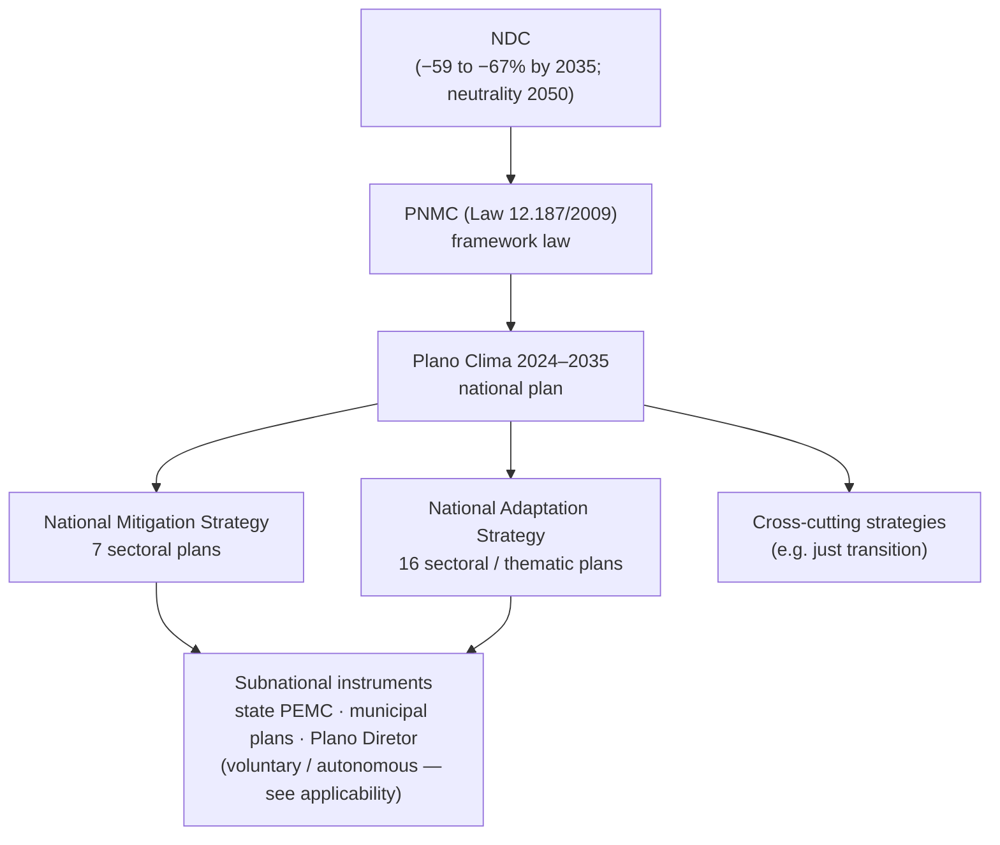
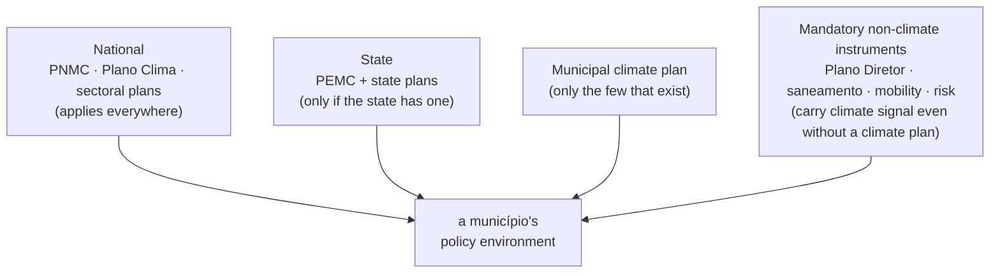

# Brazil climate policy: documents, actors, and the signal map

Landscape reference for **climate-policy signalling** in Brazil — reading a município's policy environment to judge what it *says* about a given action or sector. It is the Brazil country page of the climate-policy topic; see `overview.md` for the country-agnostic model it instantiates (the two grains, the three data moments, the signal vocabulary, the strength gates). This page says what the Brazilian document universe *is*, who publishes it, and how a document reaches a specific city — the durable data facts, not the processing.

Two features of Brazil most shape how this map differs from Chile's, and both echo the Brazil *finance* page:

- **Federalism over cascade.** Brazil is a federation where states and municipalities hold their own climate-policy powers. There is no framework law that mandates a regional-then-communal plan for every territory. Subnational climate plans are **voluntary, experimental, and sparse** — so a city's policy environment is not a clean top-down inheritance the way it is in Chile.
- **Commitment isn't only in the climate plan.** Just as most urban-adaptation *money* in Brazil is not labelled "climate" (it flows through sanitation and civil defence), most binding *municipal climate commitment* lives outside any climate plan — in the mandatory **Plano Diretor** and in sanitation, mobility, and disaster-risk plans. A view built only from climate-badged documents would miss the layer where local obligations actually sit.

Scope is all climate policy (mitigation and adaptation) plus the mandatory territorial and sectoral municipal instruments that carry climate-relevant commitments.

## The national stack (a fork, not a single line)

Brazil's framework law — **PNMC**, Política Nacional sobre Mudança do Clima (Law 12.187/2009) — plays the role Chile's LMCC plays: it defines principles, instruments, and the national planning obligation. What it produces, though, is a **two-strand** structure rather than one descending line. The **Plano Clima 2024–2035** (launched March 2026) operationalises the NDC through a mitigation strategy and an adaptation strategy in parallel, each with its own set of sectoral plans, plus cross-cutting themes:

*Read the national strands top-down for legal basis, targets, and sector framing. The dashed reality is the join to the subnational layer: unlike Chile, the arrow into state and municipal instruments is **not mandatory inheritance** — it is autonomy, and the sub-layer is patchy.*

The consequence for the data: the national layer is **legible and freshly consolidated** (Plano Clima is new, so expect churn and versioning), the sectoral-plan layer is where concrete national measures and targets sit, and the closer-to-the-city detail you most want is **thin and unevenly present**.

## Applicability: enumeration, not inheritance

This is where Brazil breaks the Chile pattern. Chile's LMCC forces a PARCC per region and a PACCC per commune, so a city's applicable set is reliably "national + my region + my commune." Brazil has **no such cascade**. A município's policy environment is assembled, not inherited:

Three rules the data must encode rather than assume:

- **National applies to all** — the one clean inheritance, same as Chile.
- **State and municipal climate plans apply only where they exist.** Coverage is a per-territory *lookup*, not a scale rule. Many of Brazil's 26 states + Federal District have a PEMC; most of its 5,570 municipalities do not have a climate plan. The presence/absence of an instrument is itself first-class data.
- **Non-climate mandatory instruments fill the local gap.** The **Plano Diretor** (master plan, mandatory for municipalities >20,000 and revised ~every 10 years) plus municipal sanitation (PMSB), mobility (PlanMob), and disaster-risk plans frequently carry the only binding local climate-relevant commitments. These must be in the document universe, not treated as out of scope.

So "coverage" in Brazil is closer to *building a per-city dossier* than applying a formula — and the sparser the subnational climate layer, the more the non-climate instruments and the national/state layers carry the signal.

## What should be in the inventory (the document record)

Same durable field contract as the country-agnostic model, with Brazil-specific values. Names illustrative; the *fields* are the contract.

| Field | Brazil value / note |
|---|---|
| `source_document_id` | stable snake_case id; join key to every signal |
| `source_name` | official Portuguese title |
| `source_url` | gov.br, ministry, state-agency, or municipal host — heterogeneous |
| `source_level` | `national · state · intermunicipal · municipal` (federal scale set) |
| `document_type` | `framework · national_plan · sector_plan · state_policy · municipal_climate_plan · master_plan · sectoral_municipal_plan · adaptation_strategy` — **wider than Chile**, because non-climate carriers count |
| `document_status` | `final · draft · consultation · portal_only · placeholder` |
| `territory_code` | built on **IBGE codes** (2-digit UF state, 7-digit município) for the applicability lookup |
| `uf_code` / `region_code` | state (UF) filter; macro-region optional |
| `publisher` | ministry (MMA and line ministries), state environment secretariat/agency (e.g. CETESB, SEMIL), or prefeitura |
| `publication_year`, `language` | provenance; `pt` |
| `access_type` | `pdf · portal · gov_br · municipal_site` |
| `has_climate_plan` (derived) | per-territory flag — does this state/município have a climate instrument at all, or only non-climate carriers? |

The structural workhorses are the same five — **level · type · status · territory_code · publisher** — plus one Brazil-specific derived flag (`has_climate_plan`) that captures the coverage gap the federal system creates.

## Signals (the payload vocabulary)

Unchanged from the shared model — the closed primitive set (**action, target, funding, monitoring, governance, sector_priority, sector, risk, context**) with **explicitness** and **commitment strength** on every signal, and verbatim grounding to an exact quote. See `overview.md`. Nothing about Brazil's federalism changes what a policy statement *can be*; it only changes which documents you have to read to find it.

## Document families and actors (Brazil)

| Document family | Level | Typical publisher | Role in the stack | Signal value |
|---|---|---|---|---|
| **NDC** | National | Union (MMA / Itamaraty) | international commitment | top-level targets and framing |
| **PNMC** (Law 12.187/2009) | National | Congress / MMA | framework law, instruments, governance | legal basis, instrument definitions |
| **Plano Clima 2024–2035** | National | MMA + interministerial | national plan operationalising the NDC | strategy, targets, sector framing (new — expect updates) |
| **National Mitigation Strategy — 7 sectoral plans** | National | line ministries | concrete mitigation measures by sector | **very high** — national measures and sector targets |
| **National Adaptation Strategy — 16 sectoral/thematic plans** | National | line ministries + MMA | adaptation objectives and guidelines by theme (cities, water, health, DRM, coasts, infrastructure, …) | **very high** — adaptation measures, risk framing |
| **State climate policy (PEMC)** + state plans | State | state legislature / environment agency | state-level policy where it exists (e.g. SP Law 13.798/2009) | high where present; absent in many states |
| **Municipal climate plan** | Municipal | prefeitura | local climate delivery | **highest where it exists — but rare** |
| **Plano Diretor** (master plan) | Municipal | prefeitura + câmara | mandatory land-use/ordering (>20k pop.) | climate-relevant zoning, risk areas, growth limits — often the only binding local instrument |
| **Municipal sectoral plans** (PMSB sanitation, PlanMob mobility, disaster-risk) | Municipal | prefeitura | mandatory sector planning | disperse but real climate signal (drainage, transport, risk) |

Coverage is deep and freshly consolidated at national level, uneven at state level, and thin at municipal climate level — so the mandatory **Plano Diretor** and municipal sector plans do disproportionate work in representing a city's local commitments.

## What makes a signal strong

The same durable gates as the shared model — locality, explicitness, commitment, status, specificity — with one Brazil-specific caveat: **locality is harder to lean on.** Because dedicated local climate plans are sparse, the strongest *available* local signal is often inside a non-climate instrument (a flood-risk mapping in the Plano Diretor, a drainage target in the PMSB). The weighting should credit those as genuine local commitments, not discount them for lacking a climate label — the mirror image of the finance page's rule that unlabelled sanitation money still counts.

## Where to look (and the access reality)

- **National** — gov.br/mma and the interministerial Plano Clima portal (NDC, PNMC, Plano Clima, national strategies); line-ministry sites for sectoral plans.
- **State** — state environment secretariats and agencies (e.g. CETESB / SEMIL in São Paulo) for PEMCs and state plans; coverage and format vary widely by state.
- **Municipal** — prefeitura sites for the rare municipal climate plan, and for the Plano Diretor / PMSB / mobility / risk plans that carry local signal.

As in Chile, `access_type` and `source_url` are first-class: a listed instrument may be portal-only or unresolved, and the 5,570-município long tail means much of the municipal layer is discoverable only site-by-site.

## Known limitations (the load-bearing weirdness)

- **No mandatory cascade.** Federal autonomy means coverage is enumeration, not inheritance; absence of a state/municipal plan is common and must be recorded, not inferred as "nothing."
- **Signal dispersed across non-climate instruments.** The binding local climate content often sits in Plano Diretor, sanitation, mobility, and risk plans — miss those and the municipal layer looks empty when it isn't.
- **Fresh, moving national layer.** Plano Clima launched in 2026; its sectoral plans and targets are new and will be revised — the national inventory needs versioning and a status/last-checked discipline.
- **Municipal long tail.** 5,570 municipalities, most without a climate plan; the layer that would differentiate neighbouring cities is mostly the master plan, not a climate instrument.
- **State heterogeneity.** PEMCs differ in age, structure, and force; some predate the current national framework and don't map neatly onto Plano Clima's sector split.

## Notes on generalising

Brazil confirms which parts of the Chile model are truly portable and which were Chilean specifics. **Portable and unchanged:** the two grains, the three data moments, the primitive/signal vocabulary, and the strength gates — these belong in `overview.md`. **Country values, not structure:** the instrument names (LMCC↔PNMC, PARCC/PACCC↔state PEMC/municipal plans), the scale set (`communal` unitary ↔ `municipal` federal), and the territory codes (Chile region/commune ↔ Brazil IBGE UF/município). **The one genuine structural variable the two countries expose:** applicability can be **inheritance** (Chile's mandated cascade) or **enumeration** (Brazil's voluntary patchwork) — so the shared model should treat the applicability rule as a country-provided strategy, plus a standing category for **non-climate instruments that carry climate signal**, which both countries need but Brazil needs heavily.

## See also

- Country-agnostic model: `overview.md` (this folder).
- Sibling country page: `cl-climate-policy.md` (Chile — the mandated-cascade case).
- Finance parallel (same country twists): `../climate-finance/br-climate-finance.md` — the "money isn't labelled climate" logic that this page mirrors as "commitment isn't only in the climate plan."

## Sources

- Plano Clima 2024–2035 launch and structure (7 mitigation + 16 adaptation sectoral plans) — [Mayer Brown](https://www.mayerbrown.com/en/insights/publications/2026/03/federal-government-launches-the-climate-plan-2024-2035-and-sets-guidelines-for-brazils-climate-transition)
- PNMC / Brazilian climate legal framework (Law 12.187/2009) — [Chambers Environmental Law 2025 — Brazil](https://practiceguides.chambers.com/practice-guides/environmental-law-2025/brazil)
- Climate governance and federalism in Brazil — [Cambridge](https://www.cambridge.org/core/books/climate-governance-and-federalism/climate-governance-and-federalism-in-brazil/61635710F4C00D7CE0F76F8F8F536C56)
- Subnational / municipal climate agenda and autonomy — [Nature, Humanities & Social Sciences Communications](https://www.nature.com/articles/s41599-019-0225-x)
- Municipal adaptation build-out (AdaptaCities; 581 municipalities) — [CCAC](https://www.ccacoalition.org/news/brazils-leadership-turning-point-global-climate-action)
- State policy example — Política Estadual de Mudanças Climáticas, São Paulo (Law 13.798/2009) — [Instituto Geológico / SEMIL SP](https://www.infraestruturameioambiente.sp.gov.br/institutogeologico/2017/01/politica-estadual-de-mudancas-climaticas-pemc/)
