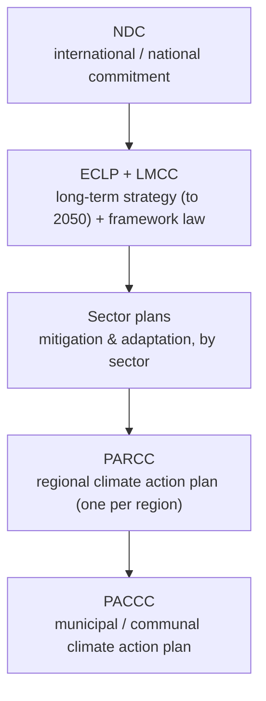
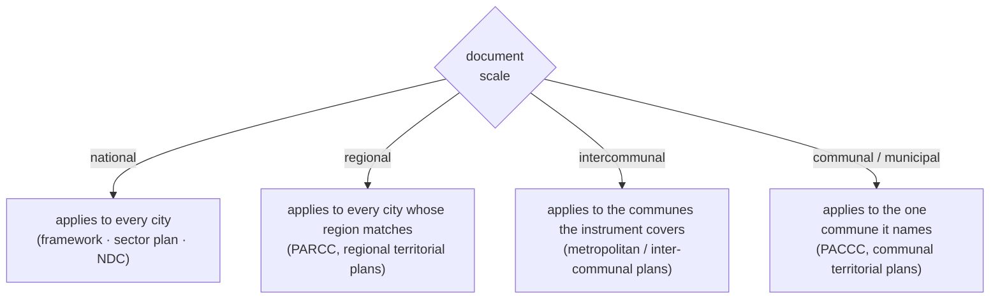

# Chile climate policy: documents, actors, and the signal map

Landscape reference for **climate-policy signalling** — reading a city's policy environment to judge what that environment *says* about a given action or sector. It fixes a shared vocabulary, names the document families and the actors that publish them, and says how a document reaches down to a specific city, so any tool that scores "does this city's policy environment support this action?" rests on a real map rather than assumptions.

This page is deliberately **about the data, not the processing**. It defines what a policy-document dataset *is*, where the documents live, and what should be in each record — the things that stay true as extraction methods, models, and context windows change. How the documents are parsed, atomised, matched, or scored is a separate, faster-moving concern and is not fixed here.

Scope is **all climate policy** (mitigation and adaptation) plus the **territorial-planning** and **environmental-programme** instruments that carry climate-relevant commitments. Chile is the worked example because its policy system is unusually *legible*: a single framework law defines a named hierarchy of instruments, which gives the data a clean spine to hang on.

## The mental model: the document is the unit, the signal is the payload

Two ideas organise the whole space.

First, **the record is a document, but the value is what the document commits to.** A finance row is self-contained — a funder, an award. A policy document is inert until you read out of it *what it commits, targets, funds, monitors, and governs*. So a policy dataset has two grains: the **document** (one row: title, actor, scale, type, status, link) and the **signal** (the individual policy statements read out of that document). The document grain says *what exists and where*; the signal grain says *what it means*. Keep them separate — most confusion comes from mixing "we have the plan" with "the plan says X."

Second, **three data moments**, the policy analogue of supply/awards/pipeline:

1. **Inventory** — what documents *exist*: the catalogue of policy and planning instruments that could bear on a city, one row per document. Answers "what's out there, at what scale, published by whom, where do I get it?" This is the manifest layer.
2. **Signals** — what the documents *say*: the policy statements read out of each document, tagged by what kind of statement they are. Answers "what does this instrument actually commit to, target, fund, or monitor?" This is the payload layer, and it is where all the analytical weight sits.
3. **Coverage** — which documents *apply* to which city: the mapping from the document set down to a specific territory, by scale. Answers "what is the policy environment *for this city*?" This is the layer that turns a national manifest into a city-specific view.

Inventory and signals relate by document. Coverage relates the document set to a jurisdiction by scale rule (below), not by a shared key.

## The nested policy stack (the Chilean spine)

Chile's framework law (**LMCC**, Ley 21.455) defines an explicit hierarchy of instruments. Each layer makes the one above it more concrete and more local — which is exactly why the stack is the organising spine of the data: a document's position in it predicts how implementable, how specific, and how city-relevant its signals are.

*Frameworks set long-term goals, obligations, and scope; the lower instruments turn those goals into named actions, delivery actors, financing pathways, timelines, and monitoring. Read top-down for legal basis and alignment context; read bottom-up for extractable, place-based commitments.*

The load-bearing consequence for the data: **locality tends to track implementation detail.** A municipal or regional plan is where you find a specific action with an owner and a date; a national framework mostly gives targets and framing. So when the same action shows up at two levels, the more local instrument is usually the stronger, more implementable signal:

> PACCC → PARCC → Sector plans → ECLP / NDC

This ordering is a durable property of the Chilean system, not a scoring parameter — any weighting scheme should respect it, whatever the exact numbers.

## Applicability: how a document binds a city

The other structural spine. Finance asks *how a city reaches money*; policy asks *which document sits above a given city* — and that is decided by **territorial scale**, encoded in every record. The rule set is deterministic and durable:

Two nuances worth carrying in the data itself rather than re-deriving:

- **Intercommunal scope is under-specified by default.** An inter-communal instrument covers a named set of communes, but manifests rarely enumerate them; the honest fallback is "every commune in the region," flagged as approximate until the covered communes are listed.
- **Status conditions the weight of a signal, not just its presence.** A `draft` or `consultation` document still binds in principle but should count for less than a `final` one — status is a first-class field for exactly this reason.

This is why a national manifest can still produce a *city-specific* view: national documents apply everywhere, regional ones filter by region, and only the sparse communal layer differentiates one city from its neighbours.

## What should be in the inventory (the document record)

The durable field set for the inventory grain — the things that identify a document, place it in the stack, and tell you where to get it. Names are illustrative; the *fields* are the contract.

| Field | What it holds | Why it's load-bearing |
|---|---|---|
| `source_document_id` | stable snake_case id | the join key to every signal read out of the document |
| `source_name` | official title (in original language) | identity; disambiguates near-duplicates across years |
| `source_url` | link to the document | where to look; may be a portal or placeholder, not always a PDF |
| `source_level` | `national · regional · intercommunal · communal · municipal` | drives **applicability** (which cities it binds) |
| `document_type` | `framework · sector_plan · parcc · paccc · territorial_plan · environmental_program` | places it in the **stack** (implementation detail expected) |
| `document_status` | `final · draft · consultation · portal_only · flipbook_only · placeholder` | conditions signal weight; flags what isn't really a document yet |
| `territory_code` | `level_region_commune` (e.g. `1_00_00` national, `2_06_00` regional, `3_06_101` communal) | machine-readable scale + territory for the applicability join |
| `region_code` | 2-digit region (`00` = national scope) | the regional applicability filter |
| `publisher` | the ministry / GORE / municipality that issued it | the governance actor; signals which sector/mandate |
| `publication_year`, `language` | provenance | versioning; translation need |
| `access_type` | `pdf · portal · sharepoint · drive · flipbook` | whether the document is actually retrievable, and how |
| `review_priority` | curator's read-value flag | lets low-value rows (e.g. placeholders) be excluded cleanly |

The five fields that do the real structural work are **level · type · status · territory_code · publisher** — scale and stack position plus who stands behind it. Everything a downstream tool needs to decide *whether and how strongly* a document bears on a city is derivable from those.

## What should be in the signals (the payload vocabulary)

A document's signals are its individual policy statements, each tagged by **what kind of statement it is**. This closed vocabulary is the policy analogue of the finance page's instrument typology — it is the domain's shared language for "what a policy document can say," and it is stable even as extraction methods change:

- **action** — a named intervention or measure the instrument sets out to do.
- **target** — a quantified or dated goal (a percentage, a year, a cap).
- **funding** — a financing pathway, budget line, or funding mechanism named for delivery.
- **monitoring** — an MRV, indicator, reporting, or verification commitment.
- **governance** — an assignment of responsibility, mandate, coordination body, or legal duty.
- **sector_priority** — a stated priority for a sector without a specific action yet.
- **sector** — a sector scoping or classification statement.
- **risk** — an identified hazard, vulnerability, or climate risk.
- **context** — framing, background, or narrative that sets up the above.

Two properties travel with every signal because they govern how much it should count, independent of any particular scoring formula:

- **explicitness** — is the statement *explicit* (the document says it) or *inferred* (read between the lines)? Explicit signals are worth more.
- **commitment strength** — the difference between "commits / targets / funds" (binding) and "prioritises / identifies / contextualises / restates" (soft). A commitment outweighs a mention.

The single most useful discipline at this grain is **verbatim grounding**: every signal should trace to an exact quote in the source document (with page/section), so a claim about what a policy says can always be checked against the policy. That principle is durable; the mechanism that enforces it is not fixed here.

## Document families and actors (Chile)

Who publishes what, and how much implementation signal to expect from each family. The **publisher archetype** is itself a signal — a MINVU sector plan speaks to cities/buildings, a MOP plan to infrastructure, a GORE PARCC to regional delivery.

| Document family | Level | Typical publisher | Role in the stack | Signal value |
|---|---|---|---|---|
| **NDC** | National | MMA (Ministerio del Medio Ambiente) | international/national commitment layer | top-level targets and framing |
| **ECLP** (Estrategia Climática de Largo Plazo) | National | MMA | long-term strategy to 2050 | pathways, sectoral budgets, strategic targets |
| **LMCC** (Ley 21.455, Marco de Cambio Climático) | National | Congress / MMA | framework law creating the mandatory instruments + governance | legal basis, instrument hierarchy, who-must-do-what |
| **Sector mitigation/adaptation plans** | National | line ministries (Energía, MINVU–Ciudades, MOP–Infraestructura, MTT–Transporte, Agricultura, Minería, …) | implementation instruments by sector | **very high** — concrete national measures and sector targets |
| **PARCC** (Plan de Acción Regional de Cambio Climático) | Regional | GORE + regional MMA (SEREMI) | regional delivery layer, one per region | **very high** — subnational actions, financing, timelines, actors, MRV |
| **PACCC** (Plan de Acción Comunal de Cambio Climático) | Communal / municipal | municipality | local delivery layer | **highest where it exists** — place-based actions and named implementers |
| **Territorial planning** (PNOT, PROT/PDR, PRC, PRI/PRM) | National → communal | MINVU / GORE / municipality | land-use and ordering instruments | climate-relevant zoning, risk areas, growth limits |
| **Environmental programmes** (e.g. PRAS) | Communal | MMA + local bodies | site/territory environmental recovery | mostly local context; thinner on climate actions |

Chile's climate-policy coverage is deep at national and regional level (framework, sector plans, and roughly one PARCC per region) and **thin at the communal level** — PACCCs are not yet systematically published. That imbalance is a defining property of the current data, not a temporary gap to gloss over (see limitations).

## What a "signal" means, and when it is strong

Whatever the eventual scoring method, a policy signal for a (city, action) pair is stronger when more of these hold — the durable gates:

- **Locality** — the signal comes from an instrument closer to the city (PACCC/PARCC over national framework).
- **Explicitness** — the document names the action or a clear equivalent, rather than implying it.
- **Commitment** — the statement commits/targets/funds, rather than merely prioritising or contextualising.
- **Status** — the document is final rather than draft/consultation.
- **Specificity** — the action carries a delivery actor, a timeline, or a funding pathway, not just a goal.

These change *value* by document and city, not *structure* — which is what lets a signal map generalise from Chile to another country by swapping the instrument names and scale codes, not the concepts.

## Where to look (and the access reality)

Chile's documents are **heterogeneously published** — there is no single API or license. Practical entry points:

- **National climate hub** (representative): https://cambioclimatico.mma.gob.cl/ — ECLP, NDC, framework material.
- **Line-ministry sites** for sector plans (energia.gob.cl, minvu.gob.cl, mop.gob.cl, sectra/mtt, odepa/agricultura, minmineria) — often direct PDFs, sometimes SharePoint or consultation portals.
- **GORE / regional SEREMI** channels for PARCCs — quality and format vary by region; some land as flipbooks or portal pages rather than a single PDF.
- **Municipal** sites for the rare PACCC.

Because hosts and terms differ by document, `access_type` and `source_url` should be treated as first-class data: knowing a document is `flipbook_only` or `portal_only` is knowing that it isn't yet a retrievable, parseable artifact.

## Known limitations (the load-bearing weirdness)

These are properties of the Chilean policy-document landscape that any honest dataset must encode rather than hide:

- **Heterogeneous publishers, no single source.** Multiple ministries, GOREs, and municipalities; not one API, format, or license. Confirm reuse terms before redistributing full PDFs.
- **Placeholder rows.** Some entries are document-*types* ("one per region", "one per commune") without a resolved URL — they mark where a document *should* exist, not one that does.
- **Access gaps.** Portal-only, SharePoint, Drive, and flipbook hosts mean a listed document may not be directly retrievable; some regional plans are in process.
- **Communal sparsity.** PACCCs are not systematically represented, so the layer that would differentiate one city from its neighbours is mostly missing.
- **Within-region non-differentiation.** Absent a municipal document, every commune in a region inherits the same applicable set (national + regional), so neighbouring communes look identical until a PACCC lands. This is the current data reality, and the clearest signal of where enrichment pays off.

## Notes on generalising

- **Structure is universal; Chile is the values.** The two spines — the nested stack and the scale-based applicability rule — plus the inventory field set and the signal vocabulary are the schema. Another country swaps instrument names (NDC/ECLP/PARCC/PACCC → its own), scale codes, and publishers; it does not add new concepts. The shared model now lives in `overview.md`; Chile is the **inheritance** case (a mandated cascade), while `br-climate-policy.md` is the **enumeration** case (a voluntary, sparse subnational layer).
- **Keep processing out of this layer.** Extraction, decomposition, matching, and scoring methods will change with tooling and context windows. This page fixes only what the data *is*, where it lives, and what each record must carry — the parts that must stay stable for any of those methods to build against.

## See also

- Country-agnostic model: `overview.md` (this folder); sibling country page: `br-climate-policy.md` (Brazil — the enumeration case).
- Sibling topic and shape template: `../climate-finance/overview.md` (portable model) and `../climate-finance/us-mn-climate-finance.md` (worked country page) — this page mirrors their section order.
- Chile signals work (the payload layer in practice): `dataset-review/reviews/cl-ssg/cl-ssg-policy-documents/` — the curated inventory and the city × action alignment review that consumes this map.
- Repo-wide terms cross-listed in `../glossary.md`; house prose conventions in `../writing-style.md`.

## Sources

- National climate hub (ECLP, NDC, framework) — https://cambioclimatico.mma.gob.cl/
- Framework law — Ley 21.455 (Ley Marco de Cambio Climático), which defines the ECLP → sector plans → PARCC → PACCC instrument hierarchy.
- Chile inventory + intended use — `dataset-review/reviews/cl-ssg/cl-ssg-policy-documents/` (`README.md`, `releases/v1/review.md`, `releases/v1/data/registry/source_documents.json`).
