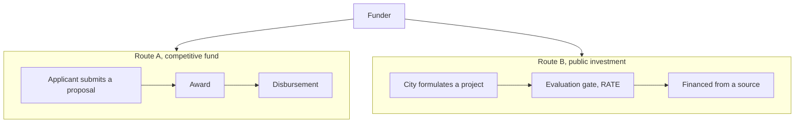

# Writing style

House style for every markdown deliverable in this repo — dataset reviews, discovery notes, knowledge-base pages. The same document is read in one pass by an engineer who needs the technical detail and by an analyst who does not, so the writing has to pay off for the non-technical reader in the first sentence and still hold the detail for the technical one. The rules below all serve that one goal.

## Rules

- **Lead with prose.** Open every section with one or two plain-language sentences stating the main point, before any list. The reader gets the theme before the detail. Never open a section with a bullet.
- **Bullets are for lists, prose is for reasoning.** Use bullets only for genuine lists of parallel items — activities, sources, fields, sibling datasets. Anything carrying a "because", "only when", or "but not" is reasoning and belongs in prose, including a claim or anti-claim. A bullet that needs three subordinate clauses is a sentence wearing a bullet's costume; unwrap it.
- **Tables for parallel numbers.** When several items share the same handful of measures (a share, a median, a rate per category), put them in a table with one row per item and one column per measure, not in a sentence or a stack of bullets. The eye scans a column; it cannot scan a paragraph. Keep prose for the one or two figures that carry the point.
- **Impersonal voice.** Describe the data and the system, not the reader. No "you".
- **Plain language first.** Reach for a technical or database term only when it carries a specific meaning ordinary words do not. Gloss a defined term in a few words on first use. A term that is load-bearing across reviews belongs in the glossary (one-sentence plain definition); link there rather than re-defining it in place.
- **Keep paths and identifiers out of prose.** Name things in plain words in the explanation, and collect the file paths and identifiers in a References block (plain name → path). Inline a path only when the sentence's job is to send the reader to that exact file — a download step, or a "see X for method" pointer.
- **Em-dashes sparingly.** An em-dash (—) marks a sharp aside or break. When most sentences carry one, the device loses force and the prose feels breathless. Default to a comma, a colon, parentheses, or a full stop. In a term-and-definition list, separate the term from its meaning with a colon, not a dash, and never stack two dashes in one line.
- **No bare tildes for "approximately".** Two tildes on a line render as ~~strikethrough~~, which silently mangles the text. Write "about" or "around", or use "≈". When a section is already labelled as approximate (priors, order-of-magnitude figures), plain numbers are fine.
- **Ground an abstract rule in a worked example.** A formula or rule lands better with one concrete instance carried through. After "size an action as hectares × rate", show "100 ha of timber management ≈ 930 UTM, about CLP 63 M". One example beats another sentence of explanation.
- **Reach for a diagram for relationships, flows, and hierarchies.** When the point is how things connect, follow on from each other, or nest, a small mermaid diagram usually beats the best paragraph, and is preferred over a long descriptive passage. The test is reader load: if following the prose means holding several moving parts in mind at once, draw it. See *Diagrams* below for when one earns its place and the patterns to use.
- **Real line breaks, never a literal `\n`.** A `\n` typed into markdown prose or a mermaid label renders verbatim as the characters backslash-n, not a new line. For a line break inside a mermaid node label use `<br/>`; in prose use an actual blank line. This usually creeps in when text is pasted from a code string.

## Optimize for review time

A finished document should make its current state and required decision easy to find. The shortest complete explanation is preferred over a chronological account of how the work developed.

- **Give each document one job.** An overview explains the source and major warnings; a methodology defines rules; a release review states supported and unsupported claims. Link to detail instead of repeating it.
- **Lead with status and decision.** State what is complete, what remains pending, and whether the artifact is safe for production use in the opening paragraph.
- **Prefer current state over process history.** Keep investigation history only when it explains a material limitation, correction, or decision.
- **Use one glance table for repeated evidence.** Put counts, coverage, validation results, and status in one compact table rather than repeating them across sections.
- **Separate facts, judgments, and open questions.** Mark source facts as verified, analytical interpretations as inferred, and unresolved points as unanswered.
- **State the consequence of every warning.** Explain what the issue prevents the data from supporting or how downstream handling must change.
- **Avoid duplication across files.** Keep the authoritative rule in one place. Other documents should include only the summary needed for their specific purpose.
- **Use the shortest complete form.** Replace a paragraph with a sentence or small table when meaning and necessary conditions remain intact.
- **Do not overuse tables.** Use a table when rows share the same fields. Keep conclusions and reasoning as short prose.

Use a two-minute review test before considering documentation complete: can a reviewer identify the scope, status, key result, main limitation, and next decision in under two minutes?

## Diagrams

Diagrams are encouraged, not merely tolerated. When the subject is a relationship, a flow, or a hierarchy, a small diagram lets the reader see the structure instead of assembling it from sentences, and a well-placed one can carry a section that prose alone leaves muddy. The bar is not "could this be drawn" but "is this hard to hold in the head as prose" — when the answer is yes, the diagram is the better default.

A diagram earns its place when the content is one of these:

- an ordered process or lifecycle, such as application then award then disbursement;
- two or more paths that are easy to conflate, such as a competitive-fund route beside a public-investment route;
- a layered or nested structure, such as national, regional and municipal levels, or the supply, awards and pipeline layers;
- a map of what sits where and what connects to what across many items.

The patterns this repo uses are a left-to-right `flowchart LR` for a single sequence, a top-down `flowchart TB` with one `subgraph` per path for contrasting routes, and `subgraph` grouping to carry more than about seven nodes when they cluster into two or three labelled groups. Grouping is what keeps a larger map readable, and is the exception to the seven-node guide: a map of a dozen items inside three labelled clusters reads fine, a dozen loose nodes does not. When the same items also share measures, pair the diagram with a glance table, the table holding the numbers and the diagram holding the relationships.

The discipline still holds: one short caption per diagram stating the takeaway, `<br/>` for line breaks in labels, and never a diagram that only restates a sentence.

Worked example — two routes that are easy to confuse, drawn rather than described:



*Caption: two ways money reaches a city, applying to a fund or formulating a project that passes the public-investment gate. The gate recommends; it does not pay.*

The fuller version is the route map in `climate-finance/cl-climate-finance.md`, where the same two-subgraph pattern carries the whole dataset landscape.

## The References block

The References block gathers the plain-name → path mappings so the prose above it can stay clean. It sits at the end of the topic it serves — not necessarily the very bottom of the file. A long document carries one per major section rather than a single pile at the end. Each entry is the plain name used in the prose, then the path or identifier it points to.

## Worked example

The point of these rules is that themes are easier to pick up when reasoning is prose and only true lists are bulleted. The contrast below is the difference.

Off — a claim packed into a bullet, with the path inline:

```markdown
- "The award is ~CLP 6.98 bn." — NO. That is the total fund across all awards; the per-applicant benefit is a per-hectare bonificación (literal cap ~10 UTM/ha). Read `amount_note`, not the fund total.
```

Better — the reasoning as prose, the path moved to a References block:

```markdown
The headline figure is the size of the whole fund, not what any one applicant receives. The per-applicant benefit is a per-hectare reimbursement, capped at roughly ten tax units per hectare, so a city should read the amount note rather than the fund total.

### References
- amount note → `data/cl_conaf_programs_v1.csv` (`amount_note` field)
```

## References

- Glossary → `knowledge-base/topics/glossary.md`
